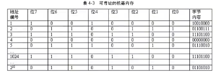
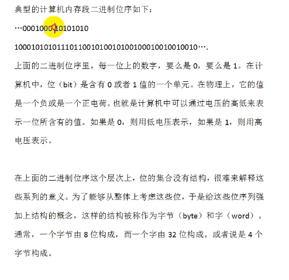
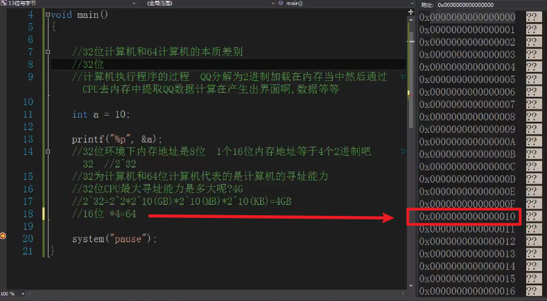

## 内存中的位，字节，字

计算机中的内存是以位为最小存储单位的。通过对内存进行组织，可以引用特定的位集合。把计算机的内存起始位编号为1，每隔8位编号增1，也就是以字节为单位，每隔一个字节编号向上加一，可以对计算机所有内存进行编号。

在于计算机的寻址能力

什么是寻址能力？

寻址能力一般指的是CPU对于内存寻址的能力，通俗来讲，就是能用到多少内存的一个问题，数据在存储器（RAM)中存放是有规律的，CPU在运算的时候需要把教据提取出来就需要知道数据存放在哪里，这时候就需要挨家挨户的找.这就叫做寻址，但是如果地址太多超出了cpu的能力范围，CPU就找不到了，==cpu最大能查找多大范围的能力叫做寻址能力。==

32位环境下内存地址是8位

1个16位内存地址等于4个2进制(2^4^)，则8位就是2^32^

计算机存储

