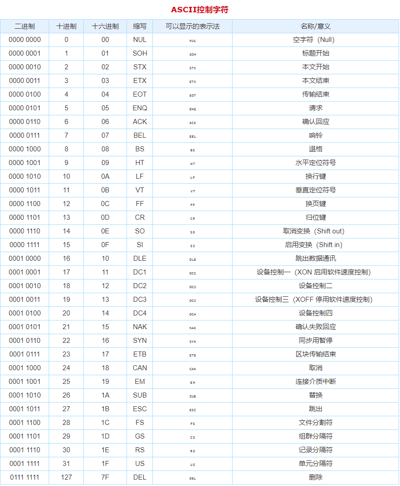
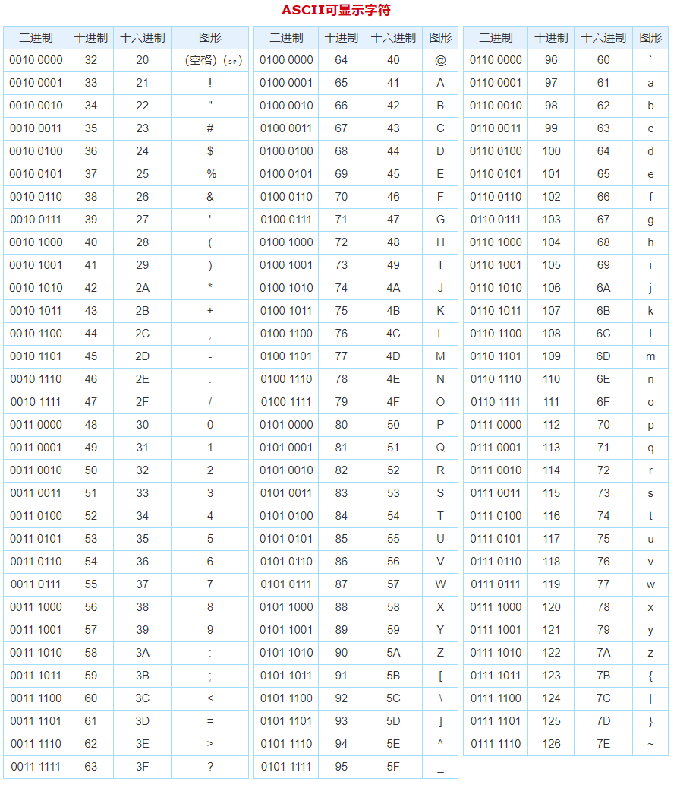

# ASCLL

### ASCII控制字符

| 二进制    | 十进制 | 十六进制 | 缩写 | 可以显示的表示法 | 名称/意义                           |
| --------- | ------ | -------- | ---- | ---------------- | ----------------------------------- |
| 0000 0000 | 0      | 00       | NUL  | ␀                | 空字符（Null）                      |
| 0000 0001 | 1      | 01       | SOH  | ␁                | 标题开始                            |
| 0000 0010 | 2      | 02       | STX  | ␂                | 本文开始                            |
| 0000 0011 | 3      | 03       | ETX  | ␃                | 本文结束                            |
| 0000 0100 | 4      | 04       | EOT  | ␄                | 传输结束                            |
| 0000 0101 | 5      | 05       | ENQ  | ␅                | 请求                                |
| 0000 0110 | 6      | 06       | ACK  | ␆                | 确认回应                            |
| 0000 0111 | 7      | 07       | BEL  | ␇                | 响铃                                |
| 0000 1000 | 8      | 08       | BS   | ␈                | 退格                                |
| 0000 1001 | 9      | 09       | HT   | ␉                | 水平定位符号                        |
| 0000 1010 | 10     | 0A       | LF   | ␊                | 换行键                              |
| 0000 1011 | 11     | 0B       | VT   | ␋                | 垂直定位符号                        |
| 0000 1100 | 12     | 0C       | FF   | ␌                | 换页键                              |
| 0000 1101 | 13     | 0D       | CR   | ␍                | 归位键                              |
| 0000 1110 | 14     | 0E       | SO   | ␎                | 取消变换（Shift out）               |
| 0000 1111 | 15     | 0F       | SI   | ␏                | 启用变换（Shift in）                |
| 0001 0000 | 16     | 10       | DLE  | ␐                | 跳出数据通讯                        |
| 0001 0001 | 17     | 11       | DC1  | ␑                | 设备控制一（XON 启用软件速度控制）  |
| 0001 0010 | 18     | 12       | DC2  | ␒                | 设备控制二                          |
| 0001 0011 | 19     | 13       | DC3  | ␓                | 设备控制三（XOFF 停用软件速度控制） |
| 0001 0100 | 20     | 14       | DC4  | ␔                | 设备控制四                          |
| 0001 0101 | 21     | 15       | NAK  | ␕                | 确认失败回应                        |
| 0001 0110 | 22     | 16       | SYN  | ␖                | 同步用暂停                          |
| 0001 0111 | 23     | 17       | ETB  | ␗                | 区块传输结束                        |
| 0001 1000 | 24     | 18       | CAN  | ␘                | 取消                                |
| 0001 1001 | 25     | 19       | EM   | ␙                | 连接介质中断                        |
| 0001 1010 | 26     | 1A       | SUB  | ␚                | 替换                                |
| 0001 1011 | 27     | 1B       | ESC  | ␛                | 跳出                                |
| 0001 1100 | 28     | 1C       | FS   | ␜                | 文件分割符                          |
| 0001 1101 | 29     | 1D       | GS   | ␝                | 组群分隔符                          |
| 0001 1110 | 30     | 1E       | RS   | ␞                | 记录分隔符                          |
| 0001 1111 | 31     | 1F       | US   | ␟                | 单元分隔符                          |
| 0111 1111 | 127    | 7F       | DEL  | ␡                | 删除                                |



### 

内存中数据的表现形式

一套规范，把所有字符进行标号

```c
void main()
{
	int a = 1;
	char b = "1";
	printf("%d,%d\n", sizeof(a), sizeof(b));
	putchar(105);
	putchar(108);
	putchar(111);
	putchar(118);
	putchar(101);
	putchar(121);
	putchar(111);
	putchar(117);

	system("pause");

}
```


## 加密解密

