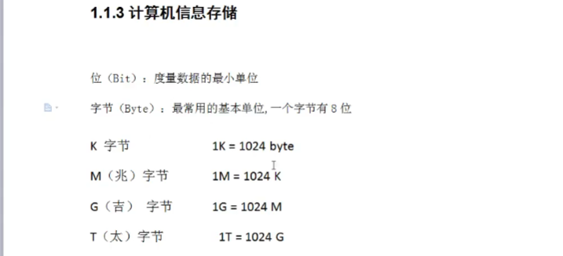
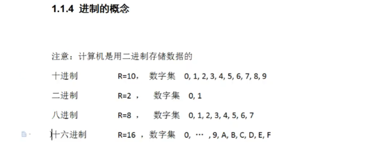
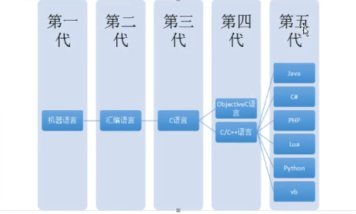
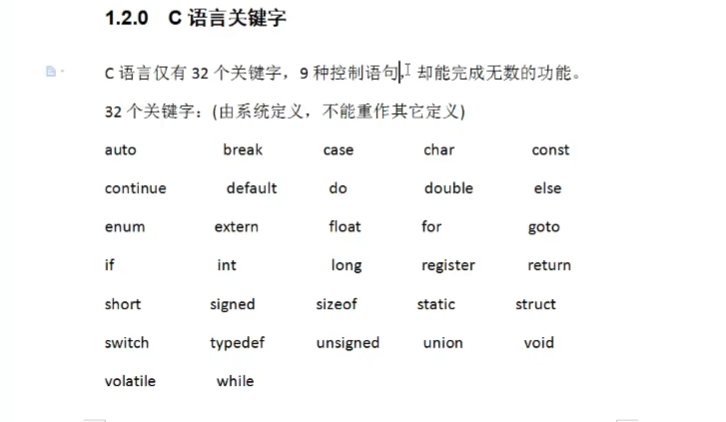
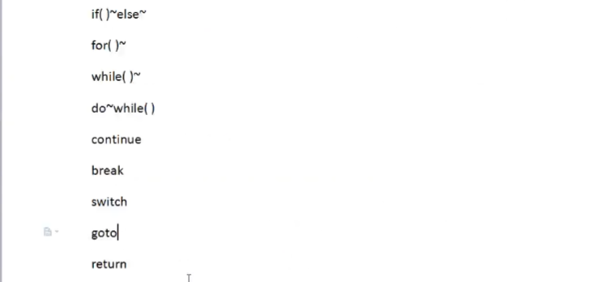
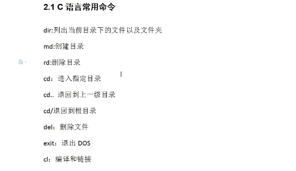

# C语言

C语言就是和电脑进行交流的语言

学了C语言是为了进阶C++

软件：一系列按照特定顺序组织的计算机数据和指令的集合。

软件的出现实现了人与计算机之间的更好的交互。

自然交互界面：声音控制，触摸屏手势识别

图形化界面：这种方式简单直观，使用者易于接受，容易上手操作。

命令行方式：需要有一个控制台，输入特定的指令，让计算机完成一些操作。较为麻烦，需要记录住一些命令。

内存地址是十六进制，黑客技术用的最多。编译成十六进制可以绕开杀毒软件检测

## 程序与指令

指令是对计算机进行程序控制的最小单位。

所有的指令的集合称为计算机的指令系统。电脑是×86，手机是ARM。

程序是为完成一项特定任务而用某种语言编写的一组指令序列。

计算机的大脑或者说心脏就是CPU，它控制着整个计算机的运作。每种CPU，都有自己的指令系统。这个指令系统，就是该CPU的机器语言。机器语言是一组由0和1系列组成的指令码，这些指令码，是cPU制作厂商规定出来的，然后发布出来，请程序员遵守。比如下面是某CPU指令系统中的两条指令：

1954年，Fortran语言出现了

这类高级语言解决问题的方法是分析出解决问题所需要的步骤，把程序看作是数据被加工的过程。基于这类方法的程序设计语言成为面向过程的语言。

==C语言就是这种面向过程的程序设计语言==

## 主流语言进化史

艾伦·麦席森·图灵（Alan Mathison Turing，1912年6月23日一1954年6月7日)，英国数学家、逻辑学家，被称为计算机科学之父，人工智能之父

### PHP是最好的语言出处

PHP是最好的语言这个梗不是出自别处，而就是出自PHP的官方文档！

问题在于，不拿文档看函数库，很难写

## C语言特点

代码量小

执行速度快可移植性较差

功能强大

编写代码实现周期长

过于自由，经验不足易出错

编程自由对平台库依赖较多

可移植性较差

## C语言关键字

靠算法，数据结构千变万化

## 9种控制语句

goto黑客用的多

