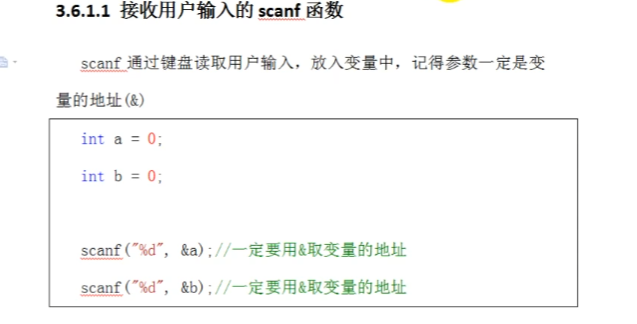
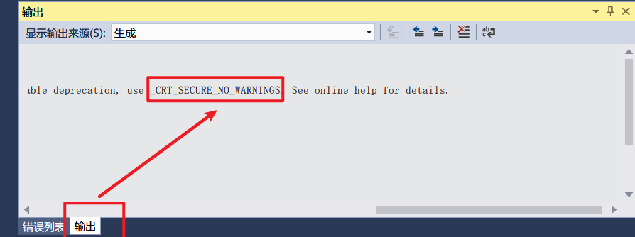
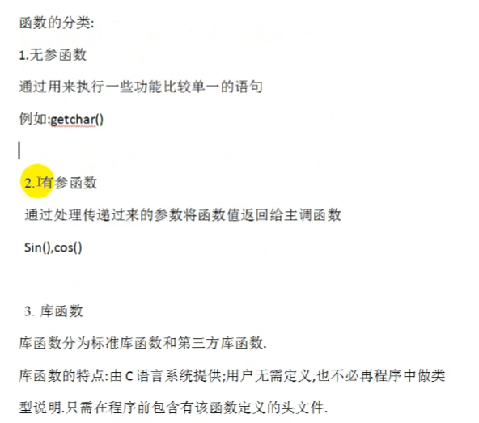
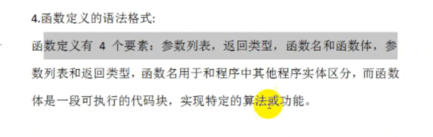
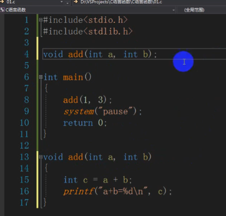
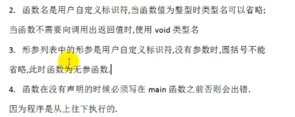

# 函数

## scanf

scanf 通过键盘读取用户输入，放入变量中，记得参数一定是变量的地址（&用于取变量地址）

&与指针相关



```c
#define _CRT_SECURE_NO_WARNINGS
#include<stdio.h>
#include<stdlib.h>
#include<Limits.h>
void main()
{

	int a = 5;
	scanf("%d", &a);
	
	printf("%d\n", a);
	system("pause");
}
```

不加最开始一行代码是错误的，直接通过输入给变量赋值是外挂的做法

需要在输出界面赋值此段语句，去界面最开始加上以下代码，则可以直接用输入值给变量赋值

`#define _CRT_SECURE_NO_WARNINGS`



定义函数时，类型若有值需要返回就定义返回值的类型，比如int，没有需要返回的就void





定义的函数要放在主程序前面，防止主程序运行完就不再查看后面，也可以放在后面，但需要在前面声明



1. 不能在函数内部再写一个函数

