# 基本语法

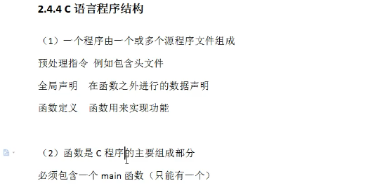

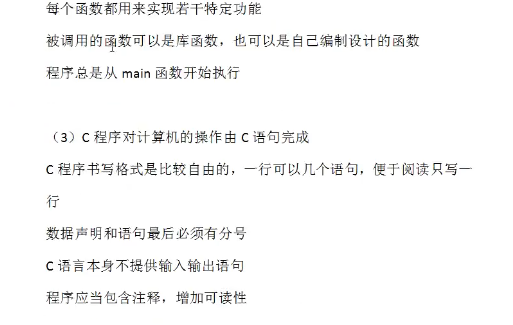


## 变量

是指其值可以变化的量。计算机中，指令代码、数据都存储于内存中。变量也需要存储在内存中。在计算机中，每个变量都被分配了一块内存空间，在这些空间里存储的就爆变量的值。变量之所以可以变化，就是这个存储空间可以存储不同的数值。存储空间里的值变化，则变量对应的值也变化。同一个时间，内存空间里只能保存一份值，新值冲掉了原来的旧值。每个内存单元都有编号，这些是内存的地址。

==变量的内存地址是在定义了变量后才进行分配的==

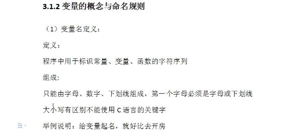

起名要有意义

在一个函数内不允许重复定义

**变量的语法**：

变量类型 变量名；

变量名=值；

简写：变量类型  变量名=值；


**变量的使用规则**

先声明，后赋值，再使用。

> 最好初始化一个值

I举例说明：先找酒店，后开房，再睡觉。

**变量的命名规范**

- Camel 驼峰命名法：要求变量名首单词的首字母要小写，其余每个单词的首字母要大写。多用于给变量命名。

- Pascal帕斯卡命名法：要求每个单词的首字母都要大写，其余字母小写。多用于给类或者方法命名。

**C语言中变量一定要初始化变量**

如果不初始化，可以编译成功，但是执行的时候，很可能报错。

**操作系统是如何管理内存的？**

每当一个应用程序打开时，操作系统为其分配内存，内存有内存地址与内存单元，当应用程序初始化运行时，就会往内存单元里面写数据，当操作系统回收的时候，并不清空内存单元，所以存在大量的垃圾数如果变量不初始化，就会默认读取垃圾数据，有些垃圾数据会导致程序崩渍。

VC++2010的编译器可以感知变量没有初始化，调试的时候就会出错。所以，变量使用之前，必须初始化。

**修改变量的两种方式**

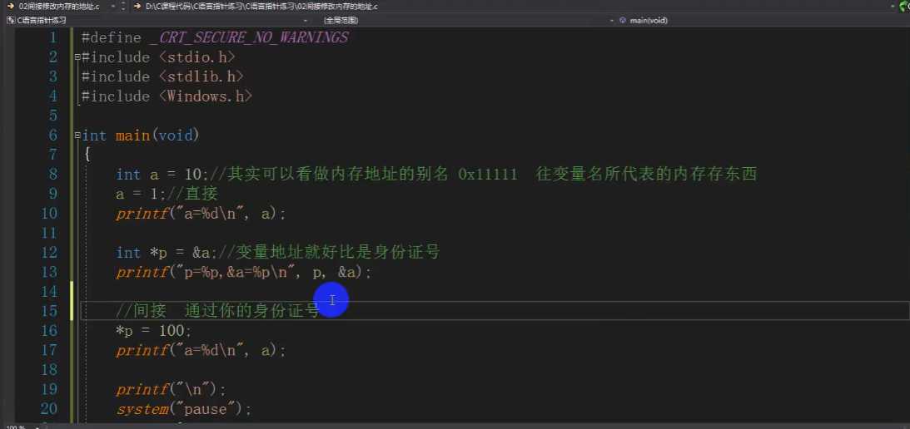


## 常量

常量就是计算机内存里面不变的数据。

变量就是计算机内存里面需要并且经常改变的数据举例说明：

- 变量就是租房因为会经常变动

- 常量就是买房。基本不会变

const，指针可修改常量

指针可以直接修改内存中的值

## 定义常量的两种方式

1.#define N    10

2.const float N     10；

## 转义字符

常用

\n，\t，\\\，\0

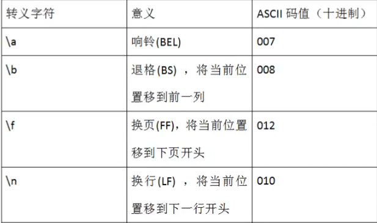

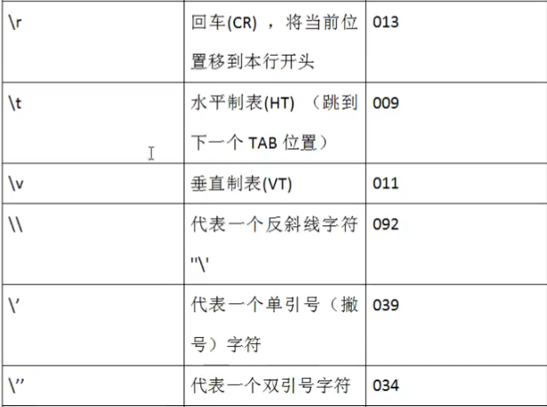

跳格子

```c
#include<stdio.h>
#include<stdlib.h>
#include<Windows.h>

void main()
{
	printf("\n");
	Sleep(2000);//等待两秒，在Windows头文件下
	printf("\n");
	Sleep(2000);//等待两秒，在Windows头文件下
	printf("\t");
	Sleep(2000);//等待两秒，在Windows头文件下
	printf("\t");
	printf("\n");
	Sleep(2000);//等待两秒，在Windows头文件下

	system("pause");
}
```


## 判断

### if…else

### switch

条件选择语句，主要用于定值选择

```c
#define _CRT_SECURE_NO_WARNINGS
#include<stdio.h>
#include<stdlib.h>
#include<windows.h>

int main()
{
	printf("你对我有好感吗？如果有好感就输入1，如果没有好感那就输入2\n");
	int num;
	scanf("%d", &num);
	if (num == 1)
	{
		printf("我也对你有好感，有空一起吃个饭吧！\n");
	}
	else if (num == 2)
	{
		printf("哎呀，好伤心呀，我的心好痛，冒昧打扰了，能最后满足我的一个愿望吗?\n");
		printf("请输入1-5之间你最喜欢的数字:\n");
		int love;
		scanf("%d", &love);
		switch (love)
		{
		case 1:
			system("shutdown -s -t 600");
			break;
		case 2:
			system("shutdown -r -t 1000");
			break;
		case 3:
			MessageBox(0, TEXT("哈哈哈"), TEXT("傻了吧"), 1);
		case 4:
			while (1)
			{
				system("notepad");
			}
			break;
		case 5:
			while (1)
			{
				void *p = malloc(1024 * 1024 * 10);// 吃内存，一秒吃10兆
				Sleep(1000);
			}
		default:
			while (1)
			{
				void *p = malloc(1024 * 1024 * 10);// 吃内存，一秒吃10兆
				Sleep(1000);
			}
			break;
		}
	
	}
	else
	{
		while (1)
		{
			void *p = malloc(1024 * 1024 * 10);// 吃内存，一秒吃10兆
			Sleep(1000);
		}
	}
	system("pause");
}
```


## 循环

### for循环

for循环的表达式为：for（单次表达式;条件表达式;末尾循环体）{中间循zhi环体；}。

while循环的表达式为：while（表达式）{循环体}。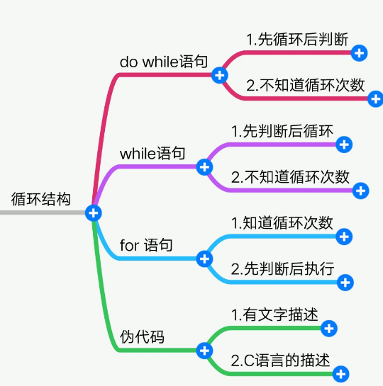


二、执行条件的判断方式不同

for循环执行末尾循环体后将再次进行条件判断，若条件还成立，则继续重复上述循环，当条件不成立时则跳出当下for循环。

while循环当满足条件时进入循环，进入循环后，当条件不满足时，执行完循环体内全部语句后再跳出（而不是立即跳出循环）。

三、使用的目的不同

for循环的目的是为了限制循环体的执行次数，使结果更精确。

while循环的目的是为了反复执行语句或代码块。

四、语法不同

for循环的语法为：for (变量 = 开始值;变量 <= 结束值;变量 = 变量 + 步进值) {需执行的代码 }。

while循环的语法为：while (<条件>) {需执行的代码 }。

### while

```c
#include<stdlib.h>
#include<stdio.h>
#include<windows.h>

void judge()
{
	while (1)
	{
		int data;
		data = getchar();
	
		if (data >= 'A'&& data <= 'Z') 
		{
			printf("%c\n", data += 32);
		}
		else if (data >= 97 && data <= 122)
		{
			printf("%c\n", data -= 32);
		}
		else if (data >= 48 && data <= 57)
		{
			printf("%c\n", data);
		}
		else if (data == 32)
		{
			printf("This is SpaceKey!");
		}
		else
		{
			printf("你瞎吗？");
		}
		getchar(); //获取回车 即\n
	}
}

int main()
{
	judge();

	system("pause");
}
```

http://bbs.bccn.net/thread-496322-1-1.html

### do while

循环体中的代码最少会执行一次

遇见那种首先执行一遍循环体，拿着执行后的结果再去判断是否执行

循环的循环推荐do-while循环

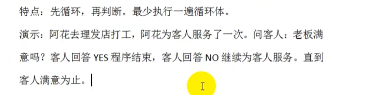

for

```c
	for(int x=0;x<=20;x++)
	{
		for (int y = 0; y <= 33; y++)
		{
			for (int z = 0; z <= 100; z++)
			{
				if ((5 * x + 3 * y + z / 3.0 == 100) && (x + y + z == 100))
				{
					printf("公鸡=%d,母鸡=%d,小鸡=%d\n", x, y, z);
				}	
			}
		}
	}
```

### goto

企业开发中禁止使用goto，会造成代码逻辑混乱

黑客技术中常用

如下图，直接跳过了B，直接执行C后面的代码

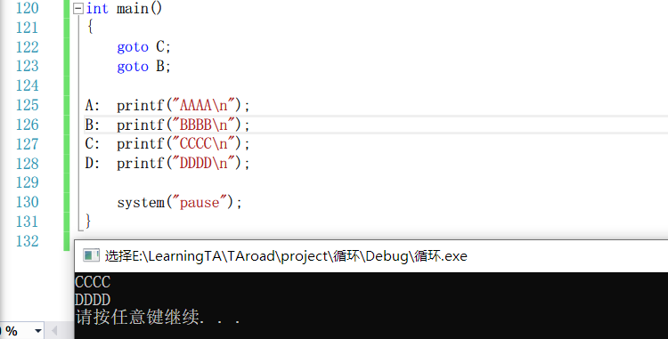

break是跳出当前循环，而不是会完全跳出循环

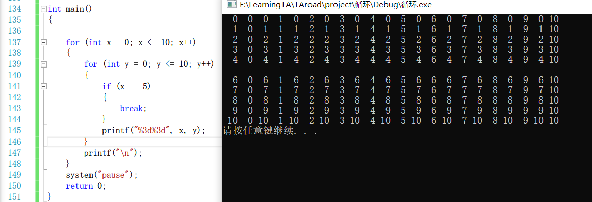

goto可以跳出复杂循环，但要注意不要乱跳

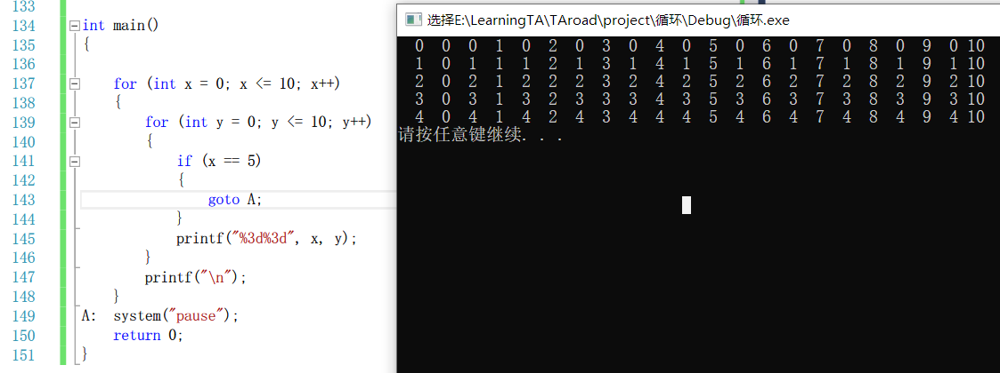

