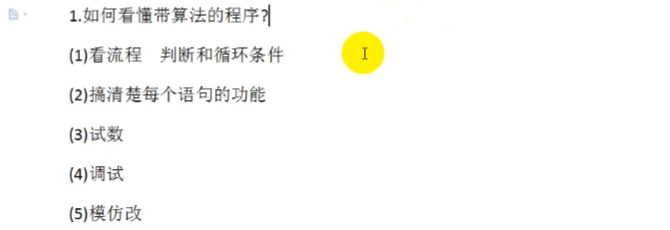

## 选择排序法



```c
#include<stdlib.h>
#include<stdio.h>

int main()
{
	// 选择排序法求最大值
	int a[10] = { 1,2,3,4,5,6,7,8,9,0 };
	int max = a[0];

	int i = 0;
	while ( i < 10)
	{
		if (max < a[i])
		{
			max = a[i];
		}
		i++;
	}

	printf("%d", max);
	system("pause");
}

```

一次循环交换9次


```c
#include<stdlib.h>
#include<stdio.h>

int main()
{
    int a[10] = { 1,2,3,4,5,6,7,8,9,0 };
	int max = 0;
	// 按住一个位置不动，直到循环出一个最大值
	// 好比打擂台，一个打全部
    // 10-1是因为此处比较到最后只剩一个肯定是最小的，不用再比较，但不适合所有情况
	for (int i = 0; i < 10-1; i++)
	{
		max = i;
		for (int j = i + 1; j < 10; j++)
		{
			if (a[max] < a[j])
			{
				int temp = a[j];
				a[j] = a[max];
				a[max] = temp;
			}
		}
		for (int i = 0; i < 10; i++)
		{
			printf("%4d", a[i]);
		}
		printf("\n");
	}

	system("pause");
}
```

考虑时间复杂度，只比较不交换不耗时间，==交换内存很耗时间==，出栈进栈

```c
#include<stdlib.h>
#include<stdio.h>

int main()
{
	// 选择排序法求最大值
	int a[10] = { 1,2,3,4,5,6,7,8,9,0 };
	int max = 0;
	// 按住一个位置不动，直到循环出一个最大值
    //假设我想当老大我只需要和你们里面最厉害的人打就可以了
    //只要你比我大我就和你交换
    //只比较，比较选出其中最大值存储它的下标再去和i比较交换
	for (int i = 0; i < 10-1; i++)
	{
		max = i;
		for (int j = i + 1; j < 10; j++)
		{
			if (a[max] < a[j])
			{				
				// 存储下标，不直接交换
				max = j;
			}
		}
		if (max != i)
		{
			int temp = a[i];
			a[i] = a[max];
			a[max] = temp;
		}


		for (int i = 0; i < 10; i++)
		{
			printf("%4d", a[i]);
		}
		printf("\n");
	}

	system("pause");
}
```

## 冒泡排序法

放屁排序法

区别于选择排序法是选择会先定一个位置，然后通过这个位置不断地和其他值比大小再考虑是否交换到这个位置，而冒泡是不管位置，直接和身边的值比大小，然后交换位置

选择排序是自己亲自下场都比一遍，冒泡排序是按给定顺序让值自动去比较

==极值会按顺序不断地沉底==

```c
#include<stdlib.h>
#include<stdio.h>

int main()
{
	int a[10] = { 9,8,7,6,5,4,3,2,1,0 };

	for (int i = 0; i < 10-1; i++)
	{
		for (int j = 0; j < 10 - 1 - i; j++)
		{
			if (a[j] > a[j + 1])
			{
				int temp = a[j + 1];
				a[j + 1] = a[j];
				a[j] = temp;
			}
		}	
	}
	printf("%d", a[9]);

	system("pause");
}
```

## 二分查找法

找中间值，记得值从0开始

```c
#define _CRT_SECURE_NO_WARNINGS
#include<stdlib.h>
#include<stdio.h>

void FindNum(int a[], int data)
{
	int tou = 0;
	int wei = 100000 - 1;
	int flag = -2;
	int ci = 0;
	while (tou <= wei)
	{
		int zhong = (tou + wei)/2;
		printf("tou=%d,wei=%d,zhong=%d,ci =%d\n", tou, wei, zhong,++ci);
		if (data == a[zhong])
		{
			printf("找到值为%d的数了", data);
			flag = 1;// 标识符，确定值是否在范围内
			break;
		}
		// 如果想查找的值大于中间值的话，中间值之前的数全部舍弃掉
		else if (data > a[zhong])
		{
			tou = zhong + 1;
		}
		else
		{
			wei = zhong - 1;//如果小于中间值的话，中间值之后的数就舍弃掉
		}
	}
	if (flag == -2)
	{
		printf("找不到这个值");
	}

}

int main()
{
	int a[100000] = { 0 };
	for (int i = 0; i < 100000; i++)
	{
		a[i] = i;
		printf("i=%d\n", i);
	}
	int data;
	scanf("%d", &data);
	FindNum(a, data);

	system("pause");
}
```

