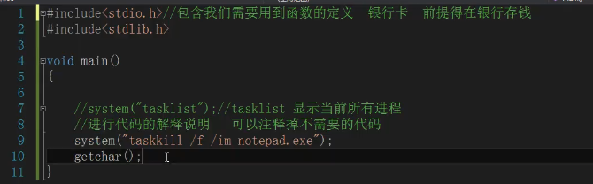

# 头文件

#include<>

库函数，要先在库里定义了才能拿来用

包含需要用到的函数的定义

编译前预处理

include是c语言预处理器指示符。#和include之间可以有多个空格。

也不一定要顶格，但是一定是第一个非空白字符。#include的作用，是告诉编译器在编译前，要做些预先处理：将后面<>中的文件内容包含到当前文件内。==所谓包含，是指将<>中列出的文件的内容复制到当前文件里。==

**注意：#一定要是第一个非空白字符。否则编译器会提示错误，并且错误信息和出错原因完全不匹配。**

> 因为getchar和printf两个函数的声明位于stdio.h文件中，所以简单的用#include把stdio.h文件包含进来，自然就把getchar和printf两个函数的声明包含进来了。

说明：函数声明只是向编译器登记有这么一个函数，声明了函数不调用这个函数，是被容许的。这就是为什么包含了整个stdio.h文件，里面声明了很多其他函数，但实际没有使用这些函数而编译器又不提示的原因。

Debug和断点调试

