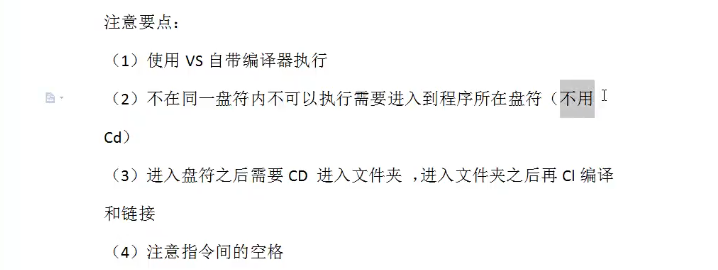
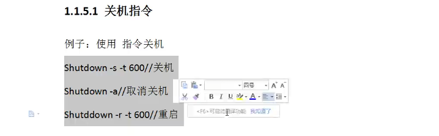
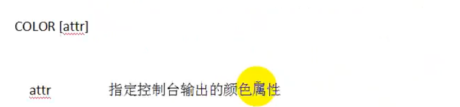
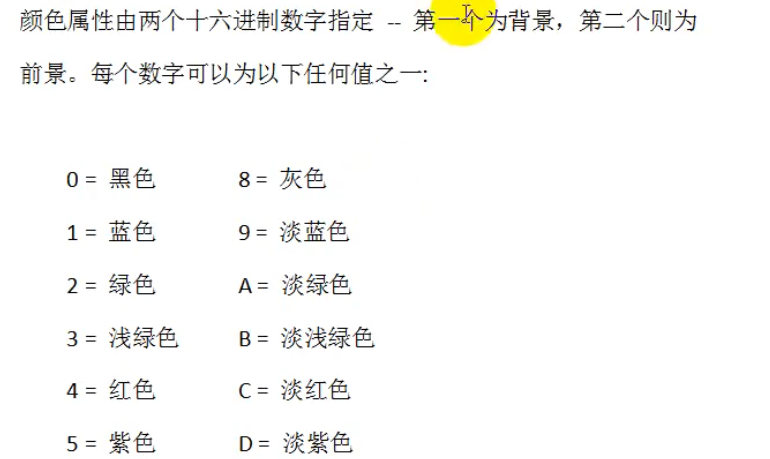
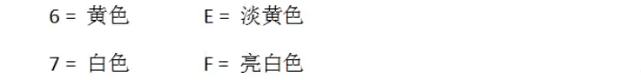
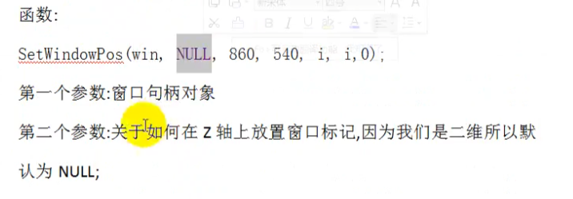
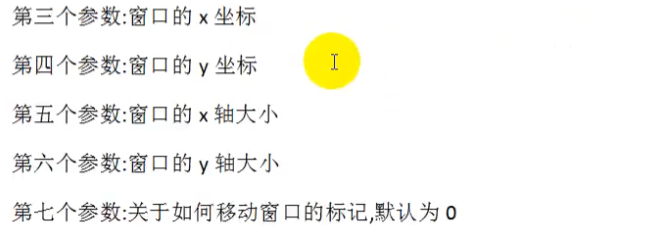
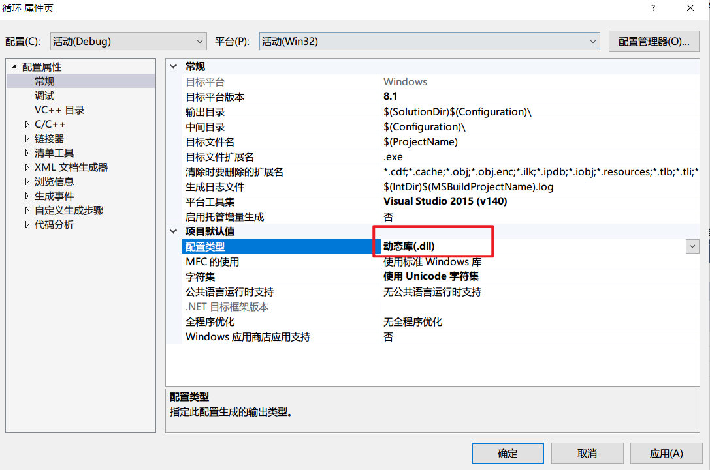
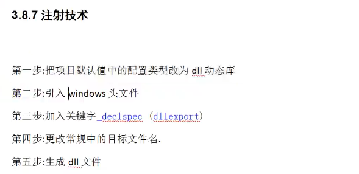

# 小程序

## 关机程序


-+

编译这个程序需要VS的开发人员命令提示

不在同一盘符不能执行





## 改变控制台颜色

```C
#include<stdio.h>
#include<stdlib.h>
#include<Limits.h>

void main()
{
	system("color 5f");
	system("title hehe");
	system("pause");

}

```







如果没有给定任何参数，该命令会将颜色还原到CMD.EXE启动时的颜色。这个值来自当前控制台窗口、/T命令行开关或DefaultColor 注册表值。

## 修改输入字母大小写

```C
#include<stdlib.h>
#include<stdio.h>
#include<windows.h>

void judge()
{
	while (1)
	{
		int data;
		data = getchar();
	
		if (data >= 'A'&& data <= 'Z') 
		{
			printf("%c\n", data += 32);
		}
		else if (data >= 97 && data <= 122)
		{
			printf("%c\n", data -= 32);
		}
		else if (data >= 48 && data <= 57)
		{
			printf("%c\n", data);
		}
		else if (data == 32)
		{
			printf("This is SpaceKey!");
		}
		else
		{
			printf("你瞎吗？");
		}
		getchar(); //获取回车 即\n
	}
}

int main1()
{
	judge();

	system("pause");
}
```

## 打开多个程序界面

```C
#include<stdlib.h>
#include<stdio.h>
#include<windows.h>

int main()
{
	int sum = 0;
	for (int i = 0; i <= 3; i++)
	{
		// 同时打开多个程序界面，注意让系统识别程序路径，转义字符
		ShellExecuteA(0, "open", "\"D:\\QQ\\Bin\\QQScLauncher.exe\"", 0,0,2);
	}
	printf("%d", sum);


	system("pause");
	return 0;
}
```

## 穷举法解方程-百鸡百钱问题

```c
#include<stdlib.h>
#include<stdio.h>
#include<windows.h>

int main()
{
	for(int x=0;x<=20;x++)
	{
		for (int y = 0; y <= 33; y++)
		{
			for (int z = 0; z <= 100; z++)
			{
				if ((5 * x + 3 * y + z / 3.0 == 100) && (x + y + z == 100))
				{
					printf("公鸡=%d,母鸡=%d,小鸡=%d\n", x, y, z);
				}	
			}
		}
	}
	system("pause");
	return 0;
	
}
```

注意{}包括的层级，少一层就会导致结果出错

注意时间复杂度，

### 优化版

```c
	for (int x = 0; x <= 20; x++)
	{
		for (int y = 0; y <= 33; y++)
		{
			int z = 100 - x - y;
			if (5 * x + 3 * y + z / 3.0 == 100)
			{
				printf("公鸡=%d,母鸡=%d,小鸡=%d\n", x, y, z);
			}
		}
	}
```





## 闪现的QQ

```c
#include<stdlib.h>
#include<stdio.h>
#include<windows.h>


// 闪现的QQ
void open()
{
	ShellExecuteA(0, "open", "\"D:\\QQ\\Bin\\QQScLauncher.exe\"", 0, 0, 2);
}

void show()
{
	// 建立一个对象存储qq的窗口，参数：类名
	// 根据类名和标题找到QQ窗口并存储在window当中
	HWND window = FindWindowA("TXGuiFoundation", "QQ");
	if (window == NULL)
	{
		printf("腾讯去哪了");
	}
	int i = 0;
	while (i < 500)
	{
		SetWindowPos(window, NULL, 400, 300, i, i, 0);
		Sleep(10);
		i += 50;
	}
	while (i > 0)
	{
		SetWindowPos(window, NULL, 400, 300, i, i, 0);
		Sleep(10);
		i -= 50;
	}
}

void close()
{
	system("taskkill /f /im QQ.exe");
}

int main()
{
	open();
	Sleep(1000);
	show();
	Sleep(1000);
	close();
	system("pause");
	return 0;
}

```

## 伪装-隐藏黑窗口

```c
//                                       注意这里有空格
#pragma comment(linker,"/subsystem:\"windows\" /entry:\"mainCRTStartup\"")

// #pragma 预编译
// linker链接
// DOS窗口  DOS指令模式
// 改成以windows模式编译 "/subsystem:\"windows\"/entry:\"mainCRTStartup\""

int main()
{
	MessageBoxA(0, "你的电脑已被锁定", "系统提示你:", 0);

	//system("pause");
	return 0;
}
```

## 黑客注射技术

需要用到动态库



