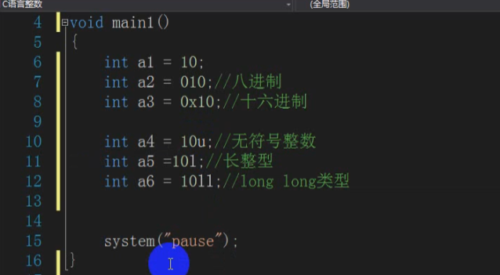
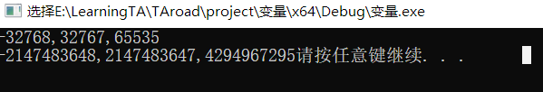

# C语言各数据类型大小和取值范围

[Dream Flying Eagle](https://blog.csdn.net/weixin_42856843) 2018-08-23 23:15:56

因为CPU的差异，各系统中的数据类型所占的字节数（bytes）不同，二进制位数（bit）也不同。那么怎样才能知道自己系统的数据类型的字节数，位数呢？

授之以鱼不如授之以渔，大家可以自己从电脑里获取这些信息。

首先我们知道1个字节等于8个位，可以用sizeof()关键字设计以下程序解决：

```cpp
/*获取当前操作系统的字节数（bytes）和位数（bit）*/
#include<stdio.h>
int main(void)
{
	printf("int:bytes %d;bit %d", sizeof(int), sizeof(int) * 8);
	return 0;
}

12345678
```


由此可得知楼主系统的整数（int）所占字节数是4，位数为32

而取值范围则可以用极限值符号（极限值符号定义在 limits.h 头文件中，以下会详细介绍）来获得
下面以char类型为例：

```cpp
/*获取char数据类型的取值范围*/
#include<stdio.h>
#include<limits.h>
int main(void)
{
	printf("char:MIN %d;MAX %d", CHAR_MIN, CHAR_MAX);

	return 0;
}

12345678910
```


**有符号整数类型**

| 类型名称                   | 字节数 | 取值范围                                                  |
| -------------------------- | ------ | --------------------------------------------------------- |
| signed char                | 1      | -2^7(-128) ~ 2^7-1(127)                                   |
| short int 或 short         | 2      | -2^15(-32 768) ~ 2^15-1(32 767)                           |
| int                        | 4      | -2^31(-2 147 483 648) ~ 2^31-1(2 147 483 647)             |
| long int 或 long           | 4      | -2^31(-2 147 483 648) ~ 2^31-1(2 147 483 647)             |
| long long int 或 long long | 8      | -2^63(-9.2233720368548e+18) ~ 2^63-1(9.2233720368548e+18) |

**无符号整数类型**

| 类型名称                                     | 字节数 | 取值范围                       |
| -------------------------------------------- | ------ | ------------------------------ |
| unsigned char                                | 1      | 0 ~ 2^8-1(255)                 |
| unsigned short int 或 unsigned short         | 2      | 0 ~ 2^16-1(65 535)             |
| unsigned int                                 | 4      | 0 ~ 2^32-1(4 294 967 295)      |
| unsigned long int 或 unsigned long           | 4      | 0 ~ 2^32-1(4 294 967 295)      |
| unsigned long long int 或 unsigned long long | 8      | 0 ~ 2^64-1(1.844674407371e+19) |

**浮点类型**

| 类型名称    | 字节数 | 取值范围                       |
| ----------- | ------ | ------------------------------ |
| float       | 4      | -/+3.4e38（精确到6位小数）     |
| double      | 8      | -/+1.7e308（精确到15位小数）   |
| long double | 12     | -/+1.19e4932（精确到18位小数） |

***极限值符号***

**表示有符号整数类型的极限值符号**

| 类型名称  | 下限      | 上限      |
| --------- | --------- | --------- |
| char      | CHAR_MIN  | CHAR_MAX  |
| short     | SHRT_MIN  | SHRT_MAX  |
| int       | INT_MIN   | INT_MAX   |
| long      | LONG_MIN  | LONG_MAX  |
| long long | LLONG_MIN | LLONG_MAX |

**表示无符号整数类型的极限值符号**

| 类型名称           | 下限 | 上限       |
| ------------------ | ---- | ---------- |
| unsigned char      | 0    | UCHAR_MAX  |
| unsigned short     | 0    | USHRT_MAX  |
| unsigned int       | 0    | UINT_MAX   |
| unsigned long      | 0    | ULONG_MAX  |
| unsigned long long | 0    | ULLONG_MAX |

**表示浮点类型的极限值符号**

| 类型名称    | 下限     | 上限     |
| ----------- | -------- | -------- |
| float       | FLT_MIN  | FLT_MAX  |
| double      | DBL_MIN  | DBL_MAX  |
| long double | LDBL_MIN | LDBL_MAX |



```c
#include<stdio.h>
#include<stdlib.h>
#include<Limits.h>


void main2()
{
	int num_max = INT_MAX;
	int num_min = INT_MIN;

	printf("%d,%d\n", num_max, num_min);
	system("pause");

}

void main()
{
	short int amax = SHRT_MAX;
	short int amin = SHRT_MIN;
	unsigned short int a = USHRT_MAX;
	printf("%d,%d,%d\n", amin, amax, a);

	long int amax1 = LONG_MAX;
	long int amin1 = LONG_MIN;
	unsigned long int a1 = ULONG_MAX;
	printf("%d,%d,%u", amin1, amax1, a1);


	system("pause");
}
```



此处`unsigned long int a1 = ULONG_MAX;
	printf("%d,%d,%u", amin1, amax1, a1);`如果用%d输出的话，会因为%d输出的是int型的值，所以范围在-2^31(-2 147 483 648) ~ 2^31-1(2 147 483 647)，unsigned short int输出没问题，因为最大值还在范围内，而unsigned short int，

如果unsigned short a=-1时输出得到65535，因为二进制取反加一以后第一位不代表符号