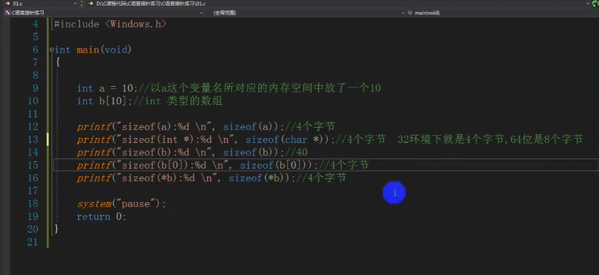
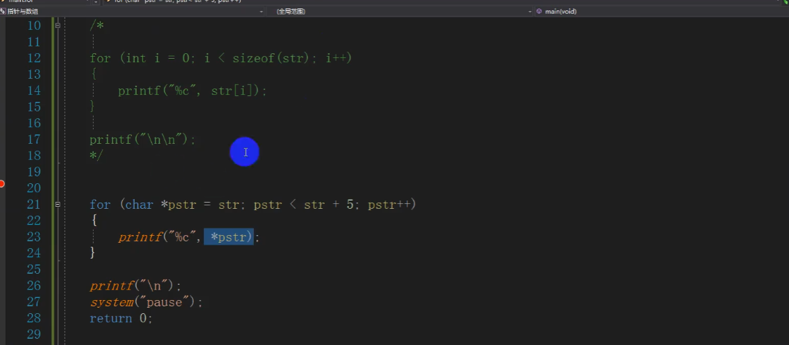

# 指针

用来修改内存

==指针就是内存地址==

**指针**是一个变量，其值为另一个变量的地址，即，内存位置的直接地址。就像其他变量或常量一样，您必须在使用指针存储其他变量地址之前，对其进行声明。指针变量声明的一般形式为：

```
type *var-name;
```


## 外挂基本原理

直接修改内存的值

一个程序载入内存，代码数据都有地址，外挂就是调用函数，修改数据而函数就是代码，变量就是数据。

## 变量名

概念：既能读又能写的内存对象，称为变量；若一旦初始化后不能修改的对象则称为常量。

一个程序载入内存，代码数据都有地址，外挂就是调用函数，修改数据而函数就是代码，变量就是数据。

总结：

1对内存，可读可写：
2通过变量往内存读写数据：
3不是向变量读写数据，而是向变量所代表的内存空间中写数据。


==名字是变量，地址是身份证号，外号是引用==

## 基本语法

指针直接修改变量值，输出即为修改后的值

### 指针变量

存放内存地址的变量

指针永远是四个字节


使用指针时会频繁进行以下几个操作：

- 定义一个指针变量

- 把变量地址赋值给指针

- 访问指针变量中可用地址的值

这些是通过使用一元运算符 ***** 来返回位于操作数所指定地址的变量的值


直接操作指针修改变量的值：`*(&p) = 38;`


## 指针大小

指针都是4个字节

指针无论是什么类型在32位环境下都是4个字节，64位环境下是8个字节

指针的大小是固定的，大小只和步长有关


## 二级指针


## 区分指针和指针变量

指针是看不到的，看到的是指针变量

指针”是概念，“指针变量”是具体实现，指针也是一个变量，所以需要进行定义，而对于指针的定义，与一般变量一样。

    1、指针就是地址，地址就是指针。
    2、地址就是内存单元的编号。
    3、指针变量就是存放内存地址的变量。
    4、指针和指针变量是两个不同的概念，但要注意的是，通常我们叙述时会把指针变量简称为指针，实际他们含义并不一样。

## 数组和指针

数组首元素地址和数组的地址是一致的


步长不一样会导致+1后的结果不一样

一个数组中10个元素，元素加1是加4个字节，一个元素4个字节，数组+1是加40个字节

直接写数组名输出是数组首元素


## **修改变量的两种方式**


## 判断数据类型大小




## 内存四区模型


函数指针可以操纵代码区

函数声明后在代码区，声明一个指针在栈区来存储代码区的地址


一个由C/C++编译的程序占用的内存分为以下几个部分：

1、栈区（stack）：由编译器自动分配释放，存放函数的参数值，局部变量的值等。其操作方式类似于数据结构中的栈。变量执行完毕销毁

2、堆区（heap)：一般由程序员分配释放，若程序员不释放，程序结束时可能由操作系统回收。

- malloc
- new
- free
- delete

>  注意它与数据结构中的堆是两回事，分配方式倒是类似于链表。

3、数据区：主要包括静态全局区和常量区，如果要站在汇编角度细分的话还可以分为很多小的区。

- 全局区（静态区）（static)：**全局变量**和静态变量的存储是放在一块的，初始化的全局变星和静态变量在一块区域，未初始化的全局变呈和未初始化的静态变显在相邻的另一块区域。程序结束后由系统释放
  - 常量区：**常量字符串**就是放在这里的。**程序结束后由系统释放**

  > 全局变量和文字常量都在全局区

4、代码区：存放函数体的二进制代码。

下图中，字符串太长，指针变量只有四个字节大小，放不下，所以放在全局区，用指针储存地址


### 栈区

栈区的函数在调用后就销毁


main函数无法打印出hehe，因为已被销毁

数组在函数调用时会从全局区复制到栈区，因为放得下字符串


所以应该在堆上开辟

### 堆区

手动开辟手动释放

全部变量和静态常量肯定会在全局区

所以是先在全局区开辟空间存储字符串，再复制到堆区


## 指针运算

指针+1，是加了一个指针所指向类型的大小，int +1是加4个字节

指针的类型不单单是决定了步长还决定了解析方式

==声明了一个类型的变量，就要用同样类型的指针变量去接收==


字符以\0结尾，所以实际占用空间会在字符串本身位数上加1

## 指针法遍历

用于链表快速排序，归并排序




用指针来遍历，指针+1因为是加=指向类型的大小，所以被指向类型遍历和指针+1是相同的，在起始位置值和步长相同情况下，结果就一定是相同的


函数参数有副本机制，除了数组

## 指针的间接赋值


*a，用来取出其对应地址的内容


## 指针数组

类比

一个用指针指向字符地址的数组

数组指针，指向数组的指针

%s，输出地址指向的内容


指针数组+1，是加一个地址的长度，因为pa[i]代表的还是一个地址