## **printf类型与数据的类型**

声明变量的时候需要指明数据类型，声明函数的时候，也需要指明函数的返回值数据类型。数据类型是对程序所处理的数据的“抽象”，将计算机中可能出现的数据进行一个分类，哪些数据可以归结为一类，哪些数据又可以归结为另一类。比如整数1，2，3，-1，-2,0，1000，归结为整数类型；带小数点的数据，比如12.1，2343.34，-23434.33，归结为实数类型。

c语言规定，在程序中使用的每一个数据，必须指定其数据类型。在c语言中，提供了非常丰富的数据类型

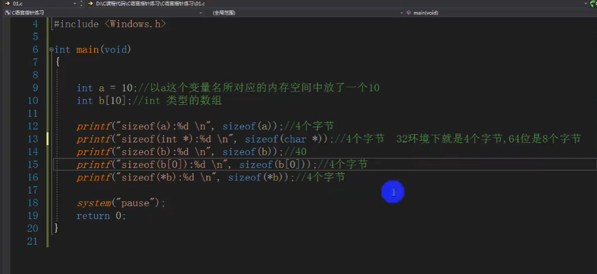

void：声明函数无返回值或无参数，声明无类型指针，显示丢弃运算结果。（C89标准新增）

char：字符型类型数据，属于整型数据的一种。（K&R时期引入）

int：整型数据，表示范围通常为编译器指定的bai存字节长。（K&R时期引入）

float：单精度浮点型数据，属于浮点数据的一种。（K&R时期引入）

double：双精度浮点型数据，属于浮点数据的一种。（K&R时期引入）

## 数据类型的本质

数据类型可理解为创建变量的模具：是固定内存大小的别名。

数据类型的作用：编译器**预算**对象（变量）分配的内存空间大小。

> 注意：数据类型只是模具，编译器并没有分配空间，只有根据类型（模具）创建变量（实物），编译器才会分配空间。

数据类型和变量的关系：通过数据类型定义变量

## 类型匹配

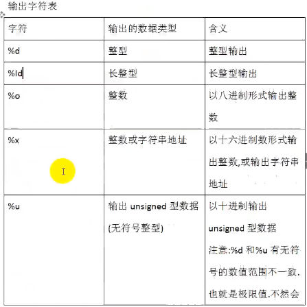

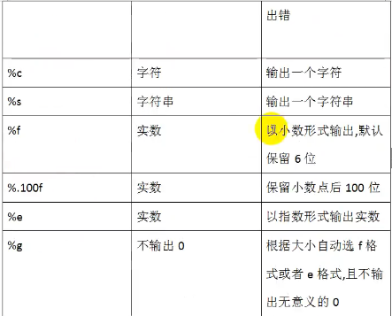

printf不会执行自动类型转换

==int，float此处都占四个字节==

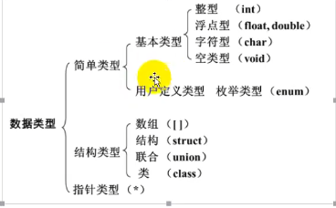

## 数据类型的差别

差别：

- 解析方式不一样（不同的位置代表的含义不同？）

- 长度不同

共同点：

- 存储方式都是二进制

一个变量的地址，我们一般都是知道开头，由数据类型推算结尾。

内存的地址都是一个个排好的小格子

当用错误的的方式解析一个数据类型时，就是出现了对内存中占用地址的长度判断不同？存在了少或者多的差异，出现垃圾数据

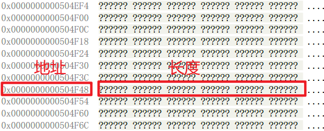

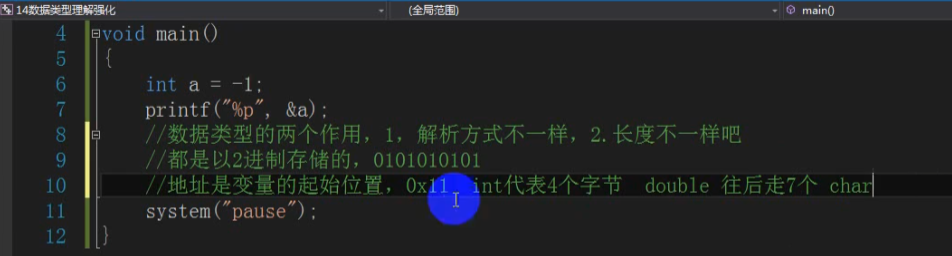

## 符号

数据的溢出，超过数据类型的范围

> 整数的正负一—有符号和无符号
>
> 前面论述的只关注了正整数，==负数在计算机中该如何表示==呢?正数和负数是两种情况，计算机又是一个很笨的东西，要区分两种情况，就必须有一个标记来表示是哪种情况。两种情况，用二进制的一位刚好可以表示，比如用0表示正数，1表示负数，刚好可以区分清楚。那么一个4字节也就是32位存储单元的整数，应该用哪一位表示数据的正负号呢?最简单的方法就是用最高位（就是最左边那一位）了。
>
> C语言中确实就是用最高位来表示一个整数的正负号，0表示为正，1表示为负。

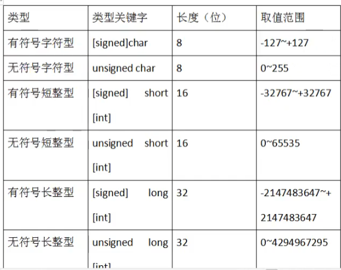

数据有值有正负，有极限

数据的运算必须建立在数据的极限范围内

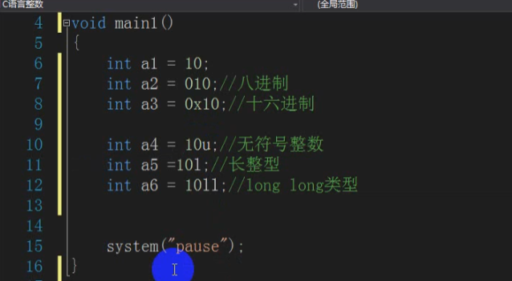

short int 用于嵌入式开发

long int存储手机号，身份证号的等

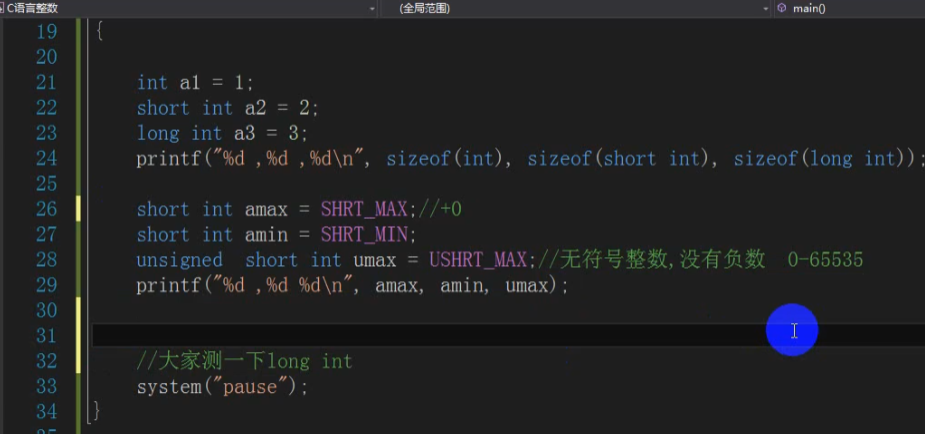

## 小数

float 单精度，float  a = 10.1f;

- 有效位数6-7

double 双精度

- 默认是15-16位

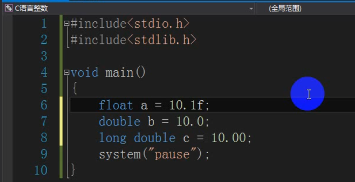

### 科学计数法

12.3e3==12.3*10^3^   e代表基数10，3代表3次方

1.2345e+002==1.2345*10的正2次方

## 字符变量和字符常量

没有string类型，string本质是char的数组

`chara='a'；//字符类型是单引号`，‘a'输出长度为4，为了兼容性

字符变量和字符常量可以不一样，所以当字符常量比字符变量大时会被切断至适合字符变量

wchar_tb='和’：//宽字符，存储汉字，占3个字节，其中包含\0占一个，则汉子占两个

### 字符串

printf("%d",sizeof("A"))；//双引号，字符串’\0'结尾

字符串’\0'结尾，\0就占据一个字节，所以字符串默认至少占一个字节

所以输出字符串“A”，长度=2

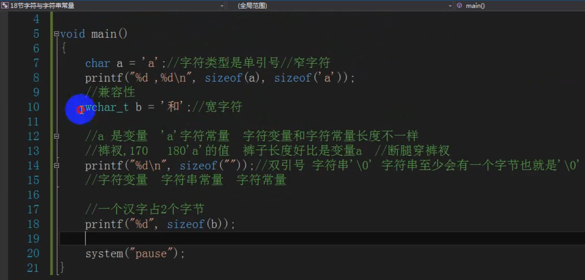

## 隐式类型转换

字节占得少的类型会转换到占得多的

小的变大的

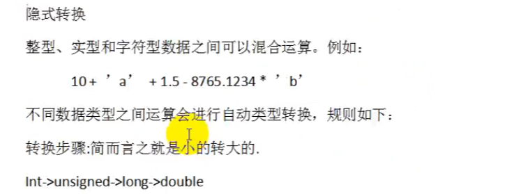

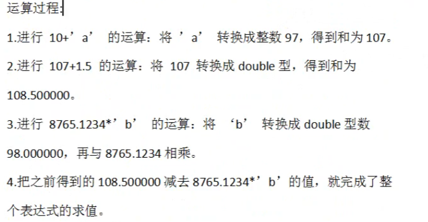

## 强制类型转换

大的转小的，破坏

浮点数转整数没有四舍五入，会直接切断

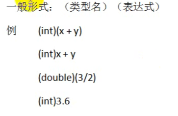

当声明一个变量的时候，变量的空间就已经能决定了

计算机不识别字符，只是在转换成ASCII码，

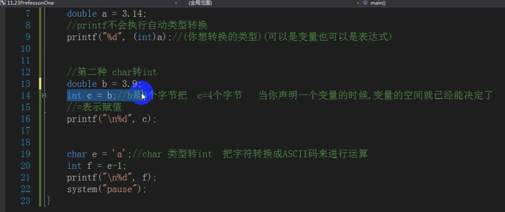

1. 当赋值给一个已经声明的类型的时候会发生类型转换

2. Char 类型转变其它类型是ASCll码的相加或者相减.

精度损失问题，较高类型向较低类型转换时可能发生

