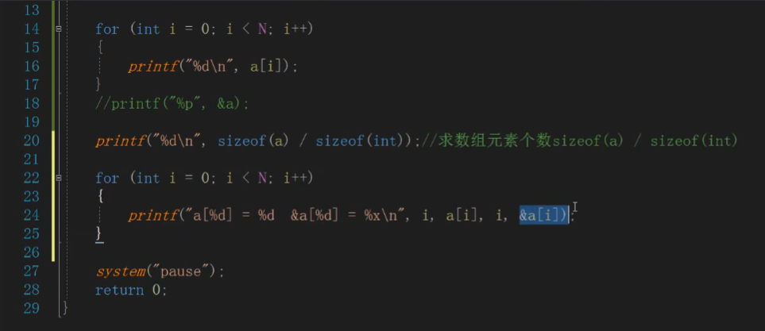

## 数组

数组是一块按连续的内存，数组个数指定开辟多大的内存

- 当数组元素确定的时候，数组个数可以省略

- 确定数组个数，但元素不够的话，会自动填充0

- 下标从0开始

越界会出问题，

%p，%x都可以用来打印数组

## 二维数组

行列

格式：

`int a[3][5]={{1,2,3,4,5}，{6,7,8,9，10}，{11,12，13，14,15}};`

在内存中同样是线性的连续存储

`a[i/5][i%5]=i;`对二维数组进行初始化

/ 是除法，取商，不考虑余数
% 是除法，取余数，不考虑商

## 

数组首元素地址和数组的地址是一致的

步长不一样会导致+1后的结果不一样

一个数组中10个元素，元素加1是加4个字节，一个元素4个字节，数组+1是加40个字节

直接写数组名输出是数组首元素

