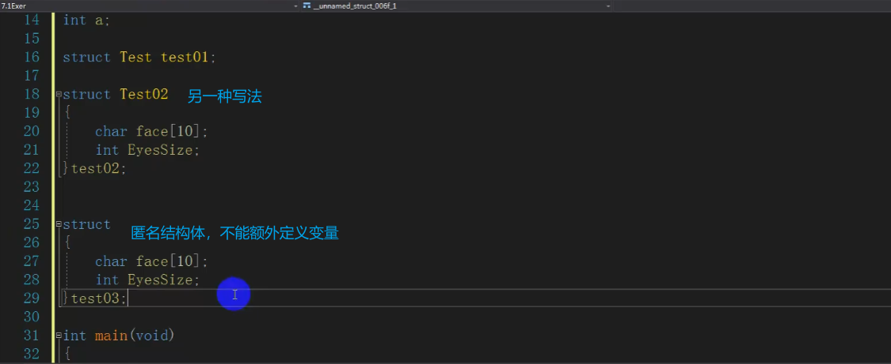

# 结构体

自定义的一种数据类型

区别于规定好的 int double等

链表，图等数据结构都是结构体

C++中叫类

## 定义

struct Test(自定义一个名字)

​	Test02直接在结构体下面定义变量

省略struct的写法定义

## 赋值

### 变量之间的相互赋值

## 初始化

-> 箭头运算符通过地址调用变量

数组名本质是指针

Test结构体它声明的时候是不开辟内存的

必须初始化对象之后才开辟空间

## 结构体的内存对齐（结构体的大小）

结构体的大小并不是进行内部成员变量的加和。

1.内存对齐的规则：

简言之如下

①结构体第一个成员与结构体变量的地址相同。

②其他成员变量都要对齐到对齐数的整数倍的地址处

③对齐数=Min（编译器默认的对齐数，该成员大小）取最小值。（VS默认值为8，Linux默认值为4）

每个成员变量均有一个对齐数。

④结构体总大小为最大对齐数的整数倍。

⑤结构体内有嵌套的结构体时，则其最大对齐数就是嵌套的结构体的大小。

 举例：

	struct stu
	{
		int a;
		double b;
		short c;
	};
	printf("%d\n", sizeof(struct stu));		//24 最大对齐数为8，short要对齐到8，
					//又因为必须是最大对齐数的整数倍，所以是24.
2.那么问题来了，对齐数可以修改吗。答案是可以的。这里需要用到预处理指令。如下：

pragma pack(4)

int main()
{
	struct stu
	{
		int a;
		double b;
		short c;
	};
	printf("%d\n", sizeof(struct stu));		//16 最大对齐数为8，short对齐到4即可.											
3.为了让结构体尽可能地小，我们可以将占空间小的成员变量集中在一起。

如：

形式1：

	struct stu
	{
		char a;
		int b;
		char c;
	};
	printf("%d\n", sizeof(struct stu));		//12  最后一个成员变量由于内存对齐需要对齐到4，
	//并且最后结果要是最大对齐数的整数倍，故为12
形式2：

struct stu
	{
		char a;
		char c;
		int b;		
	};
	printf("%d\n", sizeof(struct stu));		//8  	节省空间
显然，形式2比形式1节省空间，当结构体成员变量较多时，形式2的代码则会更有效率。

注意：结构体内成员变量的声明顺序就是在内存中的存储顺序。
例：

由此就可以清晰地看到结构体变量第一个成员变量的地址与结构体变量的地址是相同的，先声明的变量地址靠前。
------------------------------------------------
版权声明：本文为CSDN博主「Keepen」的原创文章，遵循CC 4.0 BY-SA版权协议，转载请附上原文出处链接及本声明。
原文链接：https://blog.csdn.net/Wz_still_shuai/article/details/88125314

## 内存四区

## 数组

### 静态

### 动态

使用完开辟的空间要free

## 嵌套指针

 

在堆上开辟动态内存

