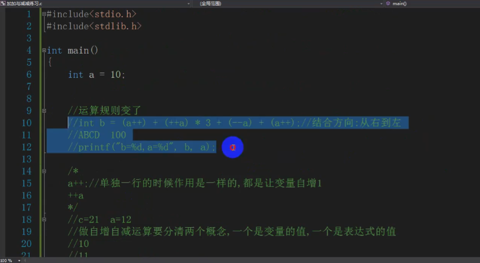
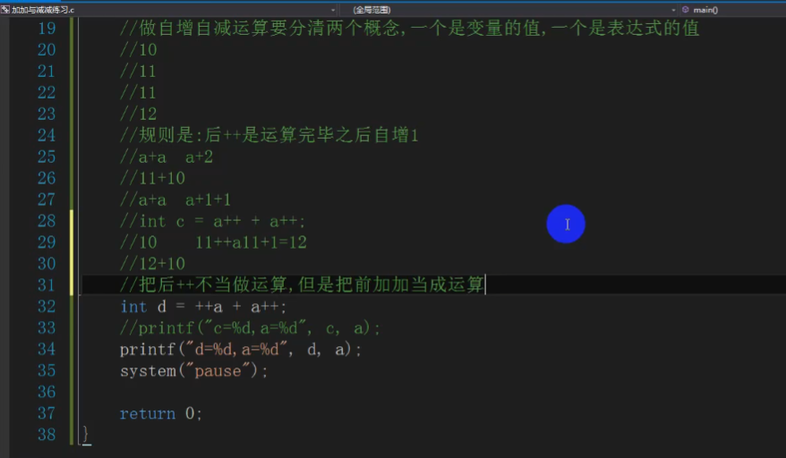
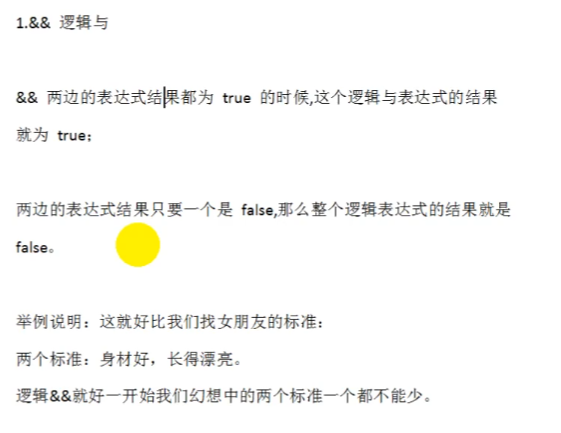
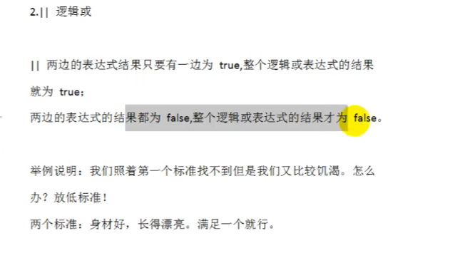
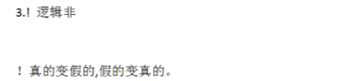
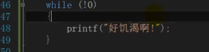
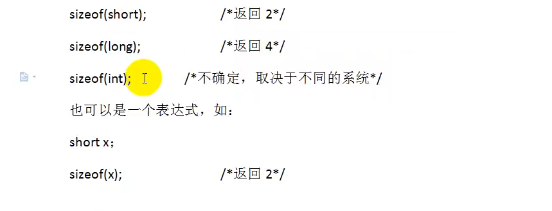
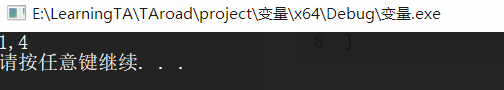

# 运算符

+

-

*

/

%

==printf("%5.3f",a);
其中5表示一共保留的位数，3表示小数点后保留的位数。==

==%运算符只能用于整数相除求余，运算结果的符号与被除数相同。==

## 自增自减运算符

++

-\-

运算顺序比加减乘除高，其加入++的运算顺序会从右往左算


如果单独使用，不管是前++还是后++，最终的结果都是给这个变量加1

前++：先给这个变量自身加1,然后带着这个加1后的值去参与运算

> 奉子成婚

后++：先拿原值参与运算，运算完毕后，再将这个变量自身加1

> 结婚后再生孩子

小心在输出中使用++的结果，可能会出现变量还没有自增就参与运算





下表将按运算符优先级从高到低列出各个运算符，具有较高优先级的运算符出现在表格的上面，具有较低优先级的运算符出现在表格的下面。在表达式中，较高优先级的运算符会优先被计算。

| 类别       | 运算符                            | 结合性   |
| :--------- | :-------------------------------- | :------- |
| 后缀       | () [] -> . ++ - -                 | 从左到右 |
| 一元       | + - ! ~ ++ - - (type)* & sizeof   | 从右到左 |
| 乘除       | * / %                             | 从左到右 |
| 加减       | + -                               | 从左到右 |
| 移位       | << >>                             | 从左到右 |
| 关系       | < <= > >=                         | 从左到右 |
| 相等       | == !=                             | 从左到右 |
| 位与 AND   | &                                 | 从左到右 |
| 位异或 XOR | ^                                 | 从左到右 |
| 位或 OR    | \|                                | 从左到右 |
| 逻辑与 AND | &&                                | 从左到右 |
| 逻辑或 OR  | \|\|                              | 从左到右 |
| 条件       | ?:                                | 从右到左 |
| 赋值       | = += -= *= /= %=>>= <<= &= ^= \|= | 从右到左 |
| 逗号       | ,                                 | 从左到右 |

计算时记得从右往左算的时候要注意算了一部分变量就会被赋值

## 关系运算符

< <= > >= 

## 逻辑运算符

**注意：c语言当中没有Bool类型，但是同样有真假的概念.**
**C语言表示逻辑运算的结果时，以数值1代表真，以0代表假**

**在判断一个量是否为真时，以0代表假，以非0代表真**

### 与&&



### 或||



### 非！





C中非0即真

## sizeof 运算符

计算数据的字节数

sizeof是个单目运算符，用来计算操作数在内存中占据的字节数，其操作数既可以是括在圆括号中的类型标识符，其返回值是size_t类型，即无符号整数



```c
void main()
{
	int b = 1;
	char a = "1";
	printf("%d,%d\n", sizeof(a), sizeof(b));
	system("pause");

}
```



