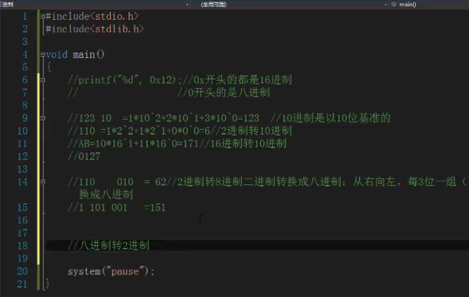
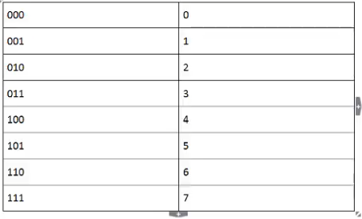
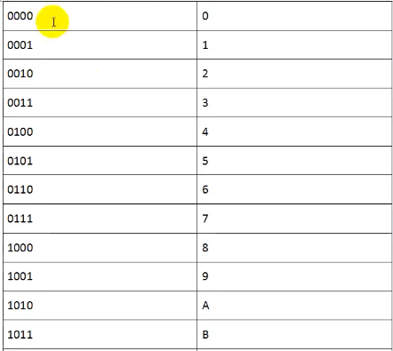
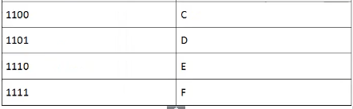
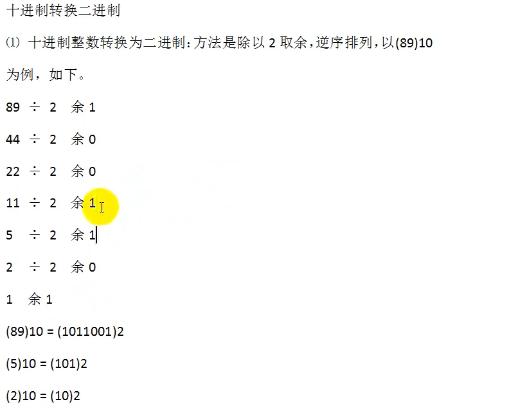
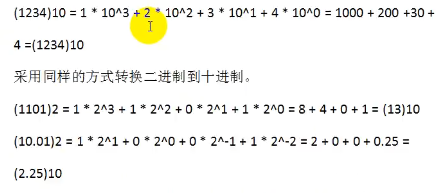
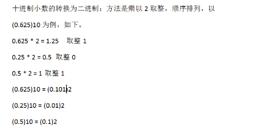

# 进制

任何进制不允许出现等于进制的数字

十六进制 0x开头

八进制 0开头 

## 二进制与十六进制之间的转换

**二进制转换成八进制：**

从右向左，每3位一组（不足3位左补0），转换成八进制

就是把二进制的数字三位一组分开，去表里找对应的值，按前后顺序排列

**八进制转换成二进制：**

用3位二进制数代替每一位八进制数

### 二进制与十六进制之间的转换

**二进制转换成十六进制：**

从右向左，每4位一组（不足4位左补0），转换成十六进制

**十六进制转换成二进制：**

用4位二进制数代替每一位十六进制数

## 二进制和十进制的转换

**十进制转换二进制：**

不断地把商除以2取余数，再把结果反着排列

**二进制转换为十进制**

十进制是逢十进一，由数字符号0,1,2,3,4,5,6,7,8,9组成，可以这样分析十进制数：

**十进制小数转换二进制：**

1、有bai无返回值du

void main没有返回zhi值，int main有返回值。

2、返回值类型

int main返回int类型的数据，void main不返dao回。
但是在zhuanC语言推荐写法中，建议使用int main，因为在有的编译器虽然viod main可以通过编译，但在其他编译器就会报错。为了代码拥有更好的可移植性，一般写int main。