# 修改

## 管理修改

Git比其他版本控制系统设计得优秀是因为Git跟踪并管理的是修改，而非文件

什么是修改：新增，删除，更改，新建

示例，新增

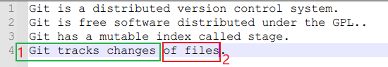

第一次新增后add，第二次不add，直接commit

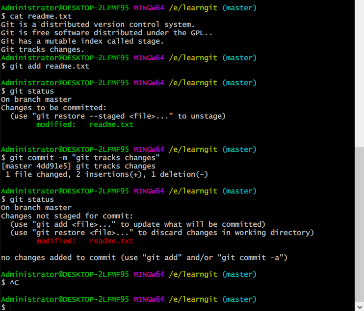

查看第一次修改和第二次修改差异

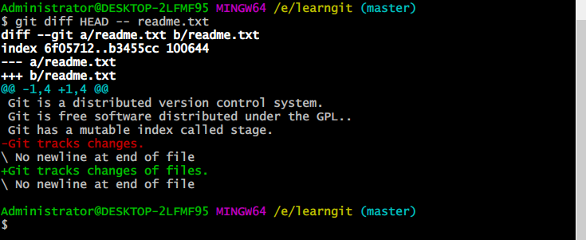

提交第二次修改

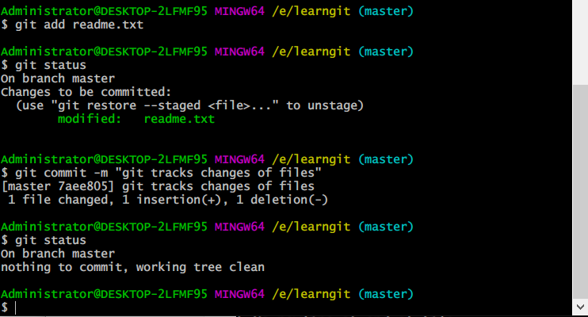


总结：

每次修改，如果不用`git add`到暂存区，那就不会加入到`commit`中

问题：cat xxx，显示的是最终修改后内容，而不是提交的内容

- cat命令不是git命令，而是linux bash命令而，它是用来显示文件内容的，也就是说显示的是工作区的文件，而不是分支或暂存区的内容。

  所以commit的确实是第一次修改，暂存区和HEAD分支内都是第一次修改完的状态，而工作区是保存的第二次修改完的状态，cat显示的是第二次修改完的工作区的内容。

## 撤销修改

新增后撤销

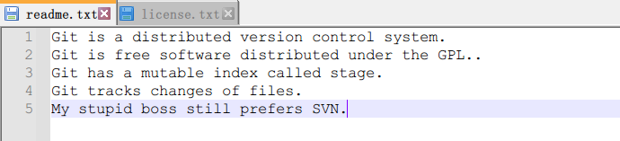

`git checkout -- file`可以丢弃工作区的修改：

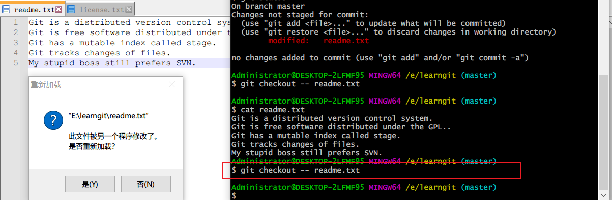

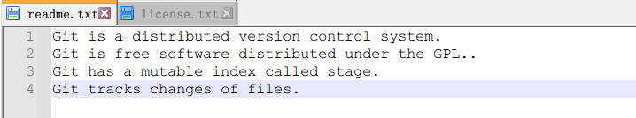

命令`git checkout -- readme.txt`意思就是，把`readme.txt`文件在工作区的修改全部撤销，这里有两种情况：

- `readme.txt`自修改后还没有被放到暂存区，现在，撤销修改就回到和版本库一模一样的状态；还没有add时，可以直接退回，如上图

- `readme.txt`已经添加到暂存区后，又作了修改，现在，撤销修改就回到添加到暂存区后的状态。（必须在没有commit前，撤销回到暂存区之前状态）

总之，就是让这个文件回到最近一次`git commit`或`git add`时的状态。

> ==`git checkout -- file`命令中的`--`很重要，没有`--`，就变成了“切换到另一个分支”的命令==

在把文件修改添加到暂存区后，想要撤回，需要`git reset HEAD <file>`, unstage返回工作区

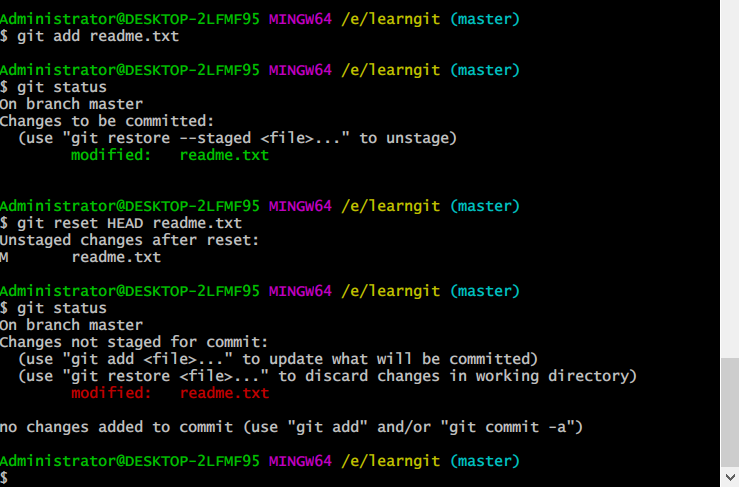

再用`git checkout -- file`撤销工作区修改

最后：

假设不但改错了东西，还从暂存区提交到了版本库，可以版本回退](https://www.liaoxuefeng.com/wiki/896043488029600/897013573512192)

不过条件是还没有把自己的本地版本库推送到远程

### 总结

场景1：当你改乱了工作区某个文件的内容，想直接丢弃工作区的修改时，用命令`git checkout -- file`。

场景2：当你不但改乱了工作区某个文件的内容，还添加到了暂存区时，想丢弃修改，分两步，第一步用命令`git reset HEAD <file>`，就回到了场景1，第二步按场景1操作。

场景3：已经提交了不合适的修改到版本库时，想要撤销本次提交，参考版本回退，不过前提是没有推送到远程库

## 删除文件

先新建一个文件，再add，再rm 和linux命令相同，

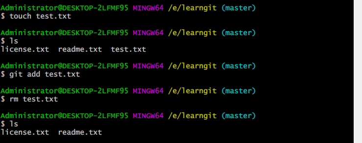

Git知道你删除了文件，因此，工作区和版本库就不一致了，`git status`命令会立刻告诉你哪些文件被删除了：

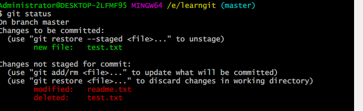

现在你有两个选择，一是确实要从版本库中删除该文件，那就用命令`git rm`删掉，并且`git commit`：

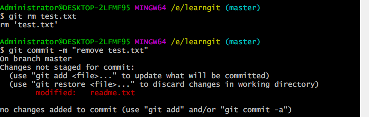

现在，文件就从版本库中被删除了

>  ==先手动删除文件，然后使用git rm <file>和git add<file>效果是一样的==

另一种情况是删错了，因为版本库里还有呢，所以可以很轻松地把误删的文件恢复到最新版本：

```
$ git checkout -- test.txt
```

`git checkout`其实是用版本库里的版本替换工作区的版本，无论工作区是修改还是删除，都可以“一键还原”。

 注意：从来没有被添加到版本库就被删除的文件，是无法恢复的！

### 小结

命令`git rm`用于删除一个文件。如果一个文件已经被提交到版本库，那么你永远不用担心误删，但是要小心，你只能恢复文件到最新版本，你会丢失**最近一次提交后你修改的内容**。

