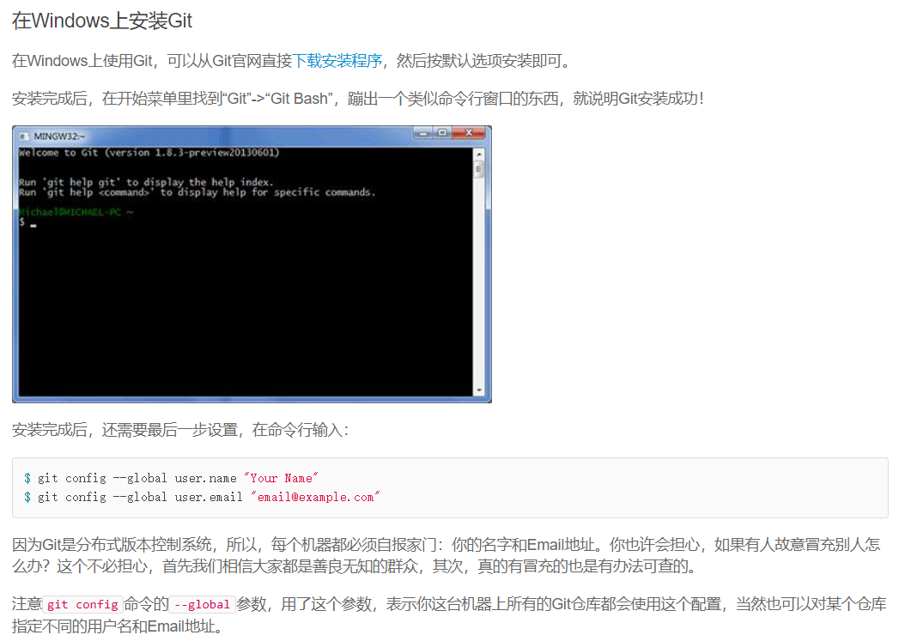
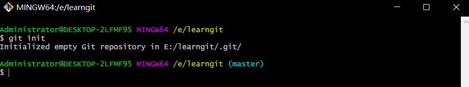
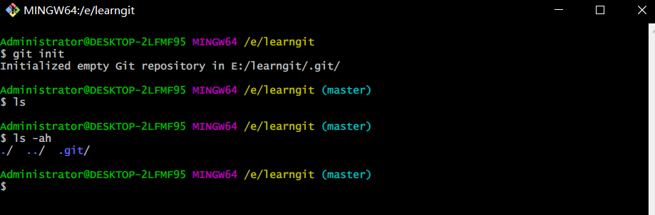
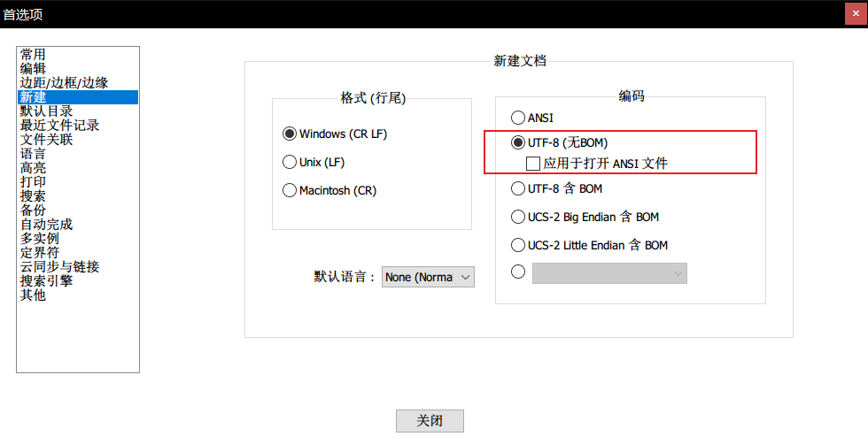

## 安装



 

## 初始化Git仓库

第一步

```linux
$ mkdir learngit
$ cd learngit
$ pwd
/Users/michael/learngit
```

如果使用Windows系统，为了避免遇到各种莫名其妙的问题，请确保目录名（包括父目录）不包含中文。

第二步，通过`git init`命令把这个目录变成Git可以管理的仓库：

```
$ git init
Initialized empty Git repository in /Users/michael/learngit/.git/
```



当前目录下多了一个`.git`的目录，这个目录是Git来跟踪管理版本库的，没事千万不要手动修改这个目录里面的文件，不然改乱了，就把Git仓库给破坏了。

如果没有看到`.git`目录，那是因为这个目录默认是隐藏的，用`ls -ah`命令就可以看见。



## 把文件添加到Git库

所有的版本控制系统，其实只能跟踪文本文件的改动，比如TXT文件，网页，所有的程序代码等等，Git也不例外。

> 版本控制系统可以告诉你每次的改动，比如在**第5行加了一个单词“Linux”，在第8行删了一个单词“Windows”**。而==图片、视频这些二进制文件==，虽然也能由版本控制系统管理，但没法跟踪文件的变化，只能把二进制文件每次改动串起来，也就是只知道图片从100KB改成了120KB，但==到底改了啥，版本控制系统不知道==，也没法知道。

因为word文件是二进制的，所以版本控制系统无法跟踪word文件改动

==如果要真正使用版本控制系统，就要以纯文本方式编写文件。==

编码方式只推荐UTF-8，保证所有语言编码方式一样，无冲突，支持所有平台

> 千万不要使用Windows自带的**记事本**编辑任何文本文件。原因是Microsoft开发记事本的团队使用了一个非常弱智的行为来保存UTF-8编码的文件，他们自作聪明地在每个文件开头添加了0xefbbbf（十六进制）的字符，会遇到很多不可思议的问题

Notepad++的默认编码设置为UTF-8 without BOM



和把大象放到冰箱需要3步相比，把一个文件放到Git仓库只需要两步：

创建一个readme.txt

第一步，用命令`git add`告诉Git，把文件添加到仓库：

```
$ git add readme.txt
```

放到`learngit`目录下（子目录也行）

第二步，用命令`git commit`告诉Git，把文件提交到仓库：

```
$ git commit -m "wrote a readme file"
[master (root-commit) eaadf4e] wrote a readme file
 1 file changed, 2 insertions(+)
 create mode 100644 readme.txt
```

==`-m`后面输入的是本次提交的说明==，可以输入任意内容，当然最好是有意义的，这样你就能从历史记录里方便地找到改动记录。

`git commit`命令执行成功后会告诉你，`1 file changed`：1个文件被改动（我们新添加的readme.txt文件）；`2 insertions`：插入了两行内容（readme.txt有两行内容）。

## 问题

为什么Git添加文件需要`add`，`commit`一共两步呢？因为`commit`可以一次提交很多文件，所以你可以多次`add`不同的文件，比如：

```
$ git add file1.txt
$ git add file2.txt file3.txt
$ git commit -m "add 3 files."
```


Q：输入`git add readme.txt`，得到错误：`fatal: not a git repository (or any of the parent directories)`。

A：Git命令必须在Git仓库目录内执行（`git init`除外），在仓库目录外执行是没有意义的。


Q：输入`git add readme.txt`，得到错误`fatal: pathspec 'readme.txt' did not match any files`。

A：添加某个文件时，该文件必须在当前目录下存在，用`ls`或者`dir`命令查看当前目录的文件，看看文件是否存在，或者是否写错了文件名。

