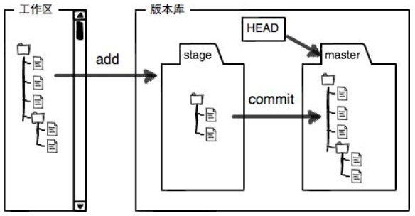
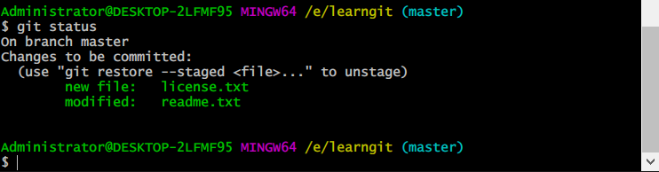
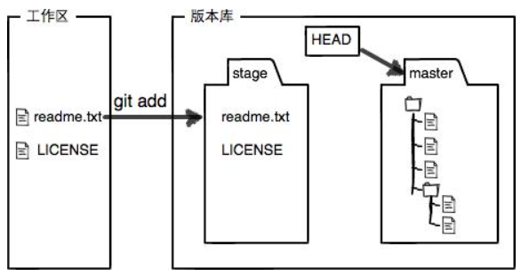
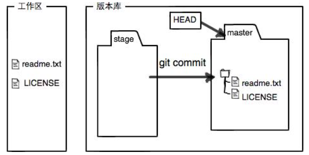

# 工作区和暂存区

Git和其他版本控制系统如SVN的一个不同之处就是有暂存区的概念

## 工作区

Working Directory

之前创建的learngit文件夹就是工作区

## 版本库 

Repository

工作区有一个隐藏目录`.git`，这个不算工作区，而是Git的版本库。

Git的版本库里存了很多东西，其中==最重要的就是称为stage（或者叫index）的暂存区==，还有Git为我们自动创建的第一个分支`master`，以及指向`master`的一个指针叫`HEAD`。

第一步用`git add`把文件添加进去，实际上就是把文件修改添加到暂存区；

第二步用`git commit`提交更改，实际上就是把暂存区的所有内容提交到当前分支。

把需要提交的文件修改通通放到暂存区，然后，一次性提交暂存区的所有修改

新添加一个license文件，并修改之前的readme文件

新的工作区和暂存区

`git add`命令实际上就是把要提交的所有修改放到暂存区（Stage）

`git commit`**一次性**把暂存区的所有修改提交到分支

