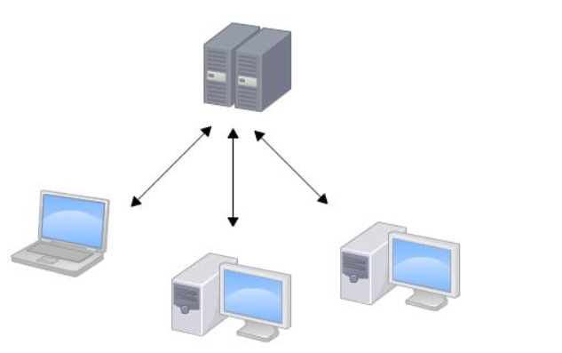
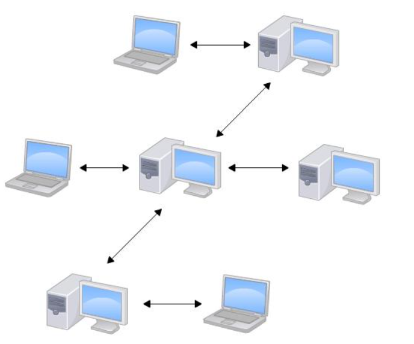

Git是分布式版本控制系统

## 集中式版本控制系统

版本库是集中存放在中央服务器

干活用自己的电脑，新版本从中央服务器里拿，做完再传回去                                                                                                                                                                                                                                                                                                                                                                                                                                                                                                                                                                                                                                                                                                                                                                                                                                                                                                                                                                                                                                               

缺点：集中式版本控制系统最大的毛病就是必须联网才能工作

## 分布式版本控制系统

分布式版本控制系统根本没有“中央服务器”，每个人的电脑上都是一个完整的版本库

每个人的电脑上都是一个完整的版本库，不需要联网，每个人修改完只要传给别人即可

分布式版本控制系统通常也有一台充当“中央服务器”的电脑，但这个服务器的作用仅仅是用来方便“交换”大家的修改

CVS作为最早的开源而且免费的集中式版本控制系统，由于CVS自身设计的问题，会造成提交文件不完整，版本库莫名其妙损坏的情况

SVN修正了CVS的一些稳定性问题，是目前用得最多的集中式版本库控制系统。

IBM的ClearCase（以前是Rational公司的，被IBM收购了），特点是安装比Windows还大，运行比蜗牛还慢

微软集中式版本控制系统叫VSS，集成在Visual Studio中，反人类的设计

