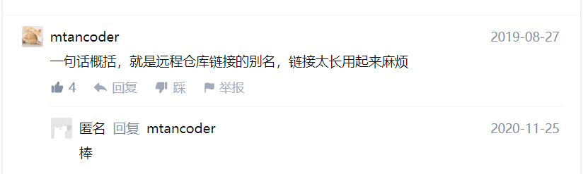

作者：田雅文
链接：https://www.zhihu.com/question/27712995/answer/39946123
来源：知乎
著作权归作者所有。商业转载请联系作者获得授权，非商业转载请注明出处。


你的代码库(repository)可以存放在你的电脑里，同时你也可以把代码库托管到Github的服务器上。

在默认情况下，origin指向的就是你本地的代码库托管在Github上的版本。

我们假设你首先在github上创建了一个Repository，叫做repository，假设你的Github ID是user1,这个时候指向你的代码库的链接是

```text
https://github.com/user1/repository
```

如果你在terminal里输入

```text
git clone https://github.com/user1/repository
```

那么git就会在本地拷贝一份托管在github上的代码库
这个时候你cd到repository
然后输入

```text
git remote -v
```

你会看到控制台输出

```text
origin https://github.com/user1/repository.git (fetch)
origin https://github.com/user1/repository.git (push)
```

也就是说git为你默认创建了一个指向远端代码库的origin（因为你是从这个地址clone下来的）

再假设现在有一个用户user2 fork了你个repository，那么他的代码库链接就是这个样子

```text
https://github.com/user2/repository
```

如果他也照着这个clone一把，然后在他的控制台里输入

```text
git remote -v
```

他会看的的就是

```text
origin https://github.com/user2/repository.git (fetch)
origin https://github.com/user2/repository.git (push)
```

可以看的origin指向的位置是user2的的远程代码库

这个时候，如果user2想加一个远程指向你的代码库，他可以在控制台输入

```text
git remote add upstream https://github.com/user1/repository.git
```

然后再输入一遍 git remote -v

输出结果就会变为

```text
origin https://github.com/user2/repository.git (fetch)
origin https://github.com/user2/repository.git (push)
upstream https://github.com/user1/repository.git (push)
upstream https://github.com/user1/repository.git (push)
```

增加了指向user1代码库的upstream，也就是之前对指向位置的命名。

总结来讲，顾名思义，origin就是一个名字，它是在你clone一个托管在Github上代码库时，git为你默认创建的指向这个远程代码库的标签



