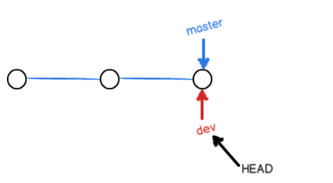

# 分支管理

分支就是科幻电影里面的平行宇宙

平行宇宙是可以合并的


分支可以保证在开发新的功能时，在另一个区域开发，不影响原区域运作，最后都做完合并即可

SVN等分支功能切换太慢，不好用

## 创建与合并

版本每次提交，Git都把它们串成一条时间线，这条时间线就是一个分支

只有一条时间线在Git里叫主分支，即`master`分支

`HEAD`严格来说不是指向提交，而是指向`master`，`master`才是指向提交的，所以，`HEAD`指向的就是当前分支

一开始的时候，`master`分支是一条线，Git用`master`指向最新的提交，再用`HEAD`指向`master`，就能确定当前分支，以及当前分支的提交点


每次提交，`master`分支都会向前移动一步，这样，随着你不断提交，`master`分支的线也越来越长。

当我们创建新的分支，例如`dev`时，Git新建了一个指针叫`dev`，指向`master`相同的提交，再把`HEAD`指向`dev`，就表示当前分支在`dev`上



> 所以Git创建一个分支很快，因为除了增加一个`dev`指针，修改`HEAD`的指向，工作区的文件都没有任何变化

从现在开始，对工作区的修改和提交就是针对`dev`分支了，比如新提交一次后，`dev`指针往前移动一步，而`master`指针不变

假如在`dev`上的工作完成了，就可以把`dev`合并到`master`上。Git怎么合并呢？最简单的方法，就是直接把`master`指向`dev`的当前提交，就完成了合并


> 所以Git合并分支也很快，仅修改指针，工作区内容不变

合并完分支后，甚至可以删除`dev`分支。删除`dev`分支就是把`dev`指针给删掉，删掉后，我们就剩下了一条`master`分支


### 创建

- 创建 dev 分支

```
$ git checkout -b dev
```

`git checkout`命令加上`-b`参数表示创建并切换，相当于以下两条命令：

```
$ git branch dev // 创建
$ git checkout dev // 切换
Switched to branch 'dev'
```


切换分支这个动作，用`switch`更科学。最新版本的Git提供了新的`git switch`命令来切换分支：

创建并切换到新的`dev`分支，可以使用：

```
$ git switch -c dev
```

直接切换到已有的`master`分支，可以使用：

```
$ git switch master
```

使用新的`git switch`命令，比`git checkout`要更容易理解


- 用`git branch`命令查看当前分支：
  - `git branch`命令会列出所有分支，当前分支前面会标一个`*`号


- 在dev分支修改readme文件并提交


- 切换回master分支，可以看到文件内容保持原来。新添加的第5行不见了


因为那个提交是在`dev`分支上，而`master`分支此刻的提交点并没有变


- 把`dev`分支的工作成果合并到`master`分支上
  - `git merge`命令用于合并指定分支到当前分支


合并后，再查看`readme.txt`的内容，就可以看到，和`dev`分支的最新提交是完全一样的

 `Fast-forward`信息，Git告诉我们，这次合并是“快进模式”，也就是直接把`master`指向`dev`的当前提交，所以合并速度非常快

不是每次合并都能`Fast-forward`


- 合并后删除dev分支


**Git鼓励你使用分支完成某个任务，合并后再删掉分支，这和直接在`master`分支上工作效果是一样的，但过程更安全。**

### 小结

Git鼓励大量使用分支：

查看分支：`git branch`

创建分支：`git branch <name>`

切换分支：`git checkout <name>`或者`git switch <name>`

创建+切换分支：`git checkout -b <name>`或者`git switch -c <name>`

合并某分支到当前分支：`git merge <name>`

删除分支：`git branch -d <name>`

## 解决冲突

创建新分支


修改readme文件并提交


Git会自动提示我们当前`master`分支比远程的`master`分支要超前1个提交


在主分支再次修改readme文件，并提交


现在，`master`分支和`feature1`分支各自都分别有新的提交


这种情况下，Git无法执行“快速合并”，只能试图把各自的修改合并起来，但这种合并就可能会有冲突


`git status`提示哪里有冲突


直接查看文件会显示冲突内容，Git用`<<<<<<<`，`=======`，`>>>>>>>`标记出不同分支的内容，HEAD表示当前分支


修改后提交


现在，`master`分支和`feature1`分支变成了下图所示：


`git log`查看


详细查看：

```
$ git log --graph --pretty=oneline --abbrev-commit
```


### 小结

当Git无法自动合并分支时，就必须首先解决冲突。解决冲突后，再提交，合并完成。

解决冲突就是把Git合并失败的文件手动编辑为我们希望的内容，再提交。

用`git log --graph`命令可以看到分支合并图。

## 分支管理策略

通常，合并分支时，如果可能，Git会用`Fast forward`模式，但这种模式下，删除分支后，会丢掉分支信息。

如果要强制禁用`Fast forward`模式，Git就会在merge时生成一个新的commit，这样，从分支历史上就可以看出分支信息

- 首先，仍然创建并切换`dev`分支：


- 提交


- 切换回master分支，合并`dev`分支，请注意`--no-ff`参数，表示禁用`Fast forward`：

  > ==因为本次合并要创建一个新的commit，所以加上`-m`参数，把commit描述写进去==

  ```
  $ git merge --no-ff -m "merge with no-ff" dev
  ```


- 查看分支历史


如果执行了 Fast Forward，开发者根本不会看到这个分支，就像在 master 直接 commit 一样


这张图容易歧义


在实际开发中，我们应该按照几个基本原则进行分支管理：

首先，`master`分支应该是非常稳定的，也就是仅用来发布新版本，平时不能在上面干活；

那在哪干活呢？干活都在`dev`分支上，也就是说，`dev`分支是不稳定的，到某个时候，比如1.0版本发布时，再把`dev`分支合并到`master`上，在`master`分支发布1.0版本；

你和你的小伙伴们每个人都在`dev`分支上干活，每个人都有自己的分支，时不时地往`dev`分支上合并就可以了。

所以，团队合作的分支看起来就像这样：


合并分支时，加上`--no-ff`参数就可以用普通模式合并，合并后的历史有分支，能看出来曾经做过合并，而`fast forward`合并就看不出来曾经做过合并

## Bug分支

在Git中，每个bug都可以通过一个新的临时分支来修复，修复后，合并分支，然后将临时分支删除

工作只进行到一半无法提交，但临时需要做其他工作时

Git提供了一个`stash`功能，可以把当前工作现场“储藏”起来，等以后恢复现场后继续工作：

```
$ git stash
```

在哪修Bug，就在哪里创建临时分支


改完提交后回到原来分支，回去前查看工作区

```
$ git status
```

用`git stash list`命令查看工作区保存处，需要恢复

- 用`git stash apply`恢复，恢复后stash内容并不删除，需要用`git stash drop`来删除

- 用`git stash pop`，恢复的同时把stash内容也删了

在master分支上修复了bug后，我们要想一想，dev分支是早期从master分支分出来的，所以，这个bug其实在当前dev分支上也存在

同样的bug，要在dev上修复，只需要把Bug提交所做的修改“复制”到dev分支。注意：只复制这个提交所做的修改，并不是把整个master分支merge过来

**Git专门提供了一个`cherry-pick`命令，让我们能复制一个特定的提交到当前分支：** 

```
git cherry-pick 4c805e2（之前提交的ID）
```

Git会自动给dev分支做一次提交，生成的commit是不同的，仅内容相同

> 既然可以在master分支上修复bug后，在dev分支上可以“重放”这个修复过程，那么直接在dev分支上修复bug，然后在master分支上“重放”也可以，不过仍然需要`git stash`命令保存现场，才能从dev分支切换到master分支

### 小结

修复bug时，我们会通过创建新的bug分支进行修复，然后合并，最后删除；

当手头工作没有完成时，先把工作现场`git stash`一下，然后去修复bug，修复后，再`git stash pop`，回到工作现场；

在master分支上修复的bug，想要合并到当前dev分支，可以用`git cherry-pick <commit>`命令，把bug提交的修改“复制”到当前分支，避免重复劳动


## Feature分支

创建一个新的分支，开始编写新功能，并添加提交，返回原分支

合并前删除新功能

未合并前删除会出现问题


开发一个新feature，最好新建一个分支；

如果要丢弃一个没有被合并过的分支，可以通过`git branch -D <name>`强行删除。

## 多人协作

```
$ git remote -v
origin  git@github.com:michaelliao/learngit.git (fetch)
origin  git@github.com:michaelliao/learngit.git (push)
```

显示了可以抓取和推送的`origin`的地址。如果没有推送权限，就看不到push的地址。

### 推送分支

推送分支，就是把该分支上的所有本地提交推送到远程库。推送时，要指定本地分支，这样，Git就会把该分支推送到远程库对应的远程分支上：

```
$ git push origin master
```

如果要推送其他分支，比如`dev`，就改成：

```
$ git push origin dev
```

并不是一定要把本地分支往远程推送：

- `master`分支是主分支，因此要时刻与远程同步；
- `dev`分支是开发分支，团队所有成员都需要在上面工作，所以也需要与远程同步；
- bug分支只用于在本地修复bug，没必要推到远程
- feature分支是否推到远程，取决于是否在此合作开发

### 抓取分支

多人协作时，大家都会往`master`和`dev`分支上推送各自的修改

- 当协同开发时，多人同时修改一个文件，并推送，已经有人修改了A文件并推送后，自己推送同样的A文件修改会冲突

Git会提示，先用`git pull`把最新的提交从`origin/dev`抓下来，然后，在本地合并，解决冲突，再推送：

- `git pull`若失败，原因是没有指定本地`dev`分支与远程`origin/dev`分支的链接，根据提示，设置`dev`和`origin/dev`的链接后再 `pull`

  ```
  $ git branch --set-upstream-to=origin/dev dev
  ```

- `git pull`成功，但是合并有冲突，需要手动解决.解决后，提交，再push


多人协作的工作模式通常是这样：

1. 首先，可以试图用`git push origin <branch-name>`推送自己的修改；
2. 如果推送失败，则因为远程分支比你的本地更新，需要先用`git pull`试图合并；
3. 如果合并有冲突，则解决冲突，并在本地提交；
4. 没有冲突或者解决掉冲突后，再用`git push origin <branch-name>`推送就能成功！

如果`git pull`提示`no tracking information`，则说明本地分支和远程分支的链接关系没有创建，用命令`git branch --set-upstream-to <branch-name> origin/<branch-name>`

### 小结

- 查看远程库信息，使用`git remote -v`；
- 本地新建的分支如果不推送到远程，对其他人就是不可见的；
- 从本地推送分支，使用`git push origin branch-name`，如果推送失败，先用`git pull`抓取远程的新提交；
- 在本地创建和远程分支对应的分支，使用`git checkout -b branch-name origin/branch-name`，本地和远程分支的名称最好一致；
- 建立本地分支和远程分支的关联，使用`git branch --set-upstream branch-name origin/branch-name`；
- 从远程抓取分支，使用`git pull`，如果有冲突，要先处理冲突。

## Rebase

多人在同一个分支上协作时，很容易出现冲突。即使没有冲突，后push的童鞋不得不先pull，在本地合并，然后才能push成功。

每次合并再push后，分支变成了这样：

```
$ git log --graph --pretty=oneline --abbrev-commit
* d1be385 (HEAD -> master, origin/master) init hello
*   e5e69f1 Merge branch 'dev'
|\  
| *   57c53ab (origin/dev, dev) fix env conflict
| |\  
| | * 7a5e5dd add env
| * | 7bd91f1 add new env
| |/  
* |   12a631b merged bug fix 101
|\ \  
| * | 4c805e2 fix bug 101
|/ /  
* |   e1e9c68 merge with no-ff
|\ \  
| |/  
| * f52c633 add merge
|/  
*   cf810e4 conflict fixed
```

Git的提交历史可以保持一条干净的直线

Git有一种称为rebase的操作，有人把它翻译成“变基”

> Git的文档特别强调需要注意的使用情形和原则： 只对尚未推送或分享给别人的本地修改执行变基操作清理历史，从不对已推送至别处的提交执行变基操作。 因为rebase会改变提交历史记录，这会影响到别人使用这一远程仓库。

Figure 36. 通过合并操作来整合分叉的历史

其实，还有一种方法：你可以提取在 `C4` 中引入的补丁和修改，然后在 `C3` 的基础上应用一次。 在 Git 中，这种操作就叫做 **变基（rebase）**。 你可以使用 `rebase` 命令将提交到某一分支上的所有修改都移至另一分支上，就好像“重新播放”一样。

在这个例子中，你可以检出 `experiment` 分支，然后将它变基到 `master` 分支上：

```console
$ git checkout experiment
$ git rebase master
First, rewinding head to replay your work on top of it...
Applying: added staged command
```

它的原理是首先找到这两个分支（即当前分支 `experiment`、变基操作的目标基底分支 `master`） 的最近共同祖先 `C2`，然后对比当前分支相对于该祖先的历次提交，提取相应的修改并存为临时文件， 然后将当前分支指向目标基底 `C3`, 最后以此将之前另存为临时文件的修改依序应用。 （译注：写明了 commit id，以便理解，下同）


Figure 37. 将 `C4` 中的修改变基到 `C3` 上

现在回到 `master` 分支，进行一次快进合并。

```console
$ git checkout master
$ git merge experiment
```


Figure 38. `master` 分支的快进合并

此时，`C4'` 指向的快照就和 [the merge example](https://git-scm.com/book/zh/v2/ch00/ebasing-merging-example) 中 `C5` 指向的快照一模一样了。 这两种整合方法的最终结果没有任何区别，但是变基使得提交历史更加整洁。 你在查看一个经过变基的分支的历史记录时会发现，尽管实际的开发工作是并行的， 但它们看上去就像是串行的一样，提交历史是一条直线没有分叉。

一般我们这样做的目的是为了确保在向远程分支推送时能保持提交历史的整洁——例如向某个其他人维护的项目贡献代码时。 在这种情况下，你首先在自己的分支里进行开发，当开发完成时你需要先将你的代码变基到 `origin/master` 上，然后再向主项目提交修改。 这样的话，该项目的维护者就不再需要进行整合工作，只需要快进合并便可。

请注意，无论是通过变基，还是通过三方合并，整合的最终结果所指向的快照始终是一样的，只不过提交历史不同罢了。 变基是将一系列提交按照原有次序依次应用到另一分支上，而合并是把最终结果合在一起。

