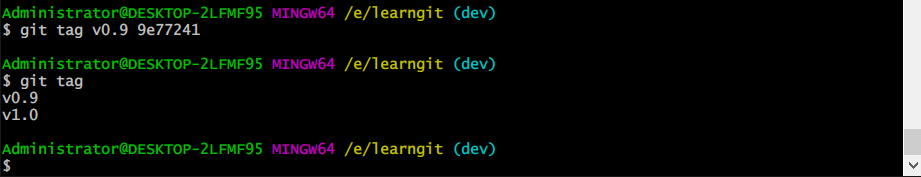

# 标签

发布一个版本时，我们通常先在版本库中打一个标签（tag）。这样，就唯一确定了打标签时刻的版本。将来无论什么时候，取某个标签的版本，就是把那个打标签的时刻的历史版本取出来。所以，标签也是版本库的一个快照。


Git的标签虽然是版本库的快照，但其实它就是指向某个commit的指针（跟分支很像，但是分支可以移动，标签不能移动），所以，创建和删除标签都是瞬间完成的。

tag就是一个让人容易记住的有意义的名字，它跟某个commit绑在一起。

## 创建标签

首先，切换到需要打标签的分支上：

```
$ git branch
* dev
  master
```

`git tag <name>`就可以打一个新标签：


默认标签是打在最新提交的commit上的，如果忘了打标签，补签，找到历史提交的commit id，然后打上就可以了

```
$ git log --pretty=oneline --abbrev-commit
66b74bb (HEAD -> dev, tag: v1.0) another
dd0e12f lala
203cd9c (origin/master) conflict fixed
2a955c9 & simpe
20263f5 AND simple
f6ad135 branch test
7106d3b remove test.txt
4802e28 test add
56155fc readme.txt
7aee805 git tracks changes of files
4dd91e5 git tracks changes
fc23f50 understand how stage works
bcba2b8 append GPL
9e77241 add distributed
02accaf wrote a readme file
```

假设对`add distributed`打标签，对应的commit id是 9e77241

```
$ git tag v0.9 9e77241
```



标签不是按时间顺序列出，而是按字母排序的

可以用`git show <tagname>`查看标签信息：


还可以创建带有说明的标签，用`-a`指定标签名，`-m`指定说明文字：

```
$ git tag -a v0.1 -m "version 0.1 released" 1094adb
```

命令`git show <tagname>`可以看到说明文字：

标签总是和某个commit挂钩。如果这个commit既出现在master分支，又出现在dev分支，那么在这两个分支上都可以看到这个标签。

### 小结

- 命令`git tag <tagname>`用于新建一个标签，默认为`HEAD`，也可以指定一个commit id；
- 命令`git tag -a <tagname> -m "blablabla..."`可以指定标签信息；
- 命令`git tag`可以查看所有标签。

## 操作标签

如果标签打错了，也可以删除：

```
$ git tag -d v0.1
```

因为创建的标签都只存储在本地，不会自动推送到远程。所以，打错的标签可以在本地安全删除

如果要推送某个标签到远程，使用命令`git push origin <tagname>`：

```
$ git push origin v1.0
```

或者，一次性推送全部尚未推送到远程的本地标签：

```
$ git push origin --tags
```


如果标签已经推送到远程，要删除远程标签就麻烦一点，先从本地删除：

```
$ git tag -d v0.9
```

然后，从远程删除。删除命令也是push，但是格式如下：

```
$ git push origin :refs/tags/v0.9
```


### 小结

- 命令`git push origin <tagname>`可以推送一个本地标签；
- 命令`git push origin --tags`可以推送全部未推送过的本地标签；
- 命令`git tag -d <tagname>`可以删除一个本地标签；
- 命令`git push origin :refs/tags/<tagname>`可以删除一个远程标签。


