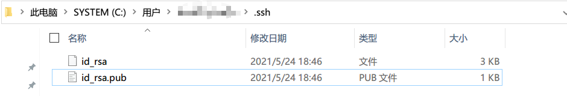
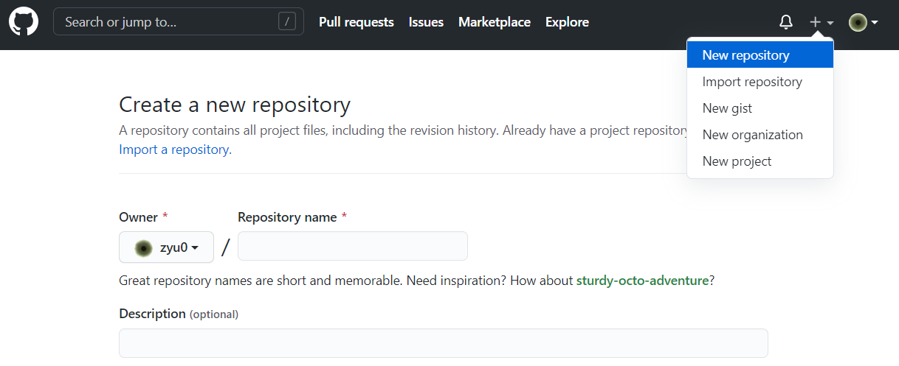

# 远程仓库

如果只是在一个仓库里管理文件历史，Git和SVN没区别

Git是分布式版本控制系统，同一个Git仓库，可以分布到不同的机器上

最早，肯定只有一台机器有一个原始版本库，此后，别的机器可以“克隆”这个原始版本库，而且每台机器的版本库其实都是一样的，并没有主次之分

> 其实一台电脑上也是可以克隆多个版本库的，只要不在同一个目录下

实际情况往往是这样，找一台电脑充当服务器的角色，每天24小时开机，其他每个人都从这个“服务器”仓库克隆一份到自己的电脑上，并且各自把各自的提交推送到服务器仓库里，也从服务器仓库中拉取别人的提交

## Github

网站就是提供Git仓库托管服务的，只要注册一个GitHub账号，就可以免费获得Git远程仓库。

本地Git仓库和GitHub仓库之间的传输是通过SSH加密的，需要一点设置：

第1步：创建SSH Key

查看在用户主目录下有没有.ssh目录



如果有，再看看这个目录下有没有`id_rsa`和`id_rsa.pub`这两个文件，如果已经有了，可直接跳到下一步。如果没有，打开Shell（Windows下打开Git Bash），创建SSH Key：

```
$ ssh-keygen -t rsa -C "youremail@example.com"
```

把邮件地址换成自己的邮件地址，一路回车使用默认值即可


为什么GitHub需要SSH Key呢？因为GitHub需要识别出你推送的提交确实是你推送的，而不是别人冒充的，而Git支持SSH协议，所以，GitHub只要知道了你的公钥，就可以确认只有你自己才能推送

GitHub允许添加多个Key。假定有若干电脑，一会儿在公司提交，一会儿在家里提交，只要把每台电脑的Key都添加到GitHub，就可以在每台电脑上往GitHub推送了

## 添加远程库




## 关联远程库

在GitHub上的这个`learngit`仓库还是空的，GitHub告诉我们，可以从这个仓库克隆出新的仓库，也可以把一个已有的本地仓库与之关联，然后，把本地仓库的内容推送到GitHub仓库


在本地的`learngit`仓库下运行命令：

```
$ git remote add origin git@github.com:zyu0/learngit.git
```

添加后，远程库的名字就是`origin`，这是Git默认的叫法，也可以改成别的

> origin就是一个远程仓库别名，默认即可

把本地库的所有内容推送到远程库上：

```
$ git push -u origin master
```

> 第一次推送`master`分支时，加上了`-u`参数，Git不但会把本地的`master`分支内容推送的远程新的`master`分支，还会把本地的`master`分支和远程的`master`分支关联起来，在以后的推送或者拉取时就可以简化命令


### SSH警告

当你第一次使用Git的`clone`或者`push`命令连接GitHub时，会得到一个警告：

```
The authenticity of host 'github.com (xx.xx.xx.xx)' can't be established.
RSA key fingerprint is xx.xx.xx.xx.xx.
Are you sure you want to continue connecting (yes/no)?
```

这是因为Git使用SSH连接，而SSH连接在第一次验证GitHub服务器的Key时，需要你确认GitHub的Key的指纹信息是否真的来自GitHub的服务器，输入`yes`回车即可。

Git会输出一个警告，告诉你已经把GitHub的Key添加到本机的一个信任列表里了：

```
Warning: Permanently added 'github.com' (RSA) to the list of known hosts.
```

这个警告只会出现一次，后面的操作就不会有任何警告了。


在Github上删除远程库以后，再次与新的远程库建立连接会出问题，需要先把旧连接删除


使用`git remote -v`查看远程库信息，然后，根据名字删除，比如删除`origin`：

```
$ git remote rm origin
```

此处的“删除”其实是解除了本地和远程的绑定关系，并不是物理上删除了远程库

### 小结

要关联一个远程库，使用命令

```
git remote add origin git@server-name:path/repo-name.git
```

关联一个远程库时必须给远程库指定一个名字，`origin`是默认习惯命名；

关联后，使用命令`git push -u origin master`第一次推送master分支的所有内容；

此后，每次本地提交后，只要有必要，就可以使用命令`git push origin master`推送最新修改


分布式版本系统的最大好处之一是在本地工作完全不需要考虑远程库的存在，也就是有没有联网都可以正常工作，而SVN在没有联网的时候是拒绝干活的！当有网络的时候，再把本地提交推送一下就完成了同步

## 从远程库克隆

新建一个库实验


克隆时小心仓库名字写错了


GitHub给出的地址不止一个，还可以用`https://github.com/michaelliao/gitskills.git`这样的地址。实际上，Git支持多种协议，默认的`git://`使用ssh，但也可以使用`https`等其他协议。

使用`https`除了速度慢以外，还有个最大的麻烦是每次推送都必须输入口令，但是在某些只开放http端口的公司内部就无法使用`ssh`协议而只能用`https`。

### 小结

要克隆一个仓库，首先必须知道仓库的地址，然后使用`git clone`命令克隆。

Git支持多种协议，包括`https`，但`ssh`协议速度最快。

