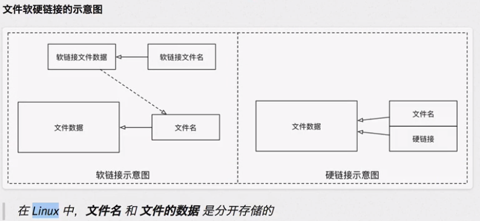

# 其他命令

## clear

清屏

## command --help

## man command

manual缩写：手册

enter，space，b，f，q

## which

查看执行命令所在位置

cd命令内置在系统内核，无独立文件，故无法找到

## find

查找文件

**find [路径] -name "*.py"**

- 配合通配符查找指定路径下扩展名为 .py 的文件，包括子目录
- 省略 [路径] 表示在当前文件夹下查找

除name还有其他方式进行搜索

## ln -s 源文件绝对路径 链接文件名

建立文件软链接，类似快捷方式

无 -s 则为硬链接，会占用和源文件同等空间，内容同步

- - 

## 软件安装卸载

### apt

- 安装

	- sudo apt install 软件名

- 卸载

	- sudo apt remove 软件名

- 更新

	- sudo apt upgrade

## sl

