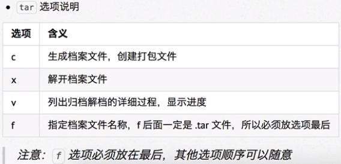

# 打包压缩

## 格式

### windows

- rar

### mac

- zip

### linux

- tar.gz
- tar.bz2

## 打包/解包

tar -cvf 打包文件.tar 被打包文件、路径

- -c

  - creat

- -v

  - verbose

- -f

  - file
  - 后再跟 ”- “表示使用“标准输入/输出”（stdin/stdout)作为输出输入文件

- -x

  - extract

  

- tar -xvf 打包文件.tar

`tar -zcvf 打包文件.tar.gz 被压缩文件/路径`

`tar -jcvf 打包文件.tar.bz2 被压缩文件/路径`

## 压缩/解压缩

- 压缩.tar文件

  - gzip
  - bzip2

- 解压缩文件

  `tar -zxvf 打包文件.tar.gz`

  `tar -jxvf 打包文件.tar.gz`

- 解压缩到指定路径

  `tar -zxvf 打包文件.tar.gz -C 目标路径`

  `tar -jxvf 打包文件.tar.gz -C 目标路径`
  
  [linux下解压zip文件](https://www.cnblogs.com/luoine/archive/2011/03/08/1977577.html)
===============================================================================

linux自带的unzip命令可以解压windows下的zip格式的压缩文件。

unzip命令

 语法：unzip ［选项］ 压缩文件名.zip

 各选项的含义分别为：

 -x 文件列表 解压缩文件，但不包括指定的file文件。

 -v 查看压缩文件目录，但不解压。

 -t 测试文件有无损坏，但不解压。

 -d 目录 把压缩文件解到指定目录下。

 -z 只显示压缩文件的注解。

 -n 不覆盖已经存在的文件。

 -o 覆盖已存在的文件且不要求用户确认。

 -j 不重建文档的目录结构，把所有文件解压到同一目录下。

 例1：将压缩文件text.zip在当前目录下解压缩。

 $ unzip text.zip

 例2：将压缩文件text.zip在指定目录/tmp下解压缩，如果已有相同的文件存在，要求unzip命令不覆盖原先的文件。

 $ unzip -n text.zip -d /tmp

 例3：查看压缩文件目录，但不解压。

 $ unzip -v text.zip

 zgrep命令

 这个命令的功能是在压缩文件中寻找匹配的正则表达式，用法和grep命令一样，只不过操作的对象是压缩文件。如果用户想看看在某个压缩文件中有没有某一句话，便可用zgrep命令。