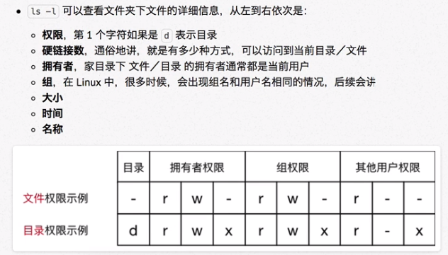
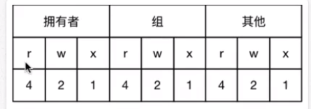
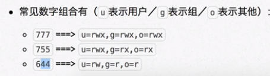

# 用户和权限

## 用户管理

### 用户

- 标准用户

	- 只能在家目录下活动

- 超级用户root账号

	- 维护和管理系统
	- sudo

		- su—substitute user

			- 使用另一个用户身份

- 创建用户

	- 用户信息储存在/etc/passwd 文本文件

		- 用户名
		- 密码：x表示加密
		- UID 用户标识
		- GID 组标识
		- 用户全名或本地帐号
		- 家目录
		- 登录使用的Shell

			- 即使用的终端命令。ubuntu默认 dash

	- useradd -m -g 组 新建用户名

		- -m 自动建立用户家目录
		- -g 指定用户所在组，否则会建立一个和用户同名的组

	- userdel -r 用户名

		- 删除用户

			- -r 会自动删除用户家目录

	- passwd 用户名

		- 设置用户密码

- 查看用户信息

	- id

		- 结合cat -n/grep 等命令查看
		- id 用户名

	- whoami

		- 查看当前登录用户账户名

	- who

		- 查看当前所有登录的用户列表

### 组

- usermod

	- 设置用户主组/附加组

		- 主组：在新建用户时指定，在etc/passwd 第四列GID对应组
		- 附加组：在etc/group 中最后一列表示该组的用户列表，用于指定用户附加权限

	- usermod -g 组 用户名

		- 修改主组 passwd中的GID
		- 一般不修改主组

	- usermod -G 组 用户名

		- 修改用户附加组
		- 修改之后必须重新登录才可生效
		- usermod -G sudo 用户名

			- 给useradd添加的用户添加sudo附加组，拥有root权限

	- usermod -s /bin/bash

		- 修改用户登录 Shell
		- windows 用xshell登录后默认ubuntu dash的Shell，会出现bug，故可用 usermod 修改登录 Shell 为 bash

			- 直接输入bash和dash也可

- 目的在于预先对组设置权限，将不同用户添加到组中，不需要为单个用户设置权限

	- 必须用sudo
	- sudo adm 等附加组便是组权限

- groupadd 组名

	- 添加组
	- 指定组 ID

		- groupadd -g 1000 jingfeng

- groupdel 组名

	- 删除组

- groupmod

	- 修改组名称

		- groupmod -n 新名 原组名

	- 修改组 ID

		- groupmod –g 1000 jingfeng1

- cat /etc/group

	- 确认组信息

		- 组信息保存在/etc/group中，/etc目录专门保存系统配置信息

- chgrp -R 组名 文件/目录名

	- 修改文件/目录的所属组

		- 可事先对组设置权限，然后将不同的用户添加到对应的组

	- -R 递归修改

### 切换用户

- su - 用户名

	- - 切换用户家目录，否则保持当前目录

## 权限

- 读 read
- 写 wright
- 执行 execute

	- ./文件
	- 目录必须拥有 x 权限，否则无法查看内容

- 硬链接数

	- 访问文件或目录时可到达路线数量   绝对路径/cd .  /cd ..
	- 取决于子目录数量

### 修改权限

- chmod

	- 修改用户/组 对 文件/目录 的权限

		- chmod +/-rmx 文件名|目录名
		- 直接修改文件 | 目录的 读 | 写 | 执行 权限，不能精确到 拥有者 | 组 | 其他

	- chmod u=rwx,go=rx test

		- 同时修改多个权限

	- 递归修改文件权限

		- chmod -R 755 文件名 | 目录名

			- 7

				- 文件或目录拥有者权限

			- 5

				- 文件或目录组成员权限

			- 5

				- 文件或目录其他用户权限

			- 
			- 

- chown

	- 修改文件 | 目录拥有者
	- chown 用户名 文件名 | 目录名

- chgrp

	- 递归修改文件 | 目录的所属组
	- chgrp -R 组名 文件名 | 目录名

