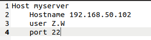

# SSH

## SSH客户端和服务器

### 客户端

- 向服务器发送加密数据，防止信息泄露

	- 防止DNS欺骗和IP欺骗

### 服务器

- 向客户端发送执行压缩数据，提高传输速度

使用Secure Shell协议连接远程计算机的软件，专为远程登录会话和其他网络服务提供安全性协议

只在linux或unix下使用，windows需安装puTTY或XShell

## 使用

### ssh [-p port] user@remote

- user

	- 远程机器用户名

- remote

	- 远程机器地址

- port

	- 指定SSH Serve监听端口，不指定默认22

		- 一般输入22，而不是port
		- 即可不输入-p

当第一次进入其他主机授权后，会生成一个known_hosts文件保存主机配置

exit 退出登录

## 高级

### 免密码登录

- 在.ssh目录下输入ssh-keygen

  - 生成公钥和私钥

    - 非对称加密算法，公钥加密数据私钥解密，反之亦然

- 执行ssh-copy-id -p port user@remote

	- 让远程服务器记住公钥

### 配置别名

- 用代号省略繁琐过程
- 在 .ssh 中建立config文件 里面输入ip和用户名等繁琐数据

