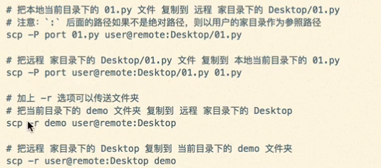

# scp

secure copy

linux下远程拷贝文件命令

`scp -P port  user@remote: 路径和文件名  具体位置`

将文件复制到具体地址，也可以反向操作

`scp -r port 文件夹 user@remote：具体地址`

-q:  quiet

-r:   recuersive
-p:   properity
-v:   verbose
-i:   identity_file      【从指定文件中读取传输时使用的密钥文件，此参数直接传递给ssh】 
-P:  port

## 支持参数

-1：强制scp命令使用协议ssh1

-2: 强制scp命令使用协议ssh2

-4: 强制scp命令只使用IPv4寻址

-6:强制scp命令只使用IPv6寻址

-B:使用批处理模式（传输过程中不询问传输口令或短语）

-C:允许压缩。（将-C标志传递给ssh，从而打开压缩功能）

-p:保留原文件的修改时间，访问时间和访问权限

-q:不显示传输进度条

-r:递归复制整个目录

-v:详细方式显示输出。scp和ssh(1)会显示出整个过程的调试信息。这些信息用于调试连接，验证和配置问题

-c cipher:以cipher将数据传输进行加密，这个选项将直接传递给ssh

-F ssh_config:指定一个替代的ssh配置文件，此参数直接传递给ssh

-i identity_file:从指定文件中读取传输时使用的密钥文件，此参数直接传递给ssh

-l limit:限定用户所能使用的带宽，以Kbit/s为单位

o ssh_option:如果习惯于使用ssh_config(5)中的参数传递方式

-P port:注意是大写的P, port是指定数据传输用到的端口号

-S program:指定加密传输时所使用的程序。此程序必须能够理解ssh(1)的选项

大家可以根据需要自行选择参数。

