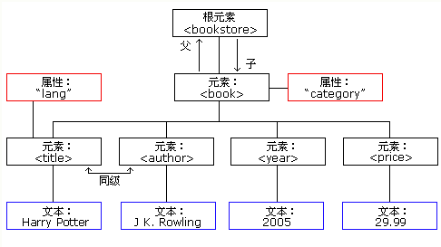

**XML文档的格式，从“根部”向“枝叶”扩展**

### 结构

- XML声明

	- 定义版本和使用编码
- 描述文档的根元素

	- 定义文档类型？
- 描述根的子元素
- 定义根元素结尾

```xml
<root>
  <child>
    <subchild>.....</subchild>
  </child>
</root>
```

==父元素，子元素，同胞==

### 案例



```xml
<bookstore>  # 根元素
<book category="COOKING">  # 子元素
  <title lang="en">Everyday Italian</title> 
  <author>Giada De Laurentiis</author> 
  <year>2005</year> 
  <price>30.00</price> 
</book>
<book category="CHILDREN">
  <title lang="en">Harry Potter</title> 
  <author>J K. Rowling</author> 
  <year>2005</year> 
  <price>29.99</price> 
</book>
<book category="WEB">
  <title lang="en">Learning XML</title> 
  <author>Erik T. Ray</author> 
  <year>2003</year> 
  <price>39.95</price> 
</book>
</bookstore>
```

