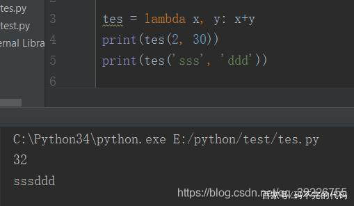
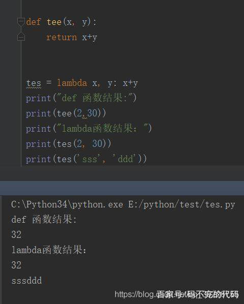
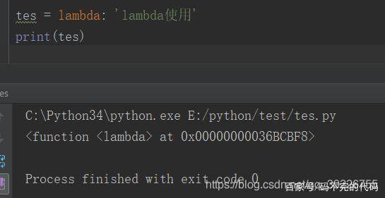
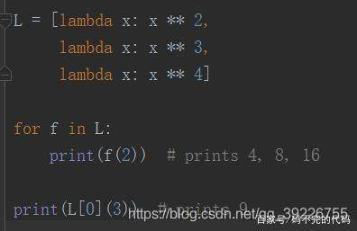

# python lambda表达式详解

[(DᴗD)B](https://me.csdn.net/qq_39226755) 2019-02-07 21:46:36  4198  收藏 16

分类专栏： [python](https://blog.csdn.net/qq_39226755/category_8517877.html) 文章标签： [lambda](https://www.csdn.net/gather_2f/MtTaEg0sMjQ3NDUtYmxvZwO0O0OO0O0O.html) [python](https://www.csdn.net/gather_24/MtjaQg4sNDk0LWJsb2cO0O0O.html)

@python lambda表达式详解

1、lambda简介

先来看一段代码示例：

第一行是lambda声明，x,y相当于传入的参数，整个函数会返回x+y的值。lambda作为一个表达式，定义了一个匿名函数，上例的代码x，y为入口参数，x+y为函数体。在这里lambda简化了函数定义的书写形式。

python允许用lambda关键字创造匿名函数。匿名是不需要以标准的方式来声明，比如说使用 def 语句。（除非赋值给一个局部变量，这样的对象也不会在任何的名字空间内创建名字，上面的例子中会创建名字。)

作为函数，它们也能有参数。一个完整的 lambda"语句"代表了一个表达式，这个表达式的定义体必须和声明放在同一行。语法如下：

lambda [arg1[, arg2, … argN]]: expression

参数是可选的，如果使用的参数话，参数通常也是表达式的一部分

2、lambda匿名函数与def区别

lambda 和def它两个的基本用法差不多，参数都是可选，也都会返回对象

如下：

不同之处：

lambda可以定义一个匿名函数，而def定义的函数必须有一个名字。这应该是lambda与def两者最大的区别。

==lambda是一个表达式，而不是一个语句（lambda is an expression, not a statement.）因此，lambda能够出现在Python语法不允许def出现的地方——例如，在一个列表常量中或者函数调用的参数中。==

lambda的主体是一个单个的表达式，而不是一个代码块。（lambda’s body is a single expression, not a block of statements.），lambda里面的语句相当于def中return中的代码一样。只能是简单的表达式，所以说lambda的能力小于def，在lambda中只能使用简单的语法，不能使用if else while return等语句

它的设计理念为：lambda是一个为编写简单的函数而设计的，而def用来处理更大的任务。（lambda is designed for coding simple functions, and def handles larger tasks.）

3、lambda的使用

为什么要使用lambda？

1、lambda函数主要用来写一些小体量的一次性函数，避免污染环境，同时也能简化代码。

2、lambda起到了一种函数速写的作用，允许在使用的代码内嵌入一个函数的定义。他们完全是可选的（你总是能够使用def来替代它们），但是你仅需要嵌入小段可执行代码的情况下它们会带来一个更简洁的代码结构。

例如：

map( lambda x: x*x, [y for y in range(10)] )

这个写法要好过

def sq(x):

return x * x

map(sq, [y for y in range(10)])

3、lambda使用可以加参数也可以不加参数

有参数就如同上面的用法

无参数：

4、lambda通常用来编写跳转表（jump table），也就是行为的列表或字典，能够按照需要执行相应的动作。如下段代码所示。

总结：

1、lambda只是一个表达式，函数体比def简单很多

2、lambda的主体是一个表达式，而不是一个代码块。仅仅能在lambda表达式中封装有限的逻辑进去

3、lambda函数拥有自己的名字空间，且不能访问自有参数列表之外或全局名字空间里的参数

4、 简单单行代码或者一次性的函数可以用lambda函数来书写，可以让代码更简洁。

5、 对于复杂函数或者函数体体量大的函数，最好不要用lambda函数，会增加代码的阅读难度，使代码晦涩难懂。

6、 在非多次调用的函数的情况下，lambda表达式即用既得，提高性能