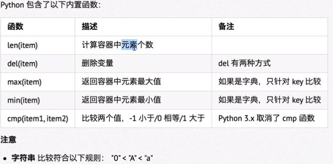
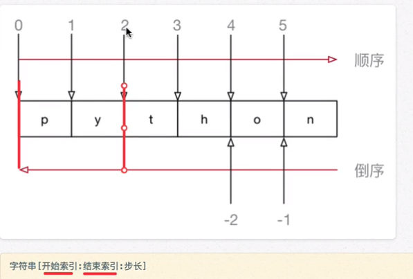
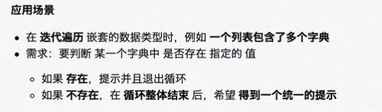

# 公共方法

## 内置函数

del即为关键字也是函数，cmp已经变为使用比较运算符 < >来比较，字符串、列表、元组都可以比较

## 切片

使用索引值来限定范围，可以对列表、元组、字符串切片，字典不行

### 语法

- 字符串[开始索引：结束索引：步长]

  - 前闭后开，不包含结束索引的值
  - 步长用来指定间隔的不断切片，要切到最后一个值就不指定结束索引，步长的正负决定了起始端点，不输入步长则默认为 1，起点在左
  - https://www.jianshu.com/p/15715d6f4dad不明点都有

  - 步长为 -1 则逆序

## for 循环遍历

