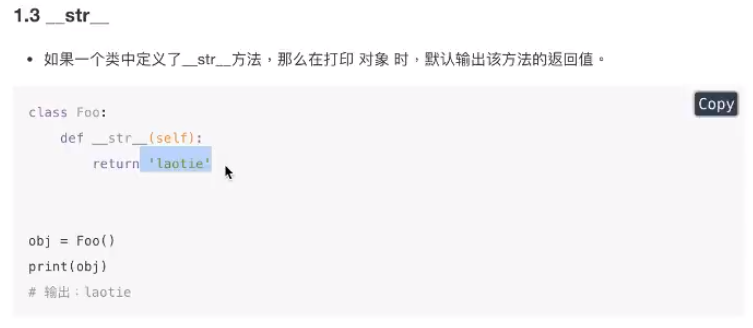

# 魔法属性和方法

## 魔术属性

无论人或事物往往都有一些含有特殊含义的文字，Python的类属性也是如此，存在着一些具有特殊含义的属性，，详情如下：

- `__doc__`表示类的描述信息

  - `类名.__doc__`

  - `对象.test.__doc__`

- `__module__`获取当前模块

- `__class__`获取对象所属的类

```python
class Goods(object):
    """这是一个商品的类 Goods"""

    def set_price(self):
        """这是Goods类中设置价格方法"""
        pass

# 类的描述信息
# 类名.__doc__
print(Goods.__doc__)

goods = Goods()
# 对象方法的描述
# 对象名.方法名.__doc__
print(goods.set_price.__doc__)

# 3 获取当前模块
print(goods.__module__)
# 4`获取对象所属的类
print(goods.__class__)
```

- `__dict__`

获取对象或者类的信息

获取对象信息`对象名.__dict__`对象的实例属性信息

获取类的信息`类名.__dict__`模块、类描述、对象方法…


## 魔术方法

- `__init__`

  - 对象初始化，清理内存

  - `__new__`

    - 使用 类名() 创建对象时，python解释器首先会调用 __new__ 方法为对象分配空间

      


- `__del__`
  - 当一个对象被从内存中销毁前，会自动调用 `__del__` 方法，此时应以执行完所有代码
  - 若希望在对象被销毁前，再做一些事情，可以使用` **del**

- `__call__`

当使用对象名（）会调用该方法


- `__str__`

打印对象的会调用print（obj）str方法一定要return，而且return一定字符串内容



- `__getitem__`，`__Setitem__`，`__delitem__`

用字典的书写格式操作对象的方法

```python
class Goods(object):
    """这是一个商品的类 Goods"""
    # 类属性
    goods_color = "白色"

    def __init__(self):
        # 实例属性
        self.org_price = 100
        self.discount = 0.7

    def set_price(self):
        """这是Goods类中设置价格方法"""
        pass
    def __call__(self, *args, **kwargs):
        print("__call__被调用")

    def __str__(self):
        return "我是xxx"
    def __del__(self):
        print("__del__被调用")

    def __getitem__(self, item):
        print("key = ", item)

    def __setitem__(self, key, value):
        print("key = %s,value = %s" % (key, value))

    def __delitem__(self, key):
        print("要删除key = ",key)


goods = Goods()
# 调用__call__方法
# goods()
# # 默认输出<__main__.Goods object at 0x7f9f57303940>,__str__后则打印返回值
# print(goods)
#
# # 通过__dict__获取对象信息，即实例属性，返回字典，
# print(goods.__dict__)
# # 通过__dict__获取类的信息 类名.__dict__返回值是一个字典
# print(Goods.__dict__)

# dict1 = {}
# dict1['a'] = 10

# goods['a'] 调用 __getitem__方法
goods['a']

# 调用__setitem__
goods['a'] = 10  

# del goods['a'] .用__delitem__ key
del goods['a']

```

