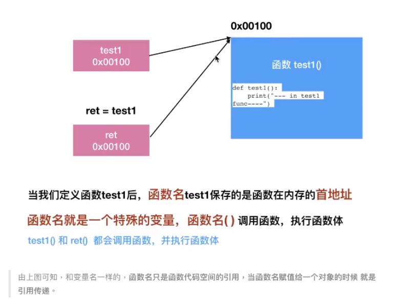

# 函数

## 定义

把具有独立功能的代码块组织为一个小模块，在需要的时候调用

==函数名是一个特殊的变量，在内存中存储着函数的地址0xxxx==

函数执行

- 1.函数名是一个特殊的变量，保存了函数的地址
- 2.自定义一个变量可以获取函数地址
- 3.自定义变量调用函数 "变量名()"

## 作用

提高效率，代码重用

## 文档注释

函数上方要保留两个空行

若给函数加注释，在定义下方使用连续的三对引号  """

在函数调用位置，使用 Crtl + Q 查看函数说明

## 函数参数

### 作用

- 增加函数的通用性，针对相同的数据处理逻辑，适应更多的数据

### 方法

- 在函数名后面的小括号内部填写参数

	- 多个参数之间使用 ， 分隔

### 类别

- 形参

	- 用来接收外部传递的参数

		- char 即一个字符

	- 函数内部作为变量使用

- 实参

	- 调用函数时传递的参数

### 不可变和可变参数

- 无论传递的参数是可变还是不可变。只要针对参数使用赋值语句，会在函数内部修改局部变量的引用，不会影响到外部变量的引用
- 如果传递的参数是可变类型，在函数内部，使用方法修改了数据的内容，同样会影响到外部的数据

### 缺省参数

- 子主题 1
- 在指定缺省参数的默认值时，应该使用最常见的值作为默认值！
- 定义时要放在参数列表末尾

### 多值参数

- 当需要一个函数能够处理的参数个数是不确定的时候，使用多值参数

	- 让调用函数更为简洁
- 命名习惯

  - *args

  	- 存放元组参数

  - **kwargs
    - 存放字典参数，输入时类似 name=“小明”
- 参数名前增加一个 *  接收元组
- 参数名前增加两个 *  接收字典

### 拆包

 元组和字典的拆包语法，简化元组和字典的传递

语法

- 想将一个元组变量直接传递给 args

	- 在元组变量前，增加一个 *

- 想将一个字典变量直接传递给 kwargs

	- 在字典变量前，增加 **

## 返回值

当一个独立功能代码执行后，希望返回一个结果，以便针对具体结果做出决策

### return 关键字返回结果

- 函数外调用者使用变量来接收结果
- return 下方的代码不会被执行到
- 如果return 后面没有任何的内容，表示会返回到调用函数的位置并且不返回任何的结果

**返回多个结果**

## 使用

### 定义函数

- 封装独立的功能

	- 对从前的代码可以def后全选代码按 Tab 整体缩进

- 定义格式

	- 子主题 4
	- 函数名要能表达函数封装代码的功能
	- 命名规则

		- 可以由字母、下划线和数字组成
		- 不能以数字开头
		- 不能与关键字重名

### 调用函数

- 享受封装的成果

	- 注意点 文件包含下划线

- 通过 函数名() 可完成对函数的调用，若定义了函数，却不调用是无法运行的
- 程序执行过程

	- 调用前，必须让python知道函数已存在，所以调用代码在def下面

- Pycharm调试工具

	- F8 Step Over 单步执行代码，但会把函数调用当做一行代码直接执行
	- F7 Step Into 单步执行代码，如果是函数，会进入函数内部

### 函数嵌套调用

- 打印分隔线

  

### 递归

- 定义

	- 一个函数内部自己调用自己

- 特点

  - 内部代码相同，根据参数不同做出不同处理
  - 当参数满足一个条件时，函数不再执行

    - 增加递归出口

      

    - 注意递归每次的返回值接收

### eval函数

- 将字符串当成有效的表达式来求值并返回计算结果
- 开发时千万不可使用 eval 转换 input 的结果

