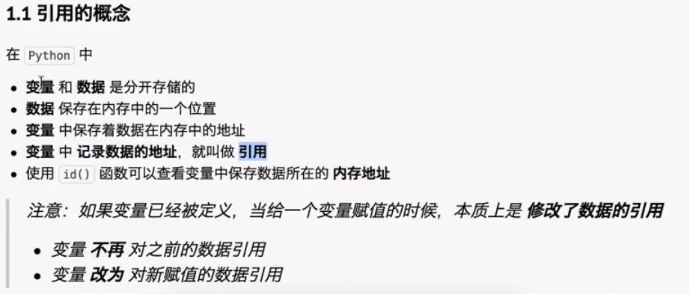
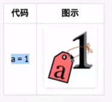
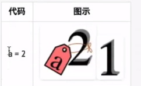
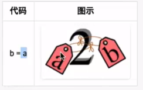
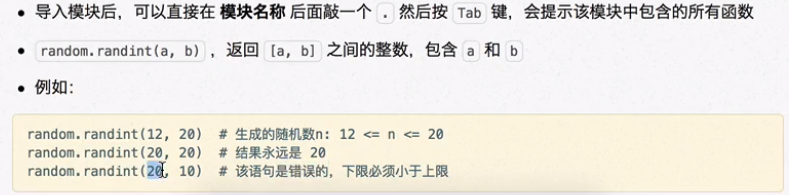

# 变量

## 变量的基本使用

## 基本信息

1. 第一次被赋值后创建并定义变量
2. 交互式查看变量不需要print
3. 可以用其他变量的计算结果来定义变量
   - 两个数字型变量可以直接进行算数运算
4. 变量重新赋值不会被重新定义
5. python中定义变量时不需要指定变量的类型
   - 解释器会根据赋值语句等号右侧的数据自动推导变量中保存数据的准确类型

## [Notes/程序/C语言/数据类型](Notes/%E7%A8%8B%E5%BA%8F/C%E8%AF%AD%E8%A8%80/%E6%95%B0%E6%8D%AE%E7%B1%BB%E5%9E%8B.md)

## 输入

- 用代码获取用户通过键盘输入的信息

- input函数

- 字符串变量 = input("提示信息：")

  - 输入的内容都是字符串类型

- 改进变量数量，使用函数嵌套，减少变量使用，节省内存

  - price = float(input(x))

## 格式化输出

**在输出文字信息的同时一起输出数据，需要用到格式化操作符**

- %
- 包含%的字符串为格式化字符串

**不同类型数据需要不同的格式化字符串**

- %06d在6位以内以0占位，超出6位输出原值

**格式**

- 例：print("我的名字叫 %s，请多多关照" % name)

	- 前面加了占位符，后面要跟上指定变量名

## 引用

### 概念

- 变量和数据都保存在内存中，函数的参数传递以及返回值都是靠引用传递的
- id（）函数查看变量保存的内存地址

### 阐释

- a=1;b=a > a=2;b=1 > a=2;b=a

	- 

	- 

	- 

- 给变量赋值 本质为 修改对数据的引用

## [[可变和不可变类型]]

## [[哈希(hash)]]

## [[局部变量和全局变量]]

## 变量命名

### 标识符

- 程序员定义的变量名、函数名
- 规则

	- 要见名知义
	- 只能由字母、下划线和数字组成
	- 不能以数字开头
	- 不能与关键字重名
	- 区分大小写
	- 变量名需要由两个或多个单词组成时

		- 法1

			- 每个单词都字母小写
			- 单词间用 _ 下划线连接

		- 法2

			- 小驼峰命名法

				- firstName

			- 大驼峰命名法

				- FirstName

	- 定义时 = 左右各保留一个空格

### 关键字

- python内部已经使用的标识符

	- 开发者不允许使用定义和关键字相同的名字和标识符

- import

	- 导入工具包/模块

		- 语句要放在文件顶部，方便下面的代码使用其工具

	- random

		- 

