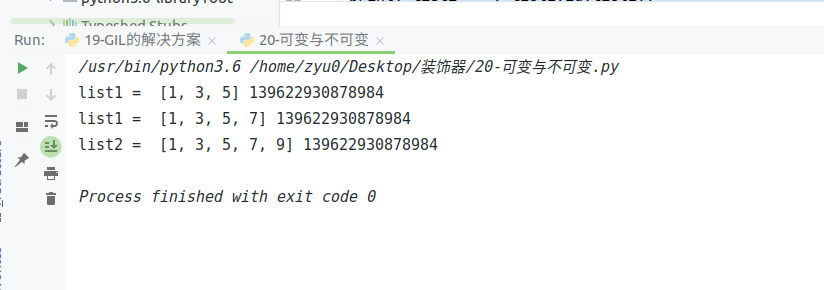
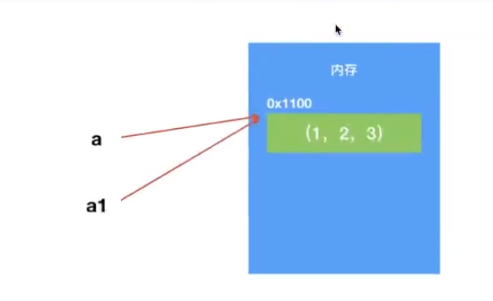

## 可变

- 列表
- 字典

	- 其key只能使用不可变类型数据

- 可变类型的数据变化是通过方法来实现的，若对可变类型变量赋值新数据，引用会被覆盖

## 不可变

- 数字类型
- 字符串
- 元组


可变与不可变

可变不可变，是指内存中的那块内容（value)是否可以被改变

- 可变类型（mutable)，创建后可以继续修改对象的内容（值）

> 字典、列表

- 不可变类型（unmutable)，一旦创建就不可修改的对象（值)

> 数字，字符串，元组

可变：变量创建后，内存内容可以再改变
不可变，变量创建 内存空间一旦被分配，就不能在改变


```python
"""
可变：变量创建后，内存内容可以再改变
不可变，变量创建 内存空间一旦被分配，就不能在改变
a是变量，保存数字，不可变

"""

def test():
    a=5
    print("a =",a, id(a))

    # 修改变量
    a = 5+1
    print("a =",a, id(a))


list1 = [1,3,5]
print("list1 = ", list1,id(list1))

# 给列表增加新的元素
list1.append(7)
print("list1 = ", list1,id(list1))

list2 = list1
list2.append(9)
print("list2 = ", list2,id(list2))
```



## 拷贝

浅拷贝，浅复制

深拷贝，深复制


作用

1、减少内存的使用

2、以后在做数据的清洗、修改或者入库的时候上对原数据进行复制一份，以防数据修改之后，找不到原数据。


### 可变拷贝

简单可变类型，浅拷贝、深拷贝都会产生一个新的空间，能够保持数据的独立性

```python
"""
可变：变重创建完成后，内存习以改变
列表和字典
"""
import copy


list1 = [1,3,5]
print("list1 = ", list1,id(list1))

#
# list3 = list1
# list3.append(7)
# print("list3 = ", list3,id(list3))
# 拷贝：
# 1、导入模块copy
# 2、调用方法

#     copy重变量）产生副本，浅拷贝
list2 = copy.copy(list1)
print("list2 = ",list2,id(list2))

# 修改list1
list1.append(7)
print("list1 = ", list1,id(list1))
print("list2=",list2,id(list2))


# deepcopy(变量）产生副本，深拷贝
list1 = [1, 3, 5]
print("list1 = ", list1, id(list1))

list2 = copy.deepcopy(list1)
print("list2=",list2,id(list2))

# 修改ｌｉｓｔ２
list2.append(7)
print("list2=",list2,id(list2))

# 总结：　简单可变类型的深浅拷贝，会产生新的空间，保证数据的独立性
```

复杂可变类型浅拷贝


复杂可变类型深拷贝


### 不可变拷贝

对简单不可变类型不管深浅拷贝，都不会改变地址



对复杂不可变类型浅拷贝，都不会改变地址，深拷贝，会新建空间

>  这个数据是否有可变的数据类型，如果有，他就会开辟多个空间存储数据和地址，能够保持数据独止性


==应该就是当复制对象可变时，为保证数据稳定独立，所以会重新开辟一个新空间来存储，而不可变对象因为其稳定不可变，所以直接复制其内存地址，而不再开辟新空间来容纳==

**只要开辟新空间则算做深拷贝，就算是浅拷贝，在底层也可看作深拷贝**

### 切片拷贝

变量名[:]

> 切片拷贝，是一种浅拷贝，副本对象和原对象指向同一个空间

```python
Ａ=[1,2,3]
B=[11,22,33]

C =(A,B)
print("C = ",C,id(C))
D = C[:]
print("D = ",D,id(D))
```


### 字典拷贝

字典本身自带 .copy方法

浅拷贝

```python
dict1 = {"age":[1,2]}
print("dict1 = ", dict1,id(dict1))

dict2 = dict1.copy()
print("dict2 = ", dict2,id(dict2))
print("--"*20)

dict1["age"][0] = 100
print("dict1 = ", dict1,id(dict1))
print("dict2 = ", dict2,id(dict2))
```

深拷贝和浅拷贝

1. 拷贝简单可变的数据类型的时候 a=[]

> 深拷贝和浅拷贝是一样的，都会开辟新的空间存储数据，可以保证数据的独立性

2. 拷贝有嵌套的复杂的数据类型a=[[]，[]]

>  浅拷贝开辟一片空间存放拷贝对象的地址没办法保证数据的独立性

> 深拷贝开辟多片空间存放拷贝对象的具体数据和地址保证数据的独立性

3，拷贝不可变的数据类型（）

> 深拷贝和浅拷贝都一样都不会开辟新的空间，而是直接引用了被拷贝的数据的地址

4，拷贝不可变的数据类型中嵌套了可变数据类型

> 浅拷贝：只关心最外的数据类型是什么，如果是不可变的数据类型直接引用，没有办法保证数据的独立性

> 深拷贝：这个数据是否有可变的数据类型，如果有它就会开辟多个空间存储数据和地址，达到保证数据独立性的作用

5，切片拷贝，字典拷贝

> 在python中多数情况下都是浅拷贝

单置下划线，防止  from 模块 import*  这种方式导入我们不想让他导入变量私有属性，不能真正的保证数据的安全性可以被外部直接访问，实例对象 .\__类名__私有属性名字

