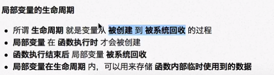

### 局部变量

- 是在函数内部定义的变量，只能在函数内部使用
- 不同的函数，可以定义同名的变量，不影响

### 全局变量

是在函数外部定义的变量（没有定义在某一个函数内），所有函数内部都可以使用这个变量
在python中，不允许直接修改全局变量的值

如果使用赋值语句，会在函数内部，定义一个局部变量

- 防止全局变量变化，导致维护困难

-  global 变量名

	- 如果在函数中需要修改全局变量，需要使用global进行声明
	- global 关键字会告诉解释器后面的变量是一个全局变量，再使用赋值语句时，就不会创建局部变量

- 许多公司会指定全局变量前加 g_ 或 gl_

==python执行时会先查看函数内部局部变量，再查看全局变量==

变量作用域？

在一个域中的变量会影响外部域进来的变量，除非外部域变量在使用前已被修改，否则会报错

 造成错误的原因：

- 编译器认为内层函数已经定义了num变量优先使用内层
- 如果在内层定义了和外层同名的变量，而且需要使用外层的变量
- nonlocal 不适用内层函数的变量，而是使用外层函数的变量

