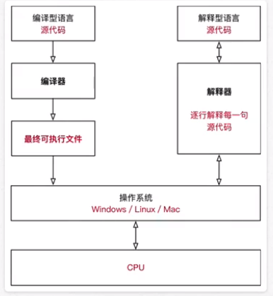

# 基本信息

创始人：ido van Rossum——仁慈的独裁者

设计哲学：
- 优雅，明确，简单
- 用一种方法来做一件事，选择明确没有歧义的语法
- 每行代码顶格写，不加空格

源程序就是一个特殊格式的文本文件
## 编译器
解释器：将其他语言翻译成机器语言的工具
- python是解释性语言，一行一行被翻译并执行

- IPython
	- python的一个交互式shell
		- 交互式运行python适合学习和验证语法和局部代码
	- 支持自动补全
	- 自动缩进
	- 支持bash shell命令
- CPython
- Jython
- IronPython
- PyPy

## 特点
简单直观，开源，纯英语般阅读容易理解，短期开发

面向对象
- 思维方式
	- 找到不同的对象，各司其职
- 程序设计技术
- 语言核心
	- 数字
	- 字符串
	- 列表
	- 字典
	- 文件
- 标准库
	- 系统管理
	- 网络通信
	- 文本处理
	- 数据库接口
	- 图形系统
	- XML处理
- 第三方模块
	- 科学计算
	- 人工智能
	- 机器学习
	- Web开发
	- 数据库接口
	- 图形系统

## [程序执行原理](%E7%A8%8B%E5%BA%8F%E6%89%A7%E8%A1%8C%E5%8E%9F%E7%90%86.md)

**^ 错误表示解释器不认识语法**

- SyntaxError: invalid syntax  语法错误
  IndentationError: unexpected indent  缩进错误

**python2.x默认不支持中文，3.x支持**

- 解释器名称python
  python3.x解释器名称python3

## IDE

Integrated Development Environment 集成开发环境

集成了开发软件需要的所有工具

- 图形用户界面
- 代码编辑器
- 编译器/解释器
- 调试器

	- 断点，单步执行

### PyCharm

- 适合大型项目开发

	- 一个项目包含很多源文件，源文件代码行数有限，几百行之内
	- 各个源文件各司其职，共同完成复杂业务

- 项目

	- 概念

		- 专门解决一个复杂业务功能的软件
		- 一个项目具有一个独立专属的目录，保存所有和项目有关的文件

	- 命名规则

		- 建议只使用小写字母，数字和下划线
		- 文件名不能以数字开始

	- 注释

		-  使代码容易阅读
		- 规则

			- 单行注释

				- # 和注释间加一个空格
				- 根据注释或代码长度考虑位置
				- 代码和注释之间加两个空格

			- 多行注释

				- 在一对连续的三个引号 """/""" 或 '''/''' 之间写注释

			- 一目了然的代码不需要注释，反之后加注释，复杂操作开始前加注释

	- 代码规范

		- PEP 8

- 新建项目报错，检查pip

	- pip是python官方推荐包管理工具

## 科普

### 关键字

- python内置的、具体特殊意义的标识符
- 关键字后面不需要使用括号

### 函数

- 封装了独立功能，可直接调用
- 函数名(参数）

### 方法

- 与函数类似，封装了独立功能，需要通过对象调用，表示针对对象要做的操作
- 对象.方法名('参数)

## [文件](python/%E6%96%87%E4%BB%B6/%E6%96%87%E4%BB%B6.md)

