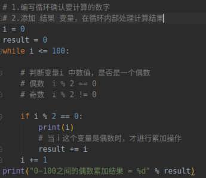

# 循环

## while

i += 1 为流程图中处理条件区域

### 关键字

- break

	- 某一条件满足时退出循环，不再执行后续重复代码

- continue

	- 某一条件满足时，不再执行后续重复代码，直接回到循环条件

		- # 注意在循环中，如果使用continue 这个关键字

在使用关键字前，需要确认循环的计数是否修改，否则会死循环

**==注意==**

- 小心计数器的缺少，注意死循环
- 除非特殊需求。否则循环计数都从 0 开始

### 循环计算

- 偶数累加求和计算示例
- 注意步骤设置

	- 先寻找需要的内容，再添加结果变量

### 循环嵌套

- while 包含 while

	- 注意 定义变量 的位置，会影响嵌套循环的次数

- 案例：打印九九乘法表

	- 转义字符

		- \t 协助输出文本时垂直方向保持对齐
		- \ 转义字符

- 编程时尤其要注意设计思维，要把事件进行拆分，变成小事件一个个写程序

## for

### 循环遍历

- for _ in _

	- for循环可以遍历所有非数字型类型

		- 但实际开发中除非确认元组中的数据类型，否则针对元组的循环遍历需求不多

	- 执行过程是每次都执行一遍内部代码

- else

	- 当遍历完成后才会被执行，若循环代码有break则不会执行

- 完成过程

- 遍历

	- 从头到尾依次从列表中获取数据

	- 在循环体内部针对每一个元素，执行相同的操作

**for循环的本质：**

1. 获取iter(可迭代对象)获取要遍历的对象的迭代器
2. next(迭代器)获取下一个元素
3. 帮我们捕获了 StopIteration 异常

