# 数据类型

## 数字型

int：整数

long：长整数，python3 似乎没了

bool：布尔类型，True / False

- 非0即True

	- 直接运算True算作 1

- 0 False

float：浮点数，小数

complex：复数型，主要用于科学计算

## 非数字型

### **str：字符串**

- ""或 '' 定义，一搬用""，只有在内部需要 "" 时，才用 ''
- 一串字符，表示文本的数据类型
- 可调用的方法都和列表类似

方法

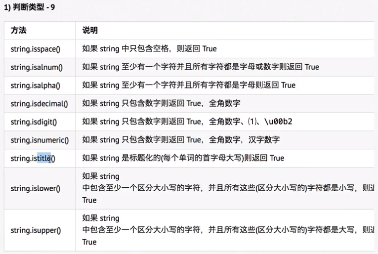isspace还可以判断\t \n \r 等空白字符
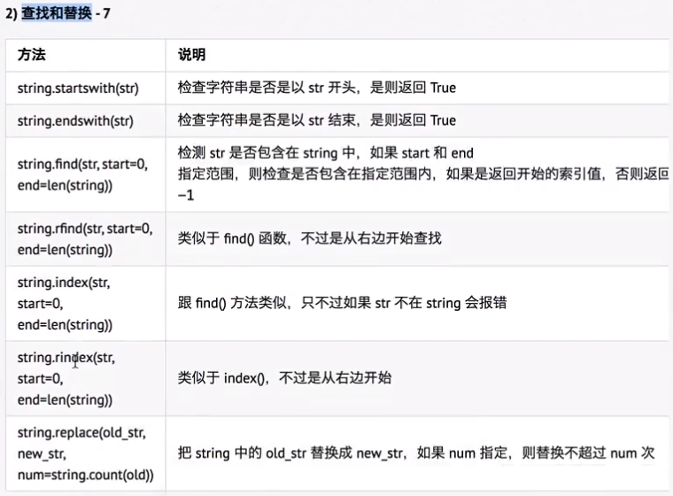
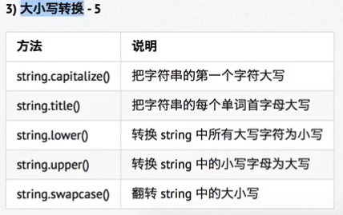
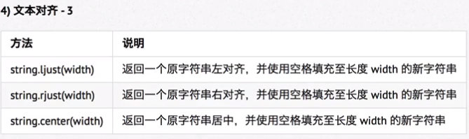
方法可以多个同时使用

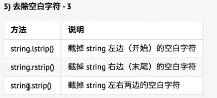
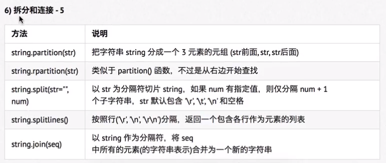

切片

- 使用索引值来限定范围，从一个大的字符串中切出小的字符串
- 语法

  - 字符串[开始索引：结束索引：步长]

    - 前闭后开，不包含结束索引的值
    - 步长用来指定间隔的不断切片，要切到最后一个值就不指定结束索引，步长的正负决定了起始端点，不输入步长则默认为 1，起点在左
    - https://www.jianshu.com/p/15715d6f4dad 不明点都有
    - 步长为 -1 则逆序

### **list 列表**

- 特点

	- 使用最频繁，其他语言中称为数组
	- 索引为数据在列表中的位置编号，也称下标，索引从 0 开始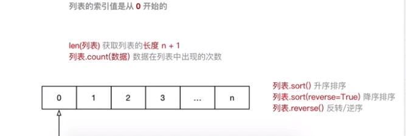

		- 查看修改不要超出索引范围

- 作用

	- 专门存储一串信息，有序的对象集合

		- 可以存储不同类型的数据
		- 一般保存相同类型数据

- 使用

	- 用 [ ] 定义，数据之间用 “,” 分隔
	- for 循环

		- 迭代 iteration遍历，提高列表遍历效率

- 在**ipython**中 定义list，再输入list名称后加  .  按Tab可以弹出此list可使用的方法，对list进行增删查改

  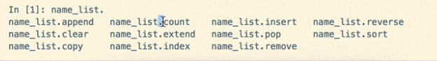

  - 可用来选择计数等功能
  - del 关键字本质是将变量从内存删除，后续代码无法使用此变量，不建议//  remove后面应该是（ ），数据是（），索引是[ ]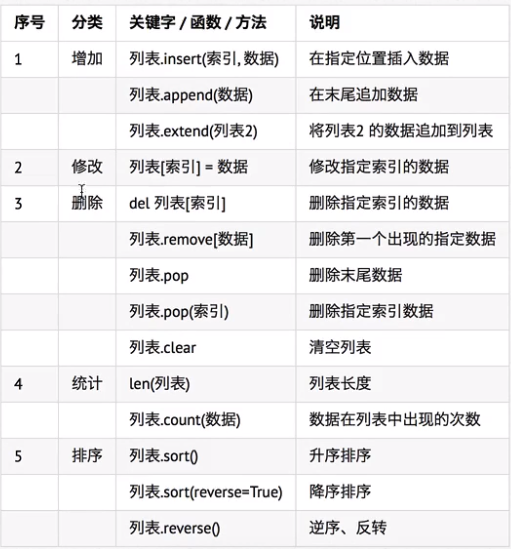

  	- extend会将一个列表中的元素分别插入列表，append会将列表作为一个元素插入列表
  	- 列表变量若使用 += 本质即为执行 extend 方法，不会修改变量的引用，则会修改外部变量。若不想修改，应使用 =

  - print(name_list.index("wangwu"))

- 应用场景

  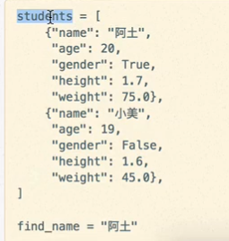

### **Tuple 元组**

- 使用

	- ( ）定义
	- 索引从0开始

		- 使用索引时都使用 [ ]

- 特点

	- 元组元素不能修改
	- 通常会保存不同类型的数据

- 注意

	- 只有1个元素的tuple定义时必须后加一个逗号 ，来消除歧义
	- 解释器在识别（）时，会自动忽略来查看内部元素

- 常用操作

	- 定义的元组变量名 加 . Tab提示方法
	- 元组和列表之间的转换

		- list函数

			- 变量名 = list(元组）

		- tuple函数

			- 变量名 = tuple(列表）

- 应用场景

	- 将函数的参数和返回值 定义为元组，以接收任意个数据和返回多个数据

		- 此时在 return 后面不需要加 （ ）
		- 接收返回的数据并输出

			- 可以使用多个变量，一次接受函数的返回结果
			- 注意使用多个变量接受结果时，变量的个数应该和元组中元素的个数保持一致

	- 格式化字符串，%后的（ ）本质即为元组

		- 可以用元组拼接新的字符串

	- 将列表转换为元组，保证数据安全

- 元组和字典的拆包语法

	- 简化元组和字典的传递
	- 语法

		- 想将一个元组变量直接传递给 args

			- 在元组变量前，增加一个 *

		- 想将一个字典变量直接传递给 kwargs

			- 在字典变量前，增加两个 *

### dict  字典

- 除列表外最灵活的数据类型，也可以储存多个数据类型
- 通常用于存储描述一个物体的相关信息
- 用 { } 定义

  - **键**获取数据，**值**保存数据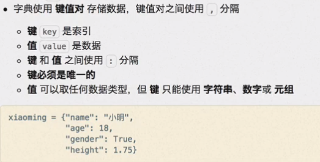
    - 字典是一个无序的数据集合，使用print函数输出时不一定和定义顺序一致// 3.6以上版本可能已经变为有序
    - ==操作==
      - 增加/修改：通过key 增加（key不存在）和修改键值对

        - 变量名["key"] = value 

      - 取值：变量名后加 ["key" ]

      - 删除：用方法 pop等

      - 其他：合并字典

        - .update(新字典名）

    - key只能使用不可变类型的数据

- 注意

	- 定义字典时代码最好一个键值对占一行
	- update合并字典时包含已经存在的键值对，会覆盖原有的键值对

- 循环遍历

	- for
	- 应用场景

		- 使用多个键值对，存储描述一个物体的相关信息
		- 多个字典放在一个列表中，进行遍历，在循环体内部对每个字典进行相同的处理

## 类型转换

int()转换字符串为整数

float(x)转换字符串为小数

## 函数type()查看变量类型

> 

