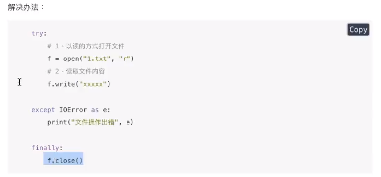
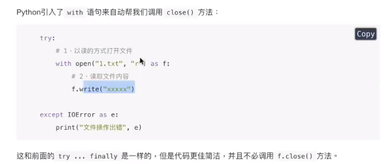
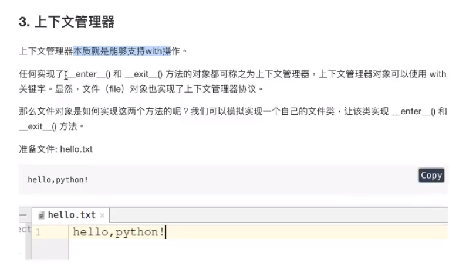
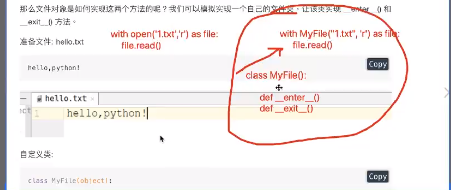

# with管理上下文的方式


由于文件读写时都有可能产生I0Error，一旦出错，后面的f，close（）就不会调用。所以，为了保证无论是否出错都能正确地关闭文件，我们可以使用try...finally 来实现：

 笨办法：

好办法：




## 上下文（context）概念

> 理解成环境就可以，（而且上下文虽然叫上下文，但是程序里面一般都只有上文而已，只是叫的好听叫上下文。。进程中断在操作系统中是有上有下的，不过不这个高深的问题就不要深究了。。。）







自定义上下文管理器

```python
"""
    类：MyFile(）类方法：
    1.__enter__()上文方法
    2.__exit__() 下文方法
    3`__init__()接收参数兵器初始化

 with MyFile('hello.txt','r') as file:
    file.read()
"""

class MyFile(object):

    # 1.__enter__()上文方法
    def __enter__(self):
        print("进入上文...")
        # 1.打开文件
        self.file = open(self.file_name, self.file_model)
        # 2. 返回打开的文件资源
        return self.file
    # 2.__exit__() 下文方法
    def __exit__(self, exc_type, exc_val, exc_tb):
        print("进入下文")
        # 关闭文件资源
        self.file.close()


    # 3`__init__()接收参数并初始化
    def __init__(self, file_name, file_model):
        # 保存文件名和文件打开模式到实例属性中
        self.file_name = file_name
        self.file_model= file_model

if __name__ == '__main__':

    with MyFile("hello.txt", "r") as file:
         # 开始读取文件
        file_data = file.read()
        print(file_data)

```

## 方式二

利用生成器的yield特性

yield在第二次执行时是执行第一次执行结束后yield后面的代码，符合上下文特征


通过装饰器@ contextmanager 实现上下文管理

- 装饰器

- 待装饰的函数

```python

"""
    思路：
    def myopen(file name,file model)
        上文（打开资源）
        yield
        下文（关闭资源）

装饰器装饰函数的步骤
1`导入模块 from contextlib import contextmanager
2`开始装饰 @contextmanager

"""
from contextlib import contextmanager


@contextmanager
def myopen(film_name, film_model):
    print("进入上文")
    # 1.打开资源
    file = open(film_name, film_model)
    # 2. 返回资源
    yield file
    print("进入下文")
    # 下文
    # 3.关闭资源
    file.close()

with myopen("hello.txt", "r") as file:
    file_data = file.read()
    print(file_data)
```

