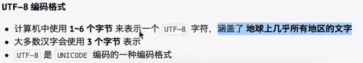
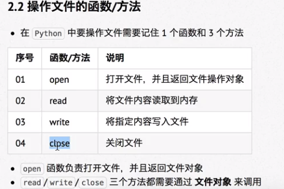
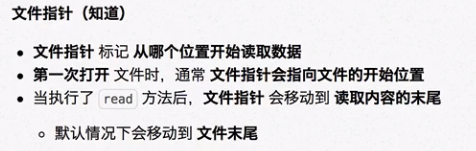
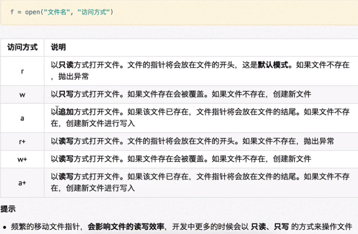
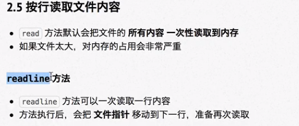
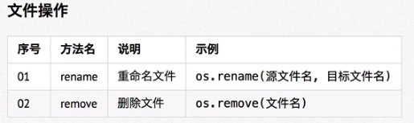
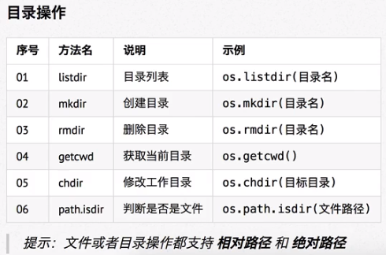

# 文件

## 文本文件

本质还是二进制文件

## 二进制文件

文件以二进制方式保存在磁盘

- 子主题 1
- 子主题 2
- 子主题 3

## 文本文件编码格式

### ASCLL编码

- python2.x默认
- American Standard Code for Information Interchange 美国标准信息交换代码
### UNICODE编码

- python3.x默认
- 

## 操作文件的套路

- 文件指针

	- 第一次读取后，文件指针移动至文件末尾。再次调用不会读取到任何内容

	- 
- 

## 文件/目录常用管理操作

python中导入 os 模块

