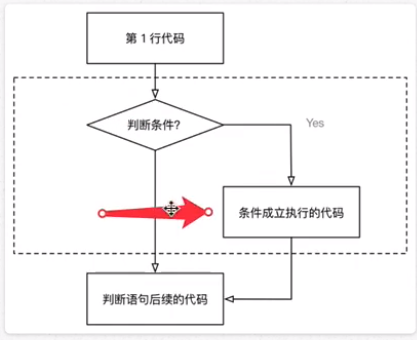
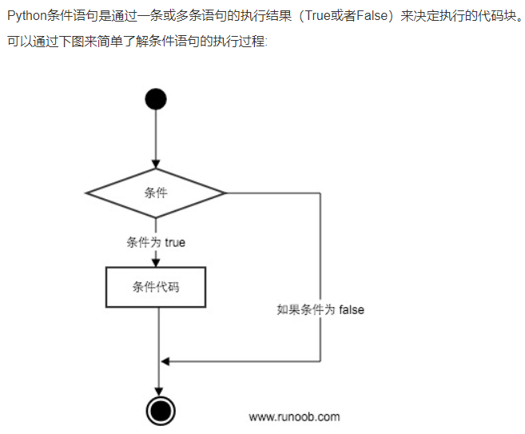
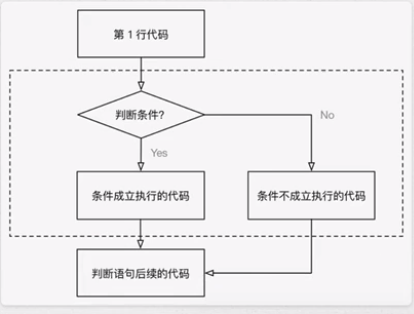

# 条件判断

## if 判断语句

判断条件是否满足

- 也被称为分支语句
- 当条件为True时才会输出

### 格式

- 顶格写 if 最后加 ：

	- IDE会在：后自动缩进

- 下条件代码一个tab缩进，或4个空格

	- tab/空格不能混用

- if 语句以及缩进部分算一个完整的代码块

	- if 语句是通过条件执行结果（True和False）来决定是否执行的代码快

### 比较运算符

### if 的嵌套

- 使用 if 进行条件判断时，若希望在条件成立的执行语句中再增加条件判断，使用 if 嵌套

## elif

为增加不同条件和不同的执行代码

同时判断多个条件，所有条件平级

## else

处理if 不符合条件的情况

下条件代码一个tab缩进，或4个空格

- tab/空格不能混用

if 和 else 语句以及缩进部分算一个完整的代码块

## 逻辑运算符

可以把多个条件按照逻辑进行连接，变成更复杂的条件

### 与 and

- 条件1 and 条件2
- 同时满足两个条件 返回True
- 有一个不成立，返回False

### 或 or

- 条件1 or 条件2
- 只要有一个满足，返回True
- 两个都不成立，返回False

### 非 not

- not 条件

	- 当条件为True或False时，if语句中使用not应输出值为True才可以执行下面代码

- 取反条件

