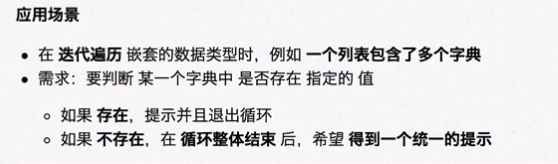
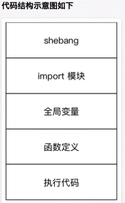

# 框架搭建

一个系统是由多个文件组成的

不同的文件扮演不同的功能

## 结构

## pass占位符

保证程序代码格式正确

## while True:

无限循环，由用户决定什么时退出循环

## 字符串判断

if _ in ["","",""]

- 使用 in 针对列表判断，避免使用 or 拼接复杂条件
- 不使用 int 转换用户输入，避免非数字输入导致错误

## TODO 注释

TODO(作者/邮件) 需要功能

## 案例

### 名片管理系统

- main文件和tool文件相互配合，tool文件写函数等模块，给main调用
- 使用字典记录名片信息，用列表记录字典

## 注意习惯

- 用pass先制定框架代码
- 程序每一步都注释上思维步骤
- 避免代码过长，用多个函数调用解决

	- 将框架代码都可以做成函数或模块
	- 未完成的功能，用TODO，完成后删除

- 定义了函数记得添加注释

**==[[linux中直接执行程序]]==**

- Shebang符号  "#！"
- `#！解释器完整路径`（/usr/bin/python3.8)

