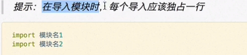
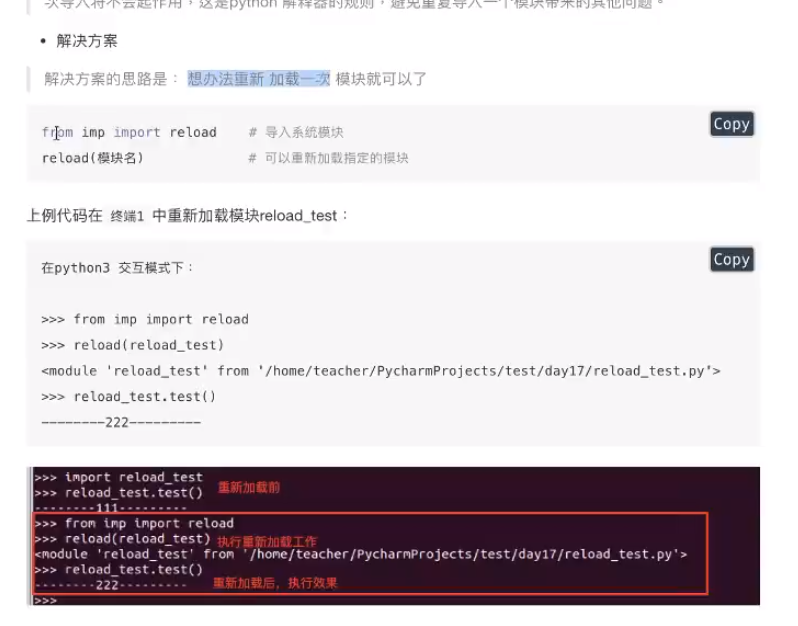
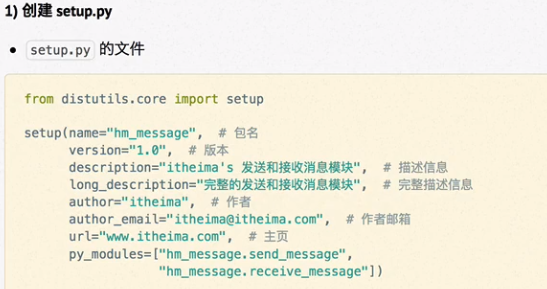
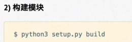
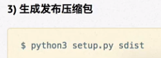
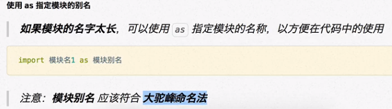
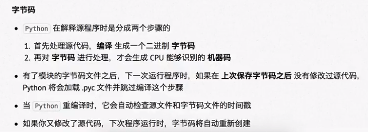

# 模块

## 概念

python程序架构的一个核心概念，工具包

- 每一个 .py 源代码文件都是一个模块

	- 在导入文件时，文件中所有没有缩进的代码都会被执行一遍

- 提供全局变量，函数，类，注意：直接执行的代码不是向外界提供的工具

## 作用

可以让从前的代码方便的复用

## 使用方法

### **import 模块名**

- import 模块名1，模块名2 不推荐。PEP8规定
- 导入代码要统一写在文件顶部，防止出错找不到

### **==from...import * 全部导入==**

- 不推荐使用

	- 不容易排错

**from...import**

- 从某一模块中导入部分工具
- 若多个模块中存在同名函数，后导入的会覆盖先导入的函数，所以要给后来者用 as 起别名


#### 私有化处理

- 如果模块中的变量不希望被其他模块以from.….import*方式导入，此时可以在变量名前加 _  以表示私有的意思。

`_变量名` 使用  from xxx import *  不能被导入，私有化

 如果不使用from.…import*上的私有将不起作用


#### import 和from..…import的区别

写法：
- mport 模块名.变量/函数/类
- from.…import*变量名/函数/类

底层的区别：
- import 直接引用了源模块的变量/函数/类
- from...import * 拷贝源模块的变量/函数/类到当前自己类

**from..…import导入的模块是整体拷贝了一份，所以本身函数修改变量不会影响导入的模块**


### **查看导入的模块路径**

- print(random.__file__)


### 如何导入指定目录下的模块

存在的问题：当我们把模块文件放到工程文件夹的外部的文件，发现无法正常引入模块

原因：外部的文件夹的路径，没有放到环境变量中

查看环境变量

> 1.导入sys模块
>
> 2.sys.path 查看环境变量返回值是列表

把自己写的模块的路径加入到环境变量中

- sys.path.append() 加入环境变量的末尾
- sys.path.insert() 加入环境变量的开头

```python
# 查看系统的path环境变量
# 1`导入模块sys
# 2`sys.path 可以查看到环境变量的具体内容

import sys

for p in sys.path:
    print(p)
# 把指定的路径加入环境变量中
# 追加到末尾
# sys.path.append("/home/zyu0/Desktop/test")
#　追加到开头
sys.path.insert(0,"/home/zyu0/Desktop/test")
print("--"*20)
for p in sys.path:
    print(p)

import app
print(app.name)
```

### 重新导入

> 为什么需要重新导入模块模块被导入后，import module 不能重新导入模块，重新导入需用reload 重新加载模块代构创建模块对象

当一个程序未完全结束时，导入的模块会保持导入时的状态，修改模块后即便重新导入也不变，==重新导入是失效的，import会防止重复包含==

解决方案：固定格式

```python
# 固定格式
from imp inport reload
reload(模块名)
```





## 包 Package

### 概念

- 一个包含多个模块的特殊目录
- 目录下有一个特殊文件  __init__.py
- 包名 命名方式与变量名一致，小写字母+ _

### 作用

- 一次导入包内所有模块

### 打包模块制作压缩包







## 模块名

### 命名规则

- 可以由字母、下划线和数字组成
- 不能以数字开头
- 不能与关键字重名

### 模块别名



==是一个标识符==

## Pyc文件

解释器发现使用了import后，会将模块文件自动编译成二进制文件，优化启动速度



compiled 编译过

这些文件存在 _pycache_中

