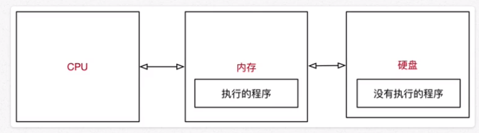
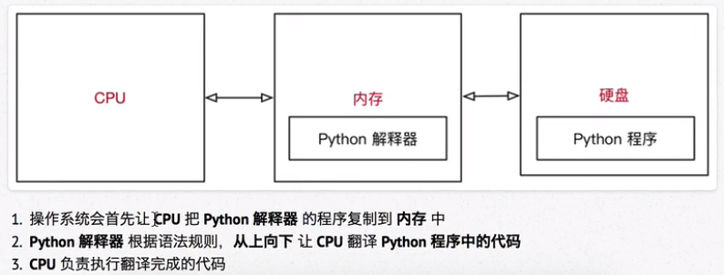
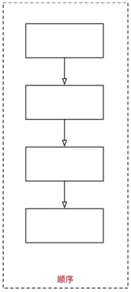
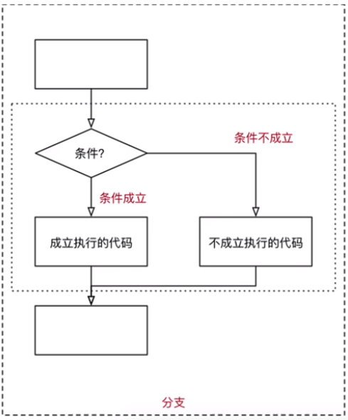
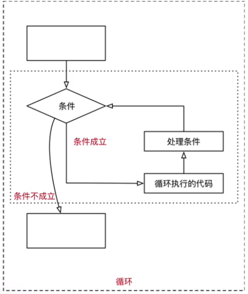

# 程序执行原理

## 计算机三大件

- CPU

- 内存

- 硬盘

## 执行原理

- CPU 负责执行

- 内存 复制程序

- 硬盘 保存程序

python程序执行原理

## 程序的作用

- 程序就是用来处理数据

- 变量用来存储数据

	- 如qq号码和密码就是两个变量

## 程序的三大流程

### 顺序

- 从上至下

### 分支

- 让程序适用于更多场景

### 循环

- 减少重复劳动

