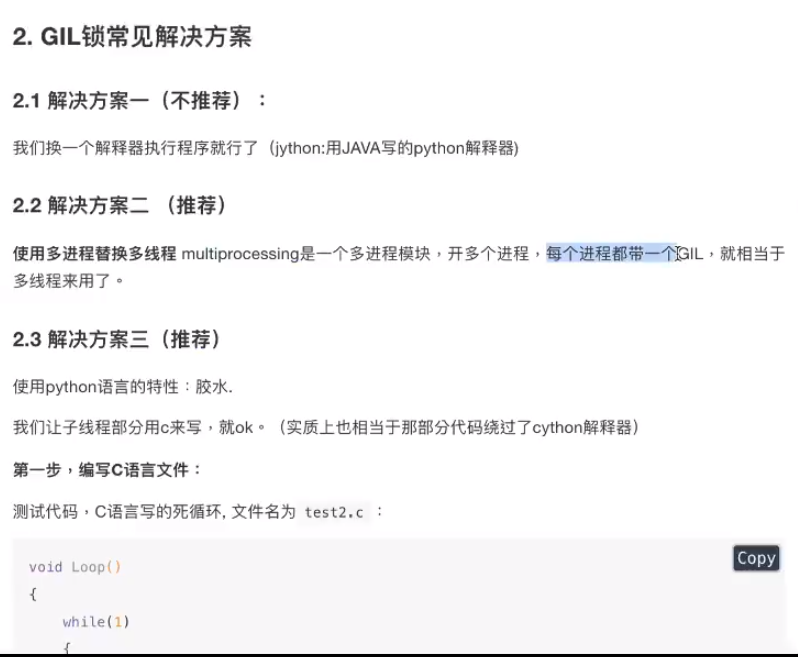

# GIL锁

监控资源的竞争情况htop

资源的消耗的情况

- 单进程	 1核
- 多进程     多核
- 多线程     多核但是很低  ——>GIL锁的问题

GIL全局解释器锁，:Global Interpreter Lock

保证同一时间，只有一个线程使用CPU

一个进程只有一个GlL锁

> 任何Python线程执行前，必须先获得GL锁，然后，每执行100条字节码，解释器就自动释放GlL锁，让别的线程有机会执行。这个GL全局锁实际上把所有线程的执行代码都给上了锁，所以，多线程在Python中只能交替执行，即使100个线程跑在100核CPU上，也只能用到1个核。

GIL不是Python特性

GlL是Pythcn解释器（Cpython)时引入的概念，在JPython、PyPy中没有GlL。GL并不是Python的语言缺陷。是解释器层级的锁，跟Python语言特性无关

> 言外之意，就是全局解释器就是为了锁定整个解释器内部的全局资源，每个线程想要运行首先获取GIL，预GlL本身又是一把互斥锁，造成所有线程只能一个一个one-by-one-并发-交替的执行。

GIL存在的原因

- 早期计算机都是单核设计
- CPython在执行多线程的时候并不是线程安全的，所以为了程序的稳定性，加一把全局解释锁，能够确保任何时候都只有一个Python线程执行

> GIL产生的背景在CPython解释内部运行多个线程的时候，每个线程都需要解释器内部申请相应的全局资源，由于C语言本身比较底层造成CPython在管理所有全局资源的时候并不能应对所有线程同时的资源请求，因此为了防止资源竞争而发生错误，对所有线程申请全局资源增加了限制-全局解释器锁。

2.4GIL的弊端·

- GL对计算密集型的程序会产生影响。因为计算密集型的程序，需要占用系统资源。

- GIL的存在，相当于始终在进行单线程运算，这样自然就慢了。

- IO密集型影响不大的原因在于，IO，input/output，这两个词就表明程序的瓶颈在于输入所耗费的时间，线程大部分时间在等待，所以它们是多个一起等（多线程）还是单个等（单线程）无所谓的。

2.5GIL锁什么时候释放?

- 在当前线程执行超时后会自动释放
- 在当前线程执行阻塞操作时会自动释放
- 当前执行完成时

 

`gcc test.c -shared -o libtest.so`

用c语言跳出了cpython锁机制？

子线程用C语言实现（test.c->libtest.so->python加载）

