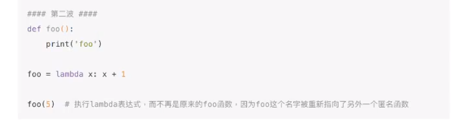
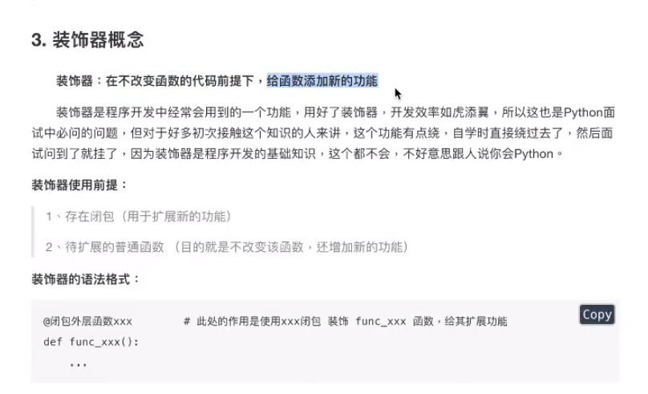
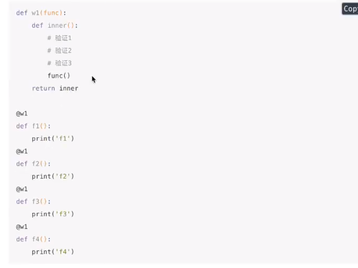
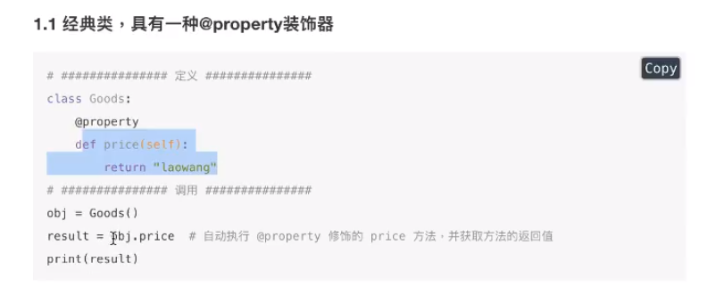
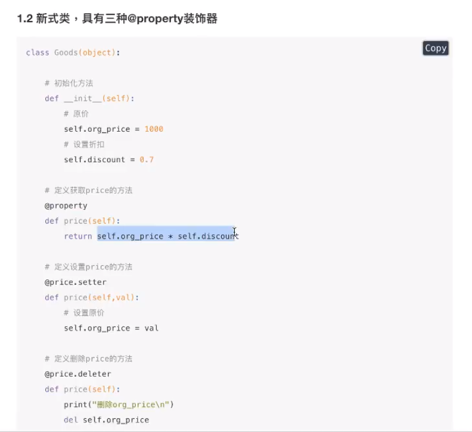
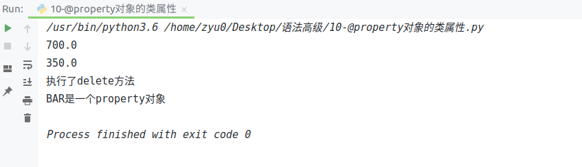

# 装饰器

装饰器用在什么场景下

装饰器函数较之于闭包的的明显特点

使用装饰器的语法格式


函数名仅仅是个变量，只不过指向了定义的函数而已，所以才能通过函数名0调用，如果函数名=Xxx被修改了，那么当在执行函数名0时，调用的就不是之前的那个函数了可以确定一点就是函数名只是一个对象，和普通对象一样这个对象可以引用其他函数的代码



## 概念

在不改变代码的情况下，给函数添加新的功能



开闭原则

写代码要遵循==开放封闭原则==，虽然在这个原则是用的面向对象开发，但是也适用于函数式编程，简单来说，它规定已经实现的功能代码不允许被修改，但可以被扩展，即：

- 封闭：已实现的功能代码块
- 开放：对扩展开放



```python
"""
目标给login（）增加验证功能
而且还不能修改源代码
"""


def function_out(func):

    def function_in():
        # func = login
        print("开始验证-------")
        func()
    return function_in

@function_out
# @function_out 装饰了login()函数
# 底层： login = function_out(login)
def login():
    print("开始登陆！")
    
# 通过闭包调用外层函数
# 这里左边login变成了里层函数function_in，右边login传入了外层函数变成func()
# login = function_out(login)
# login()
login()
```

## 坑

有参数时的装饰器

```python
def function_out(func):

     def function_in(num):
         print("----开始验证----,num = ",num)

         # 执行带装饰的函数
         # func(num) = login(num)
         func(num)
     return function_in


# 登录函数
@function_out
def login(num):
    print("开始登录 num =",num)

login(10)
```

- 普通参数

  > 待装饰的函数
  >
  > @function_out
  >
  > def login(num)
  >
  > 注意：
  > 1）function_in(参数） 
  > 2）func(参数）

- 可变参数

  > 待装饰的函数
  >
  > @function_out
  >
  > def login(*args，**kwargs）
  >
  > 注意：
  > 1）function_in(\*args，\*\*kwargs） 
  > 2）func(*args，\*\*kwargs）
  >
  > 错误：
  >
  > func(args，kwargs）

有返回值的装饰器

步骤:

- 待装饰的函数必须有返回值(return)
- 闭包的内层函数 `func(*args,**kwargs`）改为`return func(*args,**kwargs）`


```python
def function_out(func):

    def function_in(num):
        # func = login
        print("开始验证-------")
        return func(num)
    return function_in


@function_out
# @function_out 装饰了login()函数
# 底层： login = function_out(login)
def login(num):
    print("开始登陆！")
    return num + 10

result = login(8)
print(result)

```


## 通用版装饰器

```python


def function_out(func):

     def function_in(*args, **kwargs):
         print("----开始验证----")
         print("function_in=", args)
         print("function_in=", kwargs)
         # 执行带装饰的函数
         # func(num) = login(num)
         # func((10,), {a=10}  加 * 拆包
         return func(*args, **kwargs)
     return function_in


# 登录函数
@function_out
def login(*args, **kwargs):
    print("开始登录 num =")
    print("login:args=",args)
    print("login:kwargs=",kwargs)
    
    return 10

result = login(10,a=10)
print(result)

```

## 在原装饰器上设置外部变量

装饰器工厂

在工厂中创建装饰器，有点类似进程池？

向装饰器内部传递参数

```python
"""
1.存在闭包
2.存在待修饰的函数
"""

def test(path):
    print(path)
    def function_out(func):
        # print("function_out path=",path)
        """外层变量"""
        def function_in():
            print("-----开始验证-----")
            func()
        # 返回内层函数的引用
        return function_in
    #　返回装饰器的引用
    return function_out


@test("login.py")
# @test("login.py") 分解为2步
# 1`test("login.py")  --> 返回了function_out引用  有参数时才会执行这一步
# 2`@ 第一步的结果      --> @function_out
# login = function_out(login)
# @function_out
def login():
    print("开始登录")

@test("register.py")
def register():
    print("开始注册")


login()
register()

```

## 多重装饰器

多个装饰器装饰同一个函数，就像墙体做了多层装修

```python
"""
1’创建一个袭饰器，一个待袭饰的画数
"""

# 定义一个让文字加粗的装饰器
def makeBlod(func):
    def function_in():
        return "<b>"+func()+"</b>"
    return function_in


# 定义一个让文字倾斜的装饰器
def makeItalic(func):
    def function_in():
        return "<i>"+func()+"</i>"
    return function_in


@makeBlod
# 达成这个模式：<b>helloworld-q</b>
def test():
    return "helloworld-1"


@makeItalic
def test2():
    return "helloworld-1"


@makeBlod
@makeItalic
def test3():
    return "helloworld-1"


# print(test())   # <b>helloworld-1</b>
# print(test2())  # <i>helloworld-1</i>
print(test3())
```

**装饰原则：就近原则（靠近待装饰函数的先装饰，随后一层一层装）**

## 类装饰器

装饰器函数其实是这样一个接口约束，它必须接受一个callable对象作为参数，然后返回一个callable对象。
在Python中一般callable对象都是函数，但也有例外。只要某个对象重写了_call（）方法，那么这个对象就是callable的。


使用一个类为一个函数装饰

```python
# 装饰器类
class Test(object):

    def __init__(self,func):
        print("__init__方法")
        print("--func--",func)
        # func是函数login的引用,保存原本函数的引用
        self.func = func

    def run(self):
        print("——正在疯跑--")

    # 决定了对象是否可以调用方法
    def __call__(self, *args, **kwargs):
        print("开始验证")
        # 调用原来login的内容
        self.func()

# test = Test()
# test()

@Test
# login = Test(login)
def login():
    print("开始登录")

login()  # login已经是一个对象，里面的func才是原来的login函数


```

类的书写：

> 必须有两个方法
>
> 1）init方法，必须接收装饰器传递的参数func
>
> 2)  call方法，self.func）

格式：

​		@类名

​		待装饰的函数

> @Test
>
> def login():
>
> login=Test(login)
>
> login()       —-->调用类的\__call__ 方法

对象名() 调用对象的\__call__ 方法

## @property

property属性

让我们通过  `对象.方法名`  的方式可以调用方法

@property装饰的方法，只能有一个参数self

```python
class Foo(object):

    # 初始化方法
    def __init__(self,num):
        self.num = num
    # 获取值的方法
    @property
    def prop(self):
        return self.num

# 创建对象
foo = Foo(100)

# 调用对象方法
# print(foo.prop())
# @property　像使用属性一样使用方法，foo.prop之后，--->foo.prop()
print(foo.prop)
```

但限于def prop(self): 方法中没有传入参数，一般用于在类中获取值

### 其他使用方式

Python中的类有`经典类`和`新式类`，`新式类`的属性比`经典类`的属性丰富。（如果类继object，那么该类是新式类，Python3中默认所有类为新式类）


在类的实例方法上应用@property装饰器



新式类，具有三种@property装饰器



- @xxx.setter，调用xxx方法，传入并保存一个参数

- @xxx.deleter，调用xxx方法，删除一个？

```python
"""
类：Goods方法：
    1.初始化方法
    2.获取价格的方法
    3.设置价格的方法
    4.删除价格的方法
"""
class Goods(object):
    # 1.初始化方法
    def __init__(self):
        # 初始化原价
        self.org_price = 1000
        # 初始化折扣
        self.discount = 0.7
    # 2.获取价格的方法
    @property
    def price(self):
        return self.org_price*self.discount

    # 3.设置价格的方法
    @price.setter
    def price(self,val):
        if val > 0:
            self.org_price = val
    # 4.删除价格的方法
    @price.deleter
    def price(self):
        print("执行了delete方法")

# 创建对象
goods = Goods()
# goods.price == goods.price()
print(goods.price)
# goods.price == goods.price(500)
goods.price = 500
print(goods.price)

# del goods.price　= @price.deleter goods.price()
del goods.price
```

**类属性方式，创建值为property对象的类属性**

当使用类属性的方式创建property属性时，经典类和新式类无区别

property方法中有个四个参数

- 第一个参数是方法名，调用 对象.属性 时自动触发执行方法
- 第二个参数是方法名，调用 对象.属性=XXX 时自动触发执行方法
- 第三个参数是方法名，调用 del对象.属性 时自动触发执行方法
- 第四个参数是字符串，调用 对象.属性doc，此参数是该属性的描述信息

```python
"""
类：Goods方法：
    1.初始化方法
    2.获取价格的方法
    3.设置价格的方法
    4.删除价格的方法
"""


class Goods(object):
    # 1.初始化方法
    def __init__(self):
        # 初始化原价
        self.org_price = 1000
        # 初始化折扣
        self.discount = 0.7
    # 2.获取价格的方法

    def get_price(self):
        return self.org_price*self.discount

    # 3.设置价格的方法

    def set_price(self,val):
        if val > 0:
            self.org_price = val
    # 4.删除价格的方法

    def del_price(self):
        print("执行了delete方法")

    # property(第一个参数，第二个参数，第三个参数，第四个参数）
    # 第一个参数，当我们foo.BAR自动调用第一个参教的方法
    # 第二个参载，当我们f00.BAR=100，自动调用第二个参教的方法
    # 第三个参数，当我们del foo.BAR，自动调用第三个参袭的方法
    # 第四个参数，当我们Foo.BAR.__doc__，自动获取第四个参数的内容
    BAR = property(get_price,set_price,del_price,"BAR是一个property对象")


if __name__ == '__main__':
    # 创建对象
    goods = Goods()
    print(goods.BAR)
    # 
    goods.BAR = 500
    print(goods.BAR)

    del goods.BAR
    # 获取对象描述
    print(Goods.BAR.__doc__)
```

