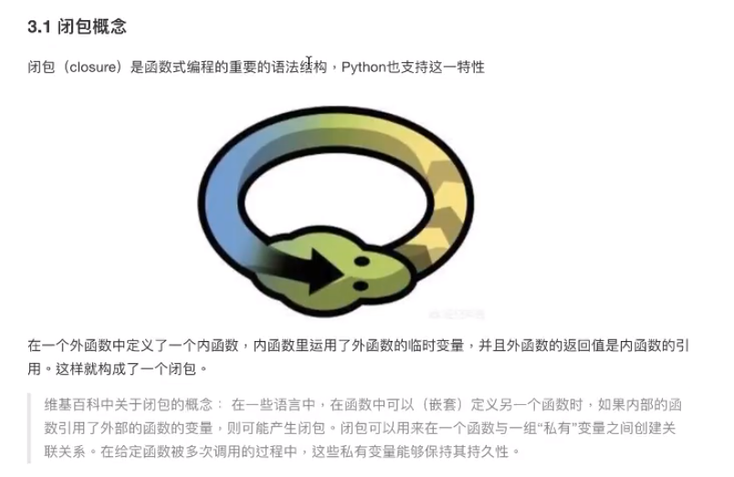
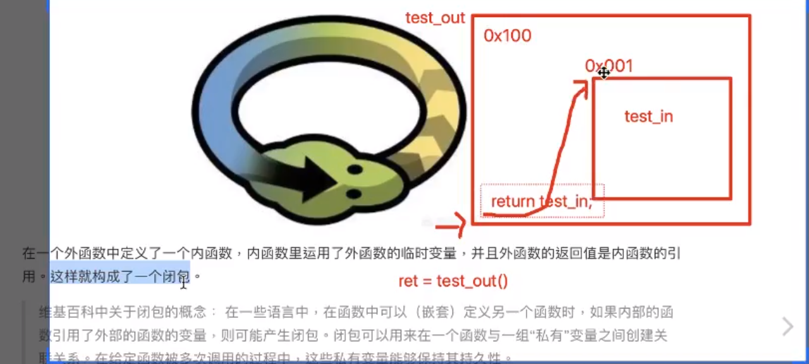
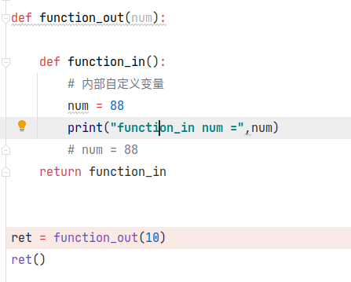

# 闭包

## 构成条件

- 必须有一个内嵌函数（函数里定义的函数）——这对应函数之间的嵌套
- 内嵌函数必须引用一个定义在闭合范围内（外部函数里）的变量—一内部函数引用外部变量
- 外部函数必须返回内嵌函数——必须返回那个内部函数，返回引用

## 问题

内层定义了和外层同名的变量，内层优先使用内层定义的变变量，即使定义的变量在内层最后

==python执行时会先查看函数内部局部变量，再查看全局变量==

变量作用域？

在一个域中的变量会影响外部域进来的变量，除非外部域变量在使用前已被修改，否则会报错

 造成错误的原因：

- 编译器认为内层函数已经定义了num变量优先使用内层
- 如果在内层定义了和外层同名的变量，而且需要使用外层的变量

nonlocal 关键字约束：不使用内层函数的变量，而是使用外层函数的变量

