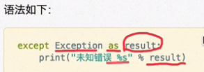

### 概念

- 程序运行，解释器遇到错误，停止程序运行，提示错误信息

	- 抛出异常

### 意义

- 程序开发很难处理完所有的特殊情况，可通过异常捕获来针对突发事件做集中处理，保证程序的稳定性和健壮性

### 语法

- try：下跟代码
- except 错误类型：
- 捕获未知错误

	

- else：

	- 只有在没有异常时才会执行的代码

- finally：

	- 无论是否有异常，都会执行的代码

### 异常的传递

- 当函数/方法 执行出现异常，会将异常传递给 函数/方法 的调用一方

	- 若传递至主程序后，没有异常处理，再执行程序终止
	- 解释器每次的错误提示从上至下便是错误传递路径

- 在主程序中加 错误捕获代码 增加简洁性和健壮性

### 主动抛出 raise 异常

- 用于应用程序特有业务需求

	- 例如：提示用户输入密码的长度需求，少于8位则抛出异常“长度不够”

- 语法

	
	

### 注意事项

- 当python解释器抛出异常时，最后一行错误信息的第一个单词，就是错误类型

