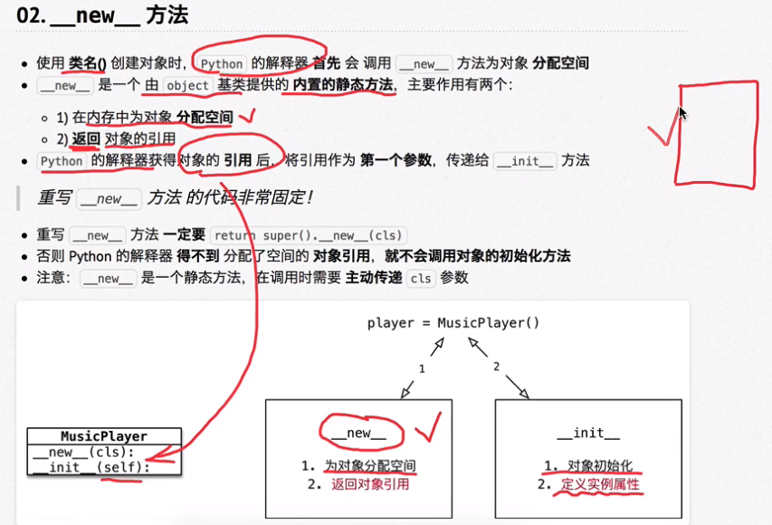

# 面向对象 OOP

==Object Oriented Programming==

## 概念

- 相比较函数是更大的封装，根据职责在一个对象中封装多个方法

## 步骤

- 在完成一个需求前，首先确定职责——要做的事情（方法）
- 根据职责确定不同的对象，在对象内部封装不同的方法
- 最后完成的代码，就是顺序地让不同的对象调用不同的方法

专门应对复杂项目开assets/发，提供固定套路


**之前学习的都是面向过程的编程方式：**

- 将完成某需求的所有步骤从头到尾逐步实现
- 根据开发需求将某些功能独立的代码封装成一个个函数
- 最后完成的代码就是顺序调用不同的函数

不适合复杂项目开发


## 三大特性

### 封装

#### 基础语法

##### **1. dir 内置函数**

展示对象内部所有属性和方法，__方法名__ 格式是python提供的内置方法或属性

##### **2. 类**

- 概念

	- 对一群具有相同特征或行为的事物的统称，是抽象的，不能直接使用

		- 特征即属性
		- 行为即方法

	- 类似制造飞机的图纸。是一个模板，负责创造对象

- 设计

  - 三个要素

  	- 类名

  		- 满足大驼峰命名法
  		- 名词提炼法分析整个业务流程后出线的名词，通常为类名
  - 属性
  	
  	- 事物特征描述
  	
  - 方法
  	
  	- 事物具有的行为（动词）
  	
  - 注意

  	- 需求中未涉及的属性和方法在设计时不予考虑
  	- 开发时，先被使用的类，应该先开发

- 定义 类

	- class 类名：

		- 函数内第一个参数必须是 self，要符合大驼峰命名法

	- 类属性

		- 特点

			- 给类对象定义的属性
			- 通产被用于记录与这个 类 相关的特征
			- 不会记录具体对象的特征

		- 在class下方用 赋值语句定义 类属性

	- 类方法

		- 在类方法内部可以直接访问类属性或调用其他的类方法

			- 方法内部只需要访类属性

	- 静态方法

		- 方法内部，不需要访问实例属性和类属性

		- 类名.静态方法名 来调用静态方法

- 特点

	- 类是一个特殊的对象，属于类对象

##### 3. 对象

- 概念

	- 是由类创建出来的一个具体存在，可以直接使用
	- 由哪个类创建出来的对象，就拥有哪个类定义的属性和方法

- 特点

	- 不同的对象，属性不一定相同，但属性和方法的数量不会变换
	- 在对象的方法内部，可以直接访问对象属性
	- 同一个类创建的对象之间，属性是互不干扰的
	- 一个对象的属性可以是另外一个类创建的对象

		- 可以通过None来做不确定的属性中间转换，通过外界赋值进行二次确认

	- 每一个对象都有自己独立的内存空间，保存各自不同的属性
	- 多个对象的方法，在内存中只有一份，再调用方法时，需要把对象的引用传递到方法内部

- 种类

	- 变量
	- 数据
	- 函数

- 验证是否对象

	- 在标识符/数据 后输入 . 按Tab ipython提示有能调用的方法列表
	- 使用 dir 传入标识符或数据，查看对象内部所有属性和方法

- 创建对象

  - 这里是实例对象

  - 术语

    - 实例，即创建出的对象

    - 实例比，创建对象的动作

    - 实例属性，对象的属性

    - 实例方法

      - 对象调用的方法
      - 方法内部需要访问实例属性
      - 实例方法内部可以使用 类名. 访问类属性

##### 4. 方法中的 self 参数

- 给对象增加属性

	- 使用 .属性名，利用赋值语句。不推荐使用，因为没有封装至类的内部

		- 子主题 1

##### 5. 初始化方法

- `__init__` 系统自动调用
- 定义时形参只有需要外部传入时才需要定义，其他不需要加形参

##### 6. 内置方法和属性

- ##### `__del__`

	- 当一个对象被从内存中销毁前，会自动调用 `__del__` 方法，此时应以执行完所有代码
	- 若希望在对象被销毁前，再做一些事情，可以使用` __del__1

- `__str__`

	- 使 print 输出的变量为自定义内容
	- 必须返回一个字符串

- `__file__`

	- 查看模块的完整路径

- `__name__`

  

  

-`__init__`

	- 对象初始化，清理内存

- `__new__`

  - 使用 类名() 创建对象时，python解释器首先会调用 __new__ 方法为对象分配空间

    

- 私有属性和私有方法

  - 实际开发中，对象的某些属性和方法只希望在对象内部被使用，不希望在外部被访问
  - 私有属性

  	- 对象不希望公开的属性

  - 私有方法

  	- 对象不希望公开的方法

  - python中没有真正的私有

    - 在名称前加  _类名 即可破解私有

      

### 继承

#### **概念**

- 子类拥有父类以及父类的父类所有的属性和方法

#### **术语**

- 子类

- 父类

- 继承

- 派生类

- 基类

- 派生

#### **新式类和旧式类**

- 新式类默认使用 object 类作为基类
- 旧式类不以object为基类
- 为保证编写代码能够在python2 和 3 运行，若没有父类，统一继承object

#### **分类**

**单继承**

- 语法

	- class 类名(父类名)：
	- 子类只需要根据职责封装子类特有的属性和方法

- 方法重写

  - 当父类的方法不能满足子类需求时使用
  - 方式1_覆盖

  	- 即在子类中重新编写一个与父类同名的方法并实现，会自动覆盖原方法

  - 方式2_扩展

  	- 
  	- ==super()==
  	  - super（)使用的时候，传递参数的时候，self 不用传递
  	  - super（)调用顺序，按照mro顺序来完成
  	    - Grandson.mro是一个元组当在类中使用 super() 在mro列表中找到当前类的下一元素，调用该元素的方法

- 父类的私有属性和私有方法

	- 前加 __

- 子类可以调用父类公有属性和公有方法

	- 便可以通过公有方法调用间接访问私有属性和私有方法


根据我们之前学习的知识可以知道，在子类初始化的时候需要手动调用父类的初始化方法进行父类的属性的构造，不然就不能使用提供的属性。


**多继承**

又称菱形继承，钻石继承

- 子类可以拥有多个父类，且拥有所有父类的属性和方法

	- 减少重复，减少冗余

- 语法

  - class 子类名(父类名1, 父类名2...)

  - ```python
    class Grandson(Son1,Son2):
        
        def __init _(self,name,age,gender):
            # 单独调用父类的初始化方法 
            # 此时父类的被初始化了两次
            Son1._init(self，name,age)
            Son2._init_(self,name,gender) 
            print('Grandson的init结束被调用’）
              
    # 此处 Son1._init(self，name,age)都改为super()的话，便可解决多次调用parent父类的情况
              
    class Grandson(Son1,Son2):
        
        def __init _(self,name,age,gender):
    
    		# 此处 Son1._init(self，name,age)都改为super()的话，便可解决多次调用parent父类的情况,执行时会自动调用父类一次
            super()._init(name,age)
            # Son2._init_(self,name,gender) 
            print('Grandson的init结束被调用’）
             
              
    ```

- 注意

  - 开发时尽量避免同名，父类间存在同名属性或方法，==应尽量避免使用多继承==
  - 多继承会出现父类被子类初始化多次，浪费资源

- MRO

	- 方法搜索顺序

		- python针对类提供的内置属性 __mro__ 查看方法搜索顺序，一个算法将复杂结构上所有的类全部都映射到一个线性顺序上，而根据这个顺序就能够保证所有的类都会被构造一次。

**多继承中super（)执行顺序，严格执行MRO顺序表，`类名.__mro__`，不建议使用类名调用父类，用super()解决多次调用parent父类的情况**

### 多态

#### 概念

- 不同的子类对象调用相同的父类方法，产生不同的执行结果

#### 步骤

- 继承
- 重写父类方法


## 注意事项

python中 属性的获取存在一个向上查找机制

- 在对象中找不到属性名，会向上查找类中


## [[单例设计模式]]

## [[异常]]
